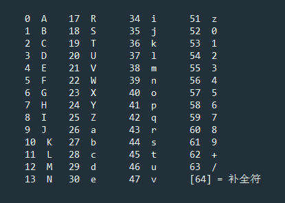

## base64

[TOC]

### 1.简介

> Base64是一种用64个字符来表示任意二进制数据的方法。
>
> 用记事本打开exe、jpg、pdf这些文件时，我们都会看到一大堆乱码，因为二进制文件包含很多无法显示和打印的字符，所以，如果要让记事本这样的文本处理软件能处理二进制数据，就需要一个二进制到字符串的转换方法。Base64是一种最常见的二进制编码方法。

### 2.base64原理

> 所谓Base64，就是说选出64个字符----小写字母a-z、大写字母A-Z、数字0-9、符号"+"、"/"（再加上作为垫字的"="，实际上是65个字符）----作为一个基本字符集。然后，对二进制数据进行处理。
>
> base64对照表举例:
>
> 
>
> 大体步骤:
>
> 对二进制进行处理，每3个字节一组，一共3x8=24bit,划分为4组，每组正好6个bit，然后在这6个bit位的前面用00补全，这样我们就得到了4个数字，用这4个数字作为索引，在查表，获取相应的4个字符，就是编码后的字符串.
>
> 所以，Base64编码会把3字节的二进制数据编码为4字节的文本数据，长度增加33%，好处是编码后的文本数据可以在邮件正文、网页等直接显示。
>
> 如果要编码的二进制数据不是3的倍数，最后会剩下1个或2个字节怎么办？Base64用\x00字节在末尾补足后，再在编码的末尾加上1个或2个=号，表示补了多少字节，解码的时候，会自动去掉.
>
> 所以，具体来说，转换方式可以分4步走
>
> - 1.将每三个字节作为一组，一共是24个二进制位。
> - 2.将这24个二进制位分为四组，每个组有6个二进制位。
> - 3.在每组前面加两个00，扩展成32个二进制位，即四个字节。
> - 4.根据对照表，得到扩展后的每个字节的对应符号，这就是Base64的编码值
>
> 举一个具体的例子，演示英文单词Man是如何转化的:
>
> - 1."M"、"a"、"n"的ASCII值分别是77、97、110，对应的二进制值是01001101、01100001、01101110，将它们连成一个24位的二进制字符串010011010110000101101110。
> - 2.将这个24位的二进制字符串分成4组，每组6个二进制位：010011、010110、000101、101110。
> - 3.在每组前面加两个00，扩展成32个二进制位，即四个字节：00010011、00010110、00000101、00101110。它们的十进制值分别是19、22、5、46。
> - 4.根据上表，得到每个值对应Base64编码，即T、W、F、u。\

### 3.方法

> Base64是一种通过查表的编码方法，不能用于加密，即使使用自定义的编码表也不行
>
> Base64适用于小段内容的编码，比如数字证书签名、Cookie的内容等
>
> | 用途     | 编码                         | 解码                   |
> | ------ | -------------------------- | -------------------- |
> | 字符串，文件 | base64.b64encode()         | base64.b64dedode     |
> | URL    | base64.urlsafe_b64encode() | base64.urlsafedecode |

### 4.代码演示

> 注意: 改变在python3.4中,现在处理的对象都是`byte like object` ,所以,前面要变成2进制去编码和阶码
>
> #### 对文本进行编码解码
>
> ```python
> import base64
> test1 = b'hello world'
> a = base64.b64encode(test1)
> print(a)
> b = base64.b64decode(a)
> print(b)
> ```
>
> ```python
> b'aGVsbG8gd29ybGQ='
> b'hello world'
> ```
>
> #### 对图片进行编码,解码
>
> ```python
> #!/usr/bin/env python
> # coding=utf-8
>
> import base64
>
>
> def convert_image():
>     # 原始图片 ==> base64 编码
>     with open('./logo.jpg', 'rb') as f:
>         image_data = f.read()
>         base64_data = base64.b64encode(image_data)
>         fout = open('./base64_content.txt', 'bw')
>         fout.write(base64_data)
>         fout.close()
>
>     # base64编码 ==> 原始图片
>     with open('./base64_content.txt', 'br') as f:
>         base64_data = f.read()
>         image_data = base64.b64decode(base64_data)
>         fout = open('./base64_test.jpg', 'wb')
>         fout.write(image_data)
>         fout.close()
>
>
> if __name__ == '__main__':
>     convert_image()
> ```

