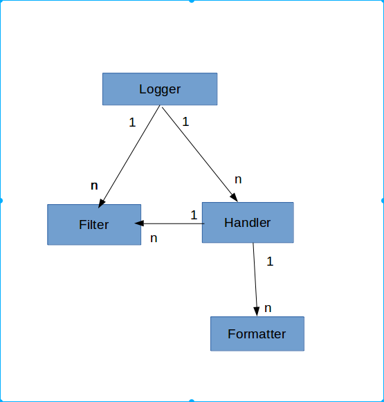

## logging

[TOC]

> logging的具体[参数和方法](http://python.usyiyi.cn/documents/python_278/library/logging.html)
>
> 这是按照`how to` 主题下的学习.

### 什么时候使用logging

> 主要包括`debug(), info(), warning(), error(),critical`
>
> | 你想完成的任务                          | 完成任务的最佳工具                                |
> | -------------------------------- | ---------------------------------------- |
> | 在控制台上显示命令行脚本或者程序的常规用法说明          | [`print()`](http://python.usyiyi.cn/documents/python_278/library/functions.html#print) |
> | 报告程序一般操作时所发生的事件（如监视状况或者调查错误）     | [`logging.info()`](http://python.usyiyi.cn/documents/python_278/library/logging.html#logging.info) （或者 [`logging.debug()`](http://python.usyiyi.cn/documents/python_278/library/logging.html#logging.debug) ，非常详细的输出，用于诊断目的） |
> | 对于特定的运行时事件发出警告                   | 在库代码中使用[`warnings.warn()`](http://python.usyiyi.cn/documents/python_278/library/warnings.html#warnings.warn) ，表明问题是可以避免的，且客户应用应该修改代码以消除警告使用[`logging.warning()`](http://python.usyiyi.cn/documents/python_278/library/logging.html#logging.warning) 表示客户应用对此问题无能为力，但是还是应该注意该事件。 |
> | 对于特定的运行时事件报告错误                   | 抛出异常                                     |
> | 报告对错误的抑制，而不是抛异常（长期运行的服务进程的错误处理器） | 根据特定的错误和应用领域，使用合适的[`logging.error()`](http://python.usyiyi.cn/documents/python_278/library/logging.html#logging.error)、 [`logging.exception()`](http://python.usyiyi.cn/documents/python_278/library/logging.html#logging.exception) 或者[`logging.critical()`](http://python.usyiyi.cn/documents/python_278/library/logging.html#logging.critical) |
>
> 严重级别(升序): 默认是`WARNIGN`
>
> | 级别         | 何时使用                                     |
> | ---------- | ---------------------------------------- |
> | `DEBUG`    | 详细信息，典型地调试问题时会感兴趣。                       |
> | `INFO`     | 证明事情按预期工作。                               |
> | `WARNING`  | 表明发生了一些意外，或者不久的将来会发生问题（如‘磁盘满了’）。软件还是在正常工作。 |
> | `ERROR`    | 由于更严重的问题，软件已不能执行一些功能了。                   |
> | `CRITICAL` | 严重错误，表明软件已不能继续运行了。                       |

### 一个简单的例子

> ```python
> #!/usr/local/bin/python
> # -*- coding:utf-8 -*-
> import logging
> 	logging.debug('debug message')
> logging.info('info message')
> logging.warn('warn message')
> logging.error('error message')
> logging.critical('critical message')
> ```
>
> 输出
>
> ```python
> WARNING:root:warn message
> ERROR:root:error message
> CRITICAL:root:critical message
> ```
>
> 应为默认级别为`WARNING`所以和定义文件不同的是,只输出了`WARNING` 以上级别的内容.而且在默认的情况下,logging模块将日志打印在屏幕上(stdout),日志的格式如下
>
> ```markdown
> WARNING   :root           : warn message
> |日志级别   |Logger实例名称 |日志的消息内容 
> ```
>
> 既然有默认日志级别,那么级别就可以更改

### 更改日志级别并写入文件

> 应用与简单的日志生成`logging.basicConfig()`
>
> ```python
> import logging
> logging.basicConfig(filename='example.log',level=logging.DEBUG)
> logging.debug('This message should go to the log file')
> logging.info('So should this')
> logging.warning('And this, too')
> ```
>
> 输出
>
> ```python
> DEBUG:root:This message should go to the log file
> INFO:root:So should this
> WARNING:root:And this, too
> ```
>
> 或者设置为`INFO` 级别,那么标准输出不会出现任何内容:
>
> ```python
> #!/usr/local/bin/python
> # -*- coding:utf-8 -*-
> import logging
> 	# 通过下面的方式进行简单配置输出方式与日志级别
> logging.basicConfig(filename='logger.log', level=logging.INFO)
> logging.debug('debug message')
> logging.info('info message')
> logging.warn('warn message')
> logging.error('error message')
> logging.critical('critical message')
>
> ```
>
> 标准输出中没有内容,但是当前文件夹下会生成`logger.log` ,内容如下
>
> ```python
> INFO:root:info message
> WARNING:root:warn message
> ERROR:root:error message
> CRITICAL:root:critical message
>
> # 因为通过level=logging.INFO设置日志级别为INFO，所以所有的日志信息均输出出来了
> ```

### 从多个模块中记录日志

> 如果程序由多个模块组成,则可以:
>
> ```python
> # myapp.py
> import logging
> import mylib
>
> def main():
>     logging.basicConfig(filename='myapp.log', level=logging.INFO)
>     logging.info('Started')
>     mylib.do_something()
>     logging.info('Finished')
>
> if __name__ == '__main__':
>     main()
> ```
>
> ```python
> # mylib.py
> import logging
>
> def do_something():
>     logging.info('Doing something')
> ```
>
> 运行myapp.py,可以在myapp.log中看到
>
> ```python
> INFO:root:Started
> INFO:root:Doing something
> INFO:root:Finished
> ```
>
> 根据这样的写法,可以扩展到多个模块中,但是这样的简单的模式,无法获取消息是来自与程序的那个部分
>
> `basicConfig()` 就只是一种简单的配置方式

### 记录可变的数据,格式化输出

> ```python
> # 格式化输出
>  
> service_name = "Booking"
> # 使用python自带的字符串格式化，不推荐,但是一些旧的程序可能有这样的,兼容方面也需要考虑
> logger.error('%s service is down!' % service_name)  
> logger.error('%s service is down!', service_name)  # 使用logger的格式化，推荐
> logger.error('%s service is %s!', service_name, 'down')  # 多参数格式化
> logger.error('{} service is {}'.format(service_name, 'down')) # 使用format函数，推荐
> ```

### 改变消息的格式

> 要改变消息的格式,需要手动自动想要的格式
>
> ```python
> import logging
> logging.basicConfig(format='%(levelname)s:%(message)s', level=logging.DEBUG)
> logging.debug('This message should appear on the console')
> logging.info('So should this')
> logging.warning('And this, too')
> ```
>
> 输出:
>
> ```python
> DEBUG:This message should appear on the console
> INFO:So should this
> WARNING:And this, too
> ```
>
> 注意早期例子中的'root'不见了.
>
> 对于可以指定的格式,需要参照[LogRecord](http://python.usyiyi.cn/documents/python_278/library/logging.html#logrecord-attributes)  
>
> `LogRecord`
>
> | 属性名             | 格式                    | 描述                                       |
> | --------------- | --------------------- | ---------------------------------------- |
> | args            | 不需要格式化args。           | 参数元组，会合并到`msg`中以产生`message`。             |
> | asctime         | `%(asctime)s`         | 人类可读的[`LogRecord`](http://python.usyiyi.cn/documents/python_278/library/logging.html#logging.LogRecord)创建的时间。默认形式为‘2003-07-08 16:49:45,896’（逗号后面的数字表示时间的毫秒部分）。 |
> | created         | `%(created)f`         | [`LogRecord`](http://python.usyiyi.cn/documents/python_278/library/logging.html#logging.LogRecord)创建的时间（形如[`time.time()`](http://python.usyiyi.cn/documents/python_278/library/time.html#time.time)的返回值，即epoch跳秒）。 |
> | exc_info        | 不需要格式化exc_info。       | 异常元组（形如`sys.exc_info`，如果没有异常为*None*。     |
> | filename        | `%(filename)s`        | `pathname`的文件名部分。                        |
> | funcName        | `%(funcName)s`        | 日志调用所在的函数名。                              |
> | levelname       | `%(levelname)s`       | 消息的级别名称（`'DEBUG'`, `'INFO'`, `'WARNING'`, `'ERROR'`, `'CRITICAL'`）。 |
> | levelno         | `%(levelno)s`         | 消息的级别数字（`DEBUG`, `INFO`, `WARNING`, `ERROR`, `CRITICAL`）。 |
> | lineno          | `%(lineno)d`          | 日志调用所在的源码行号（如果可用）。                       |
> | module          | `%(module)s`          | 模块（`文件名`的名字部分）。                          |
> | msecs           | `%(msecs)d`           | [`LogRecord`](http://python.usyiyi.cn/documents/python_278/library/logging.html#logging.LogRecord)创建时间中的毫秒部分。 |
> | message         | `%(message)s`         | 日志消息，`msg % args`的计算结果。[`Formatter.format()`](http://python.usyiyi.cn/documents/python_278/library/logging.html#logging.Formatter.format)被调用时该属性被设置。 |
> | msg             | 不需要格式化msg。            | 日志调用时所传进来的原始的格式化字符串。和`args`合并以产生`message`或是任意一个对象（参见[*使用任意对象作为消息*](http://python.usyiyi.cn/documents/python_278/howto/logging.html#arbitrary-object-messages)）。 |
> | name            | `%(name)s`            | 记录日志的logger的名字。                          |
> | pathname        | `%(pathname)s`        | 日志调用所在文件的完整路径名（如果可用）。                    |
> | process         | `%(process)d`         | 进程 ID （如果可用）。                            |
> | processName     | `%(processName)s`     | 进程名（如果可用）。                               |
> | relativeCreated | `%(relativeCreated)d` | LogRecord创建时离装载日志模块时的毫秒数。                |
> | thread          | `%(thread)d`          | 线程 ID （如果可用）。                            |
> | threadName      | `%(threadName)s`      | 线程名字（如果可用）。                              |

### 在消息中显示日期/时间

> `datefmt`
>
> 要显示事件的日期和时间，在格式化字符串中放置 ‘%(asctime)s’：
>
> ```
> import logging
> logging.basicConfig(format='%(asctime)s %(message)s')
> logging.warning('is when this event was logged.')
>
> ```
>
> 将会打印：
>
> ```
> 2010-12-12 11:41:42,612 is when this event was logged.
> ```
>
> 默认用于显示日期／时间的格式为ISO8601（如上所示）。如果你需要更多的对于日期／时间格式的控制，提供*datefmt*参数给`basicConfig`，如下：
>
> ```
> import logging
> logging.basicConfig(format='%(asctime)s %(message)s', datefmt='%m/%d/%Y %I:%M:%S %p')
> logging.warning('is when this event was logged.')
>
> ```
>
> 将会打印：
>
> ```
> 12/12/2010 11:46:36 AM is when this event was logged.
> ```
>
> *datefmt* 参数的格式和[`time.strftime()`](http://python.usyiyi.cn/documents/python_278/library/time.html#time.strftime)所支持的格式相同。

### 记录异常信息

> 当使用logging模块时,不需要出入异常对象,只要直接调用logger.error() 或者logger.exception() 就可以把异常等记录下来
>
> ```python
> # 记录异常信息
>  
> try:
>     1 / 0
> except:
>     logging.exception("错误信息")
>    
> # ERROR:root:错误信息
> # Traceback (most recent call last):
> #   File "<ipython-input-110-6332d114cee8>", line 2, in <module>
> #     1 / 0
> #  ZeroDivisionError: division by zero
> ```

### 高级日志

> logging采取了模块化的设计,提供了很多有用的组件:
>
> - Logger 暴露了应用程序代码能直接使用的接口。
> - Handler将（记录器产生的）日志记录发送至合适的目的地。
> - Filter提供了更好的粒度控制，它可以决定输出哪些日志记录。
> - Formatter 指明了最终输出中日志记录的布局。

### logger (记录器)

> Logger是一个树形层级结构，在使用接口debug，info，warn，error，critical之前必须创建Logger实例，即创建一个记录器，如果没有显式的进行创建，则默认创建一个root logger，并应用默认的日志级别(WARN)，处理器Handler(StreamHandler，即将日志信息打印输出在标准输出上)，和格式化器Formatter。
>
> 常用的记录器对象分2类:配置和发送信息:
>
> #### 创建方法
>
> ```python
> logger = logging.getLogger(logger_name)  #logger_name 指定一个名字,用于输出,便于定位
> ```
>
> `logger_name` 可以是一个以句号分隔的层次结构的值，比如foo.bar.baz（它也可以只是普通的foo）。层次列表下游的loggers是上游loggers的子孙。例如，对于名称为foo的logger，名称为foo.bar、foo.bar.baz和foo.bam的logger都是foo的后代
>
> #### 创建实例后,可以应用以下方法:(Logger 指代实例)
>
> - `Logger.setLevel()`:指明记录器处理的日志消息的最低级别(Logger.setLevel(looging.ERROR))
> - `Logger.addHandler(Handler_name)\Logger.removeHandler(Handler_name)` : 为记录器添加处理器
> - `Logger.addFilter(Filter_name)\Logger.addFilter(Filter_name)` : 添加过滤器
>
> #### 记录器配置好以后,可以创建日志消息(Logger方法):
>
> - [Logger.debug()](http://python.usyiyi.cn/documents/python_278/library/logging.html#logging.Logger.debug)，[Logger.info()](http://python.usyiyi.cn/documents/python_278/library/logging.html#logging.Logger.info)，[Logger.warning()](http://python.usyiyi.cn/documents/python_278/library/logging.html#logging.Logger.warning)，[Logger.error()](http://python.usyiyi.cn/documents/python_278/library/logging.html#logging.Logger.error)和[Logger.critical()](http://python.usyiyi.cn/documents/python_278/library/logging.html#logging.Logger.critical)创建带消息的日志记录，记录的级别为对应的方法名。消息实际上是个格式化字符串，可以包含如`%s`、`%d`、`%f`之类的标准字符串替换语法。其余参数为对象列表，对应于消息中的替换域。对于`**kwargs`，日志方法只考虑`exc_info`，并使用它来决定是否要记录异常信息。
> - [Logger.exception()](http://python.usyiyi.cn/documents/python_278/library/logging.html#logging.Logger.exception)创建类似于[Logger.error()](http://python.usyiyi.cn/documents/python_278/library/logging.html#logging.Logger.error)的日志消息。除此以外[Logger.exception()](http://python.usyiyi.cn/documents/python_278/library/logging.html#logging.Logger.exception)还转储调用栈。只能在异常处理器中调用该方法。
> - [Logger.log()](http://python.usyiyi.cn/documents/python_278/library/logging.html#logging.Logger.log)以日志级别为显式参数。这比调用上述的带级别的方便的方法要冗长一些，但是可以用来记录自定义级别的日志。
>
> #### 有效级别
>
> 记录器有`effective level`有效级别*的概念。如果一个记录器没有显式地设置级别，那它父节点的级别被用作有效级别。如果父节点也没有明确设置级别，那么检查*父节点的*父节点，如此反复，所有的父节点都会被搜索，直至找到一个有明确地设置级别。根记录器总是明确地设置级别（默认为`WARNING`）。在决定是否要处理事件时，记录器的有效级别用来判断是否要将事件传递给记录器的处理器

### Handler 处理器

> Handler的处理器有很多,比较常用的有3个`SteamHanler, FileHandler, NullHandler` 更多的在 [Userful Handlers](http://python.usyiyi.cn/documents/python_278/howto/logging.html#useful-handlers) 
>
> #### StramHandler
>
> 创建方法
>
> `sh = logging.StramHandler(stream=None)` 如果指明了stream,那么用作日志输出,否则,使用sys.stderr
>
> #### FileHandler
>
> 创建方法:
>
> `fh = logging.FileHandler(filename, mode='a', encoding=None, delay=False)`
>
> 指明的文件会被打开，并用作日志流。如果没有指明*mode*，使用`'a'`。如果*encoding*不为*None*，会用指定的编码来打开文件。如果*delay*为真，只到第一次调用[`emit()`](http://python.usyiyi.cn/documents/python_278/library/logging.handlers.html#logging.FileHandler.emit)的时候才打开文件。默认情况下，文件会一直增长。
>
> #### NullHanler
>
> 不做任何的格式化或者输出。本质上它是个‘什么都不做’的handler，由库开发者使用。
>
> 创建Handle后,可以执行如下的配置方法
>
> - setLevel() 指定分发日志的最低级别
> - setFormatter()   为处理器选择一个格式化器
> - addFilter/removeFilter 给处理器添加或移除过滤器对象

### Formatter 格式化器

> 使用Formatter对象设置日志信息的顺序,结构和内容
>
> ```python
> logging.Formatter.__init__(fmt=None, datefmt=None)
> #如果没有消息格式化字符串，默认使用原始消息。如果没有日期格式化字符串，默认的是：
> #%Y-%m-%d %H:%M:%S
> # fmt是消息的格式化字符串, datefmt是日期字符串
> ```
>
> 配置的格式参考上面的`LogRecord` 表格

### Filter 过滤器


> Handlers和Loggers可以使用Filters来完成比级别更复杂的过滤。Filter基类只允许特定Logger层次以下的事件。例如用‘A.B’初始化的Filter允许Logger ‘A.B’, ‘A.B.C’, ‘A.B.C.D’, ‘A.B.D’等记录的事件，logger‘A.BB’, ‘B.A.B’ 等就不行。 如果用空字符串来初始化，所有的事件都接受。

### 树形结构


> Logger是一个树形层级结构;
> Logger可以包含一个或多个Handler和Filter，即Logger与Handler或Fitler是一对多的关系;
> 一个Logger实例可以新增多个Handler，一个Handler可以新增多个格式化器或多个过滤器，而且日志级别将会继承。
>
> 

### Logging使用过程

> 1. 第一次导入logging模块或使用reload函数重新导入logging模块，logging模块中的代码将被执行，这个过程中将产生logging日志系统的默认配置。
> 2. 自定义配置(可选)。logging标准模块支持三种配置方式: dictConfig，fileConfig，listen。其中，dictConfig是通过一个字典进行配置Logger，Handler，Filter，Formatter；fileConfig则是通过一个文件进行配置；而listen则监听一个网络端口，通过接收网络数据来进行配置。当然，除了以上集体化配置外，也可以直接调用Logger，Handler等对象中的方法在代码中来显式配置。
> 3. 使用logging模块的全局作用域中的getLogger函数来得到一个Logger对象实例(其参数即是一个字符串，表示Logger对象实例的名字，即通过该名字来得到相应的Logger对象实例)。
> 4. 使用Logger对象中的debug，info，error，warn，critical等方法记录日志信息。

### Logging流程

> 
>
>
> 1. 判断日志的等级是否大于Logger对象的等级，如果大于，则往下执行，否则，流程结束。
> 2. 产生日志。第一步，判断是否有异常，如果有，则添加异常信息。第二步，处理日志记录方法(如debug，info等)中的占位符，即一般的字符串格式化处理。
> 3. 使用注册到Logger对象中的Filters进行过滤。如果有多个过滤器，则依次过滤；只要有一个过滤器返回假，则过滤结束，且该日志信息将丢弃，不再处理，而处理流程也至此结束。否则，处理流程往下执行。
> 4. 在当前Logger对象中查找Handlers，如果找不到任何Handler，则往上到该Logger对象的父Logger中查找；如果找到一个或多个Handler，则依次用Handler来处理日志信息。但在每个Handler处理日志信息过程中，会首先判断日志信息的等级是否大于该Handler的等级，如果大于，则往下执行(由Logger对象进入Handler对象中)，否则，处理流程结束。
> 5. 执行Handler对象中的filter方法，该方法会依次执行注册到该Handler对象中的Filter。如果有一个Filter判断该日志信息为假，则此后的所有Filter都不再执行，而直接将该日志信息丢弃，处理流程结束。
> 6. 使用Formatter类格式化最终的输出结果。 注：Formatter同上述第2步的字符串格式化不同，它会添加额外的信息，比如日志产生的时间，产生日志的源代码所在的源文件的路径等等。
> 7. 真正地输出日志信息(到网络，文件，终端，邮件等)。至于输出到哪个目的地，由Handler的种类来决定。

### 配置日志

> 1. 使用Python代码显式的创建记录器、处理器和格式化器，并调用上述的配置方法。
> 2. 创建日志配置文件并用[fileConfig()](http://python.usyiyi.cn/documents/python_278/library/logging.config.html#logging.config.fileConfig)函数来读该文件。
> 3. 创建一个配置信息字典并传递给[dictConfig()](http://python.usyiyi.cn/documents/python_278/library/logging.config.html#logging.config.dictConfig)函数。

### 显式创建

> ```python
> import logging
> import sys
>
> '''创建logger'''
> # 获取logger实例，如果参数为空则返回root logger
> logger = logging.getLogger("AppName")
>  
>
> '''创建Handler'''
> # 文件日志
> file_handler = logging.FileHandler("test.log")
>
>  
> # 控制台日志
> console_handler = logging.StreamHandler(sys.stdout)
>
>
> '''创建formatter'''
> # 指定logger输出格式
> formatter = logging.Formatter('%(asctime)s %(levelname)-8s: %(message)s')
>
> '''添加formatter到handler'''
> file_handler.setFormatter(formatter)  # 可以通过setFormatter指定输出格式
> console_handler.formatter = formatter  # 也可以直接给formatter赋值
>
> '''添加Handler到logger'''
> # 为logger添加的日志处理器
> logger.addHandler(file_handler)
> logger.addHandler(console_handler)
>  
> # 指定日志的最低输出级别，默认为WARN级别
> logger.setLevel(logging.INFO)
>  
> # 输出不同级别的log
> logger.debug('this is debug info')
> logger.info('this is information')
> logger.warn('this is warning message')
> logger.error('this is error message')
> logger.fatal('this is fatal message, it is same as logger.critical')
> logger.critical('this is critical message')
>  
> # 移除一些日志处理器
> logger.removeHandler(file_handler)
> ```
>
> 

### 使用文件创建

> [参考官网](http://python.usyiyi.cn/documents/python_278/library/logging.config.html)
>
> 日志配置文件
>
> ```python
> # logging.conf
> '''loggers,handlers,formatters必须有的3项'''
> [loggers]
> keys=root,example01
>
> [handlers]
> keys=consoleHandler,timedRotateFileHandler,errorTimedRotateFileHandler
>
> [formatters]
> keys=simpleFormatter, multiLineFormatter
>
>  
> '''loogers对应的root'''
> [logger_root]
> level=DEBUG
> handlers=consoleHandler
> #,timedRotateFileHandler,errorTimedRotateFileHandler
>  
> '''logger对应的example01'''
> [logger_exmaple01]
> handlers=consoleHandler, timeRotateFileHandler
> qualname=example01
> propagate=0    # 为0表示不传播给上级,为1表示传播给上级
>
> '''handler'''    
> [handler_consoleHandler]
> class=StreamHandler
> level=DEBUG
> formatter=simpleFormatter
> args=(sys.stdout,)
>  
> [handler_timedRotateFileHandler]
> class=handlers.TimedRotatingFileHandler
> level=DEBUG
> formatter=simpleFormatter
> args=('debug.log', 'H')
>  
> [handler_errorTimedRotateFileHandler]
> class=handlers.TimedRotatingFileHandler
> level=WARN
> formatter=simpleFormatter
> args=('error.log', 'H')
>  
>
> '''formatter'''
> [formatter_simpleFormatter]
> format= %(levelname)s %(threadName)s %(asctime)s:   %(message)s
> datefmt=%H:%M:%S
>  
> [formatter_multiLineFormatter]
> format= ------------------------- %(levelname)s -------------------------
>  Time:      %(asctime)s
>  Thread:    %(threadName)s
>  File:      %(filename)s(line %(lineno)d)
>  Message:
>  %(message)s
>  
> datefmt=%Y-%m-%d %H:%M:%S
> ```
>
> 调用(同级目录)
>
> ```python
> import logging
> import logging.config
>
> logging.config.fileConfig('logging.conf')
>
> # create logger
> logger = logging.getLogger('example01')
>
> # 'application' code
> logger.debug('debug message')
> logger.info('info message')
> logger.warn('warn message')
> logger.error('error message')
> logger.critical('critical message')
> ```

### 重复输出的日志

> 日志中使用了重复的Handler,导致日志重复的输出
>
> #### 1
>
> ```python
> import logging
>
> logging.basicConfig(level=logging.DEBUG)
>
> fmt = '%(levelname)s:%(message)s'
> console_handler = logging.StreamHandler()
> console_handler.setFormatter(logging.Formatter(fmt))
> logging.getLogger().addHandler(console_handler)
>  
> logging.info('hello!')
> ```
>
> 输出
>
> ```python
> INFO:root:hello!
> INFO:hello!
> ```
>
> 原因是: basicConfig() 系统会默认创建一个handler,如果在添加一个控制台handler,就会重复输出日志
>
> #### 2
>
> ```python
> #!/usr/bin/env python
> # coding=utf-8
> # author:ning
>
> import logging
>
>
> def get_logger():
>     # create logger
>     logger = logging.getLogger('App')
>     # create handler
>     console_handler = logging.StreamHandler()
>     # create formatter
>     fmt = '%(levelname)s:%(message)s'
>     formatter = logging.Formatter(fmt)
>     # add formatter
>     console_handler.setFormatter(formatter)
>     # add handler
>     logger.addHandler(console_handler)
>     # set level
>     logger.setLevel(logging.INFO)
>     return logger
>
>
> def call_me():
>     logger1 = get_logger()
>     logger1.info('hi')
>
>
> if __name__ == '__main__':
>     call_me()
>     print('------')
>     call_me()
>     print('-----')
>     call_me()
>     print('-----')
> ```
>
> ```python
> INFO:hi
> ------
> INFO:hi
> INFO:hi
> -----
> INFO:hi
> INFO:hi
> INFO:hi
> -----
>
> ```
>
> 打印多次,原因是[以相同的名字调用总是返回同一个logger实例](http://python.usyiyi.cn/documents/python_278/library/logging.html#logging.getLogger) 返回的logger只有1个,但是handler一直在增加
>
> #### 3
>
> ```python
> #!/usr/bin/env python
> # coding=utf-8
> # author:ning
>
> import logging
>
>
> def get_logger():
>     # create logger
>     logger = logging.getLogger('App')
>     # create handler
>     console_handler = logging.StreamHandler()
>     # create formatter
>     fmt = '%(levelname)s:%(message)s'
>     formatter = logging.Formatter(fmt)
>     # add formatter
>     console_handler.setFormatter(formatter)
>     # add handler
>     logger.addHandler(console_handler)
>     # set level
>     logger.setLevel(logging.INFO)
>     return logger
>
>
> def foo():
>     logging.basicConfig(format='%(name)s:%(message)s')
>     logging.warn("some module use root logger")
>
>
> def main():
>     logger = get_logger()
>     logger.info('App start')
>     foo()
>     logger.info('App shutdown')
>
>
> if __name__ == '__main__':
>     main()
> ```
>
> 输出
>
> ```python
> INFO:App start
> root:some module use root logger
> INFO:App shutdown
> App:App shutdown
> ```
>
> 输出两个shutdown, 这是因为 root logger, 只要在程序中使用过 root logger,他都会默认的打印一分自己的logging
>
> 如果想要关闭root logger, 可以尝试
>
> ```python
> logging.getLogger().handlers = []  # 删除所有的handler
> logging.getLogger().setLevel(logging.CRITICAL)  # 将它的级别设置到最高
> ```
>
> 当然,也可以不加载root,只是使用实例的名字

### 多进程

> [标记](http://lightthewoods.me/2013/11/18/Python%E5%A4%9A%E8%BF%9B%E7%A8%8Blog%E6%97%A5%E5%BF%97%E5%88%87%E5%88%86%E9%94%99%E8%AF%AF%E7%9A%84%E8%A7%A3%E5%86%B3%E6%96%B9%E6%A1%88/)

