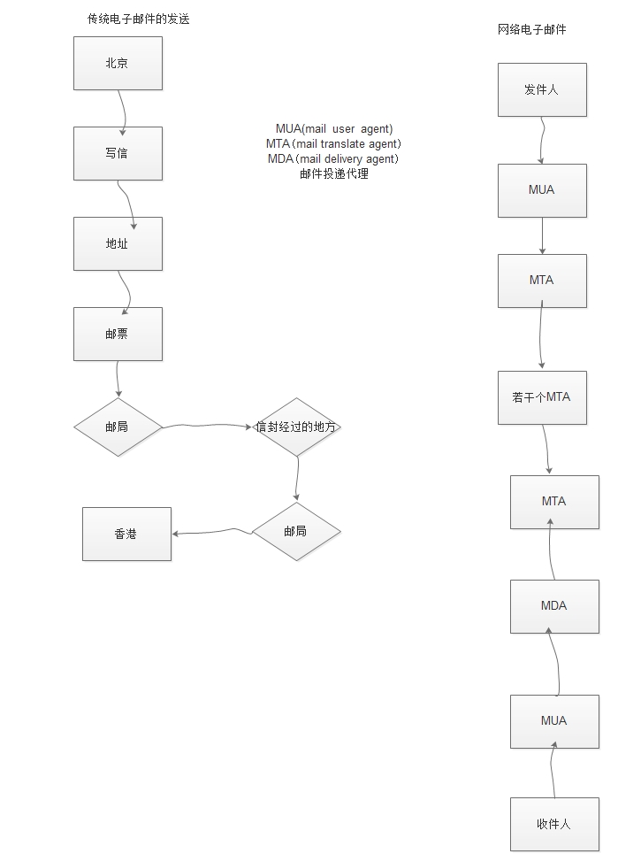
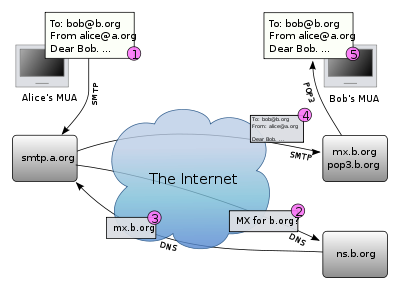
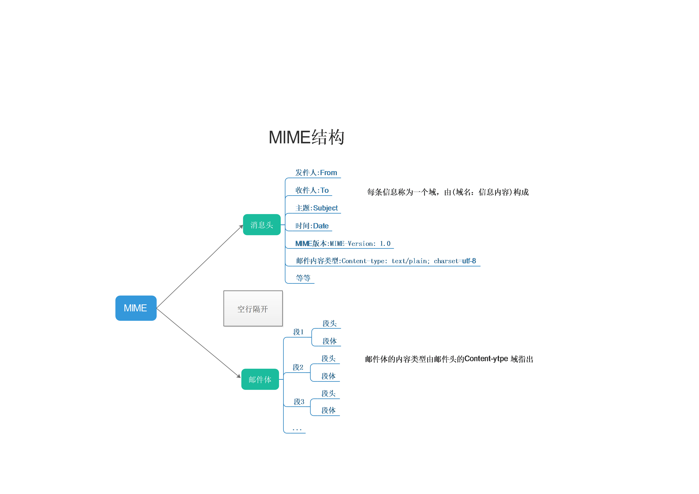
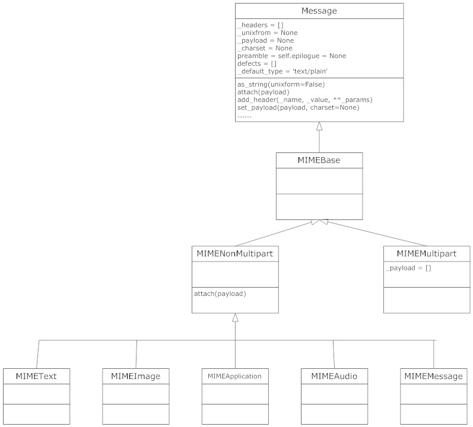
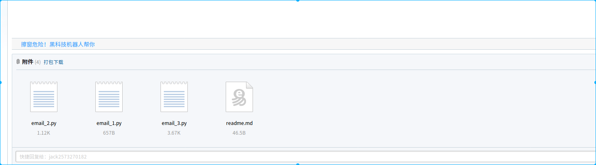

## mail

[TOC]

### 1.电子邮件概述

#### 1.1 电子邮件定义

> [电子邮件](https://zh.wikipedia.org/wiki/%E7%94%B5%E5%AD%90%E9%82%AE%E4%BB%B6),又称电子邮箱，简称电邮，是指一种由一寄件人将数字信息发送给一个人或多个人的信息交换方式，一般会通过互联网或其他电脑网络进行书写、发送和接收信件，目的是达成发信人和收信人之间的信息交互

#### 1.2 电子邮件的传输过程

> 
>
> 假设Alice(alice@a.org)利用电子邮件客户端写了一封电邮，输入收信人Bob(Bob@b.org)的电邮地址，按下“寄信”钮后，后续的流程如下：
>
> - 1.Alice通过foxmail把邮件写好，填写了对方Bob的email地址，点击“发送”，电子邮件发出。(这样的电子邮件被成为MUA--Mail User Agent--邮件用户代理)
> - 2.Email从MUA发出去，不是直接到达对方的电脑，而是发给被的MTA(Mail Transfer Agent--邮件传输代理)，也就是那些Email服务供应商，比如163，sina等，这里把邮件发送给a提供的MTA，再由a的MTA发送给b的MTA。在这个过程中还要经过别的MTA。
> - 3.Email到达b的MTA后，由于双方都是使用的@b.org，因此b的MTA投递到邮件的最终目的地MDA(Mail   Delivery Agent--邮件投递代理)，email到达MDA后，就停留在服务器上，存放在某个文件或数据库中，我们将这个长期保存邮件的地方称为电子邮箱。
> - 4.Bob通过自己的foxmail，通过MUA从MDA上把邮件提取到自己的电脑上。
>
>   

#### 1.3 Python邮件编程

> 所以要编写程序来发送和接受邮件，本质就是：
> + 1.编写MUA把邮件发送给MTA
> + 2.编写MUA把邮件从MDA上收取
>
> 发邮件时，MUA和MTA使用的协议就是SMTP：
> + Simple Mail Transfer Protocol，后面的MTA到另一个MTA也是用SMTP协议。
>
> 收邮件时，MUA和MDA使用的协议有两种：
> + POP：Post Office Protocol，目前版本是3，俗称POP3；
> + IMAP：Internet Message Access Protocol，优点是不但能取邮件，还可以直接操作MDA上存储的邮件，比如从收件箱移到垃圾箱，等等。
>
> 邮件客户端软件在发邮件时，会让你先配置SMTP服务器，也就是你要发到哪个MTA上。假设你正在使用163的邮箱，你就不能直接发到新浪的MTA上，因为它只服务新浪的用户，所以，你得填163提供的SMTP服务器地址：smtp.163.com，为了证明你是163的用户，SMTP服务器还要求你填写邮箱地址和邮箱口令，这样，MUA才能正常地把Email通过SMTP协议发送到MTA。
>
> 类似的，从MDA收邮件时，MDA服务器也要求验证你的邮箱口令，确保不会有人冒充你收取你的邮件，所以，Outlook之类的邮件客户端会要求你填写POP3或IMAP服务器地址、邮箱地址和口令，这样，MUA才能顺利地通过POP或IMAP协议从MDA取到邮件。

### 2.内置标准库

> [Python内置标准库](http://python.usyiyi.cn/translate/python_352/library/email.html)

### 3.SMTP发送邮件

#### 3.1 简介

> ##### Python SMTP支持
>
> SMTP(Simple Mail Transfer Protocol,简单邮件传输协议)是发送邮件的协议，Python内置对SMTP的支持，可以发送纯文本邮件、HTML邮件以及带附件的邮件。python发送邮件主要使用到了smtplib和email两个模块，email负责构造邮件，smtplib负责发送邮件
>
> ##### 邮件格式(RFC_2822)
>
> 每封邮件都有两个部分：邮件头和邮件体，两者使用一个空行分隔。
>
> 邮件头每个字段 (Field) 包括两部分：字段名和字段值，两者使用冒号分隔。有两个字段需要注意：From和Sender字段。From字段指明的是邮件的作者，Sender字段指明的是邮件的发送者。如果From字段包含多于一个的作者，必须指定Sender字段；如果From字段只有一个作者并且作者和发送者相同，那么不应该再使用Sender字段，否则From字段和Sender字段应该同时使用。
>
> 邮件体包含邮件的内容，它的类型由邮件头的Content-Type字段指明。RFC 2822定义的邮件格式中，邮件体只是单纯的ASCII编码的字符序列
>
> ##### MIME (Multipurpose Internet Mail Extensions) (RFC 1341)
>
> MIME扩展邮件的格式，用以支持非ASCII编码的文本、非文本附件以及包含多个部分 (multi-part) 的邮件体等。
>
> MIME消息是由消息头和消息体2大部分组成，在邮件中对应了邮件头和邮件体。邮件头和邮件体之间以空行分割.
>
> 
>
> - 邮件头包含了发件人、收件人、主题、时间、MIME版本、邮件内容的类型等重要信息。每条信息称为一个域，由域名后加“: ”和信息内容构成，可以是一行，较长的也可以占用多行。域的首行必须“顶头”写，即左边不能有空白字符（空格和制表符）；续行则必须以空白字符打头，且第一个空白字符不是信息本身固有的
> - 邮件体包含邮件的内容，它的类型由邮件头的“Content-Type”域指出。最常见的类型有text/plain(纯文本)和text/html(超文本)。邮件体被分为多个段，每个段又包含段头和段体两部分，这两部分之间也以空行分隔。常见的multipart类型有三种：multipart/mixed, multipart/related和multipart/alternative
>
> ##### MIME函数的层次结构
>
> 

#### 3.2 模块

##### 3.2.1 smtplib

> SMTP类构造函数，表示与smtp服务器之间的连接，通过这个连接可以向smtp服务器发送指令,执行相关操作，(登陆，发送邮件等等)
>
> ##### 链接服务器分为2种
>
> - 一种是使用`smtlib.SMTP()`,这是默认的SMTP协议(端口25)链接
> - 一种是使用`smtplib.SMTP_SSL()` ,这是使用加密的SMTP协议链接(端口465)
> - `smtplib.SMTP_SSL()` 拥有和`smtplib.SMTP()` 实例同样的行为(方法)
>
> ```python
> import smtplib
>
> # 不加密
> smtplib.SMTP(host='', port=0, local_hostname=None, [timeout, ]source_address=None)
> #host：smtp服务器主机名
> #port：smtp服务器的端口，默认是25，ssl端口465
>
> # 加密
> smtplib.SMTP_SSL(host='', port=0, local_hostname=None, keyfile=None, certfile=None, [timeout, ]context=None, source_address=None)
> ```

##### 3.2.2 smtplib.SMTP 操作方法

> | 方法                                       | 含义                                       |
> | ---------------------------------------- | ---------------------------------------- |
> | with.....as .....                        | 支持上下文管理器                                 |
> | SMTP.set_debuglevel(level)               | 设置是否是调试模式，默认为false，表示不输出任何调试信息           |
> | SMTP.connect([host[,port]])              | 连接到指定的smtp服务器，参数表示smtp主机和端口<br>注意：可以在host参数中指定端口号(eg:smtp.yeah.net:25),这样就不用给出port参数 |
> | SMTP.docmd(cmd[,argsring])               | 向smtp服务器发送指令。可选参数argsring表示执行的参数         |
> | SMTP.hello([hostname])                   | 使用'helo'指令向服务器确认身份，相当于告诉smtp服务器'who am I' |
> | SMTP.has_extn(name)                      | 判断指定名称在服务器邮件列表中是否存在。出入安全考虑，smtp服务器往往屏蔽了该指令 |
> | SMTP.verify(address)                     | 判断指定邮件地址是否在服务器中存在。出于安全考虑，smtp服务器往往屏蔽了该令。 |
> | SMTP.login(user,password)                | 登陆服务器                                    |
> | SMTP.sendmail(from_addr,<br>to_addr,msg[,mail_options,rcpt_options]) | 发送邮件。这里要注意一下第三个参数，<br>msg是字符串，表示邮件。我们知道邮件一般由标题，发信人，收件人，邮件内容，附件等构成，发送邮件的时候，要注意msg的格式。这个格式就是smtp协议中定义的格式。 |
> | SMTP.send_message(msg,<br /> from_addr=None,<br /> to_addrs=None, <br />mail_options=[],<br /> rcpt_options=[]) | 和sendmail唯一的区别在于发送的不是字符串,是一个`email.message.Message` 对象 |
> | SMTP.quit()                              | 断开于smtp服务器的连接                            |
>
> 示例:
>
> ```python
> #!/usr/bin/env python
> # -*- coding: utf-8 -*-
> # @Author: ningyanke
> # @Date:   2018-01-20 02:14:24
> # @Last Modified by:   ningyanke
> # @Last Modified time: 2018-01-20 02:24:37
>
>
> import smtplib
>
>
> def prompt(prompt):
>     return input(prompt).strip()
>
> fromaddr = prompt('From:')
> toaddrs = prompt('To:').split()   # 可能会发送多个人,而且是字符串
> print('ENter message, end with ^D(Unix) or ^Z(windowns):')
>
> # 发送的消息
> msg = ('From:%s\r\nTo:%s\r\n\r\n' % (fromaddr, "".join(toaddrs)))
>
> while True:
>     try:
>         line = input()
>     except EOFError:
>         break
>     if not line:
>         break
>     msg = msg + line
>
> print('Message lenth is:', len(msg))
>
> with smtplib.SMTP('localhost:') as server:
>     server.set_debuglevel(1)
>     server.sendmail(fromaddr, toaddrs, msg)
> ```

##### 3.2.3 email模块

> email模块是用来处理邮件消息(生成邮件,解析邮件)，包括MIME和其他基于RFC 2822 的消息文档。使用这些模块来定义邮件的内容。
>
> email模块中,基类是 `email.message.Message` 类,正如包结构一样.这个文件位于
>
> `/email/message/Message.py` 是所有email的基类.
>
> 我们可以从头构建完整的消息结构, 或者手动构造单个Message对象,或者在现有的结构中添加Message对象(attach),也可以创建 Message的实例,手动添加附件和所有适当的标题来创建新的对象结构,对于MIME结构邮件,可以使用`email.mime` 来构造.其包括的类[点此查看详细的介绍](http://python.usyiyi.cn/translate/python_352/library/email.mime.html), 正如前面所说的,他们都是继承自基类`Message` ,[源码](https://hg.python.org/cpython/file/3.5/Lib/email/mime/base.py) 
>
> `Message`类常用方法
>
> - ` Message.set_payload(payload, charset=None)` 将真个消息对象的有效内容设置为有效内容
>
>
> - ` Meesage.attach(payload)` 将给定的有效内容添加到当前有效内容
>
> - `Message.add_header(*_name*, *_value*, **\*_params*)` 添加头部字段
>
> - `Message.as_string` : 将`Message` 的实例对象转换成字符串,这样可以使用`smtplib.sendemail` 来发送,否则,对于`Message` 实例对象使用`smtplib.send_Message来发送`
>
> - `Message` 实例对象支持字典操作
>
> - `Message['subject'] /message.get('subject')` :设置/提取邮件标题
>
> - `Message['To'] /message.get('To')`
>
> - `Message['From'] /message.get('From')`  
>
> - `Message.keys(), Message.items`
>
> - 中文邮件的标题和内容都是base64编码的.解码可以使用email.header 里的decode_header()方法. 
>   比如 print mail['subject']   显示的都未处理的编码. 
>
> - `get_payload() `这个方法可以把邮件的内容解码并且显示出来.第一个可选择参数是mail实例,第二个参数是decode='编码' ,一般都是,'base64'编码
>
> - is_multipart(),这个方法返回boolean值，如果实例包括多段，就返回True, 
>
>   ```python
>   print mail.is_multipart() 
>   true  ,这说明这个mail邮件包含多个字段
>   ```
>
>   等等
>
> `email.mime` 包含的类
>
> | 名称                                       | 内容                                       |
> | ---------------------------------------- | ---------------------------------------- |
> | class email.mime.base.MIMEBase(_maintype,<br>_subtype, <br>**_params ) | 这是MIME的一个基类<br>_maintype是内容类型(eg:text or image) <br>_subtype是内容的minor type类型(eg:plain or gif) <br>**_params是一个字典，直接传递给Message.add_header()。 |
> | class email.mine.multipart.MIMEMultipart([_subtype[,<br>boundary[,<br>_subparts[,<br>_params]]]]) | MIMEBase的一个子类<br>多个MIME对象的集合，<br>_subtype默认值为mixed。<br>boundary是MIMEMultipart的边界，默认边界是可数的。 |
> | class email.mime.application.MIMEApplication(_data[,<br> _subtype[,<br> _encoder[,<br> **_params]]]) | MIMEMultipart的一个子类                       |
> | class email.mime.audio.MIMEAudio(_audiodata[,<br> _subtype[,<br> _encoder[,<br> **_params]]]) | MIME音频对象                                 |
> | class email.mime.image.MIMEImage(_imagedata[,<br>_subtype[,<br> _encoder[,<br> **_params]]]) | MIME二进制对象                                |
> | class email.mime.message.MIMEMessage(_msg[,<br>_subtype]) | 具体的一个message实例                           |
> | class email.mime.text.MIMEText(_text[,<br>_subtype[,<br>_charset]]) | MIME文本对象，<br>其中_text是邮件内容，<br>_subtype邮件类型，可以是text/plain（普通文本邮件），html/plain(html邮件),  <br>_charset编码，可以是gb2312,utf-8等等。 |

##### 3.2.4 发送邮件

> [email示例](http://python.usyiyi.cn/documents/python_352/library/email-examples.html)
>
> 发送邮件有2种形式
>
> - sendmail --> 必须是字符串对象
> - send_message  --> 必须是个Message对象
>
> ##### 发送文本邮件
>
> 大致的流程如下
>
> ```markdown
>                       python-email
>                           |
>                           |
>     -------------------------------------
>     |                      |            |
>    登录                  写邮件        发邮件
>     |                      |            |-邮件接收方地址
>     |-服务器设置             |-信息发送方
>     |    |                 |-信息接收方
>     |    |-smtp            |-邮件主题
>     |    |-smtp_SSL        |-邮件内容
>     |                     	   |
>     |-用户名                    |-文本
>     |-密码                      |-附件
>     |_服务器地址
> ```
>
> ```python
> #!/usr/bin/env python 
> # coding=utf-8
>
> """
> Python 对SMTP支持的有 smtplib 和 email
> email 负责构造邮件, smtplib负责发送邮件
> """
>
> import smtplib  # 导入发送邮件 smtplib
> from email.mime.text import MIMEText  # 导入接收邮件 email
>
> '''设置服务器所需要的信息'''
> # gmail 服务器 smtp 地址
> mail_host = 'smtp.gmail.com'
> # gmail 用户名
> mail_user = '****'
> # gmail 密码(如果是qq邮箱则需要授权码)
> mail_passwd = '****'
>
> # 邮件发送方地址
> sender = '****'
> # 邮件接收方地址 注意需要[]包裹，这意味着可以写多个邮件地址群发
> receivers = ['***']  # 可能有多个接收方
>
> '''设置email的信息,邮件内容的设置'''
> # 纯文本发送
> text = "I love You"  # 指定发送的信息内容
> subtype = 'plain'  # 指定信息的类型
> charset = 'utf-8'  # 指定文字编码
> message = MIMEText(text, subtype, charset)
>
> # 邮件主题
> message['Subject'] = u'这是来自gmail的python测试邮件'
> # 发送方的信息
> message['From'] = sender
> # 接收方信息
> message['To'] = receivers[0]  # message['To'] 接收的是字符串,如果有多个,需要逗号隔开
>
>
> def main():
>     '''登录并发送邮件'''
>     try:
>         smtpObj = smtplib.SMTP_SSL(mail_host, 465)  # 使用ssl加密传输
>         # smtpObj.connect(mail_host, 25)  # 连接到服务器
>         smtpObj.login(mail_user, mail_passwd)  # 登录到服务器
>         smtpObj.sendmail(
>             sender,  # 发送者
>             receivers,  # 接收者
>             message.as_string()  # 发送的字符串
>         )
>         smtpObj.quit()
>         print('发送成功')
>     except Exception as e:
>         print(e)  # 否则打印错误
>
>
> if __name__ == '__main__':
>     main()
> ```
>
> ##### 发送富文本邮件
>
> 流程和上面一样,唯一不同的是把`Text` 替换成了`HTML` 超文本
>
> ```markdown
>                 python-email
>                      |
>                      |preamble	
>     ------------------------------
>     |                |            |
>    登录             写邮件        发邮件
>     |                |            |-邮件接收方地址
>     |-服务器设置       |-信息发送方
>     |    |           |-信息接收方
>     |    |-smtp      |-邮件主题
>     |    |-smtp_SSL  |-邮件内容
>     |                      |
>     |-用户名                |-文本
>     |-密码                  |-附件
>     |_服务器地址
> ```
>
> ```python
> #!/usr/bin/env python 
> # coding=utf-8
>
> """
> Python 对SMTP支持的有 smtplib 和 email
> email 负责构造邮件, smtplib负责发送邮件
> """
>
> import smtplib  # 导入发送邮件 smtplib
> from email.mime.text import MIMEText  # 导入接收邮件 email
>
> '''设置服务器所需要的信息'''
> # gmail 服务器 smtp 地址
> mail_host = 'smtp.gmail.com'
> # gmail 用户名
> mail_user = '****'
> # gmail 密码(如果是qq邮箱则需要授权码)
> mail_passwd = '****'
>
> # 邮件发送方地址
> sender = '****'
> # 邮件接收方地址 注意需要[]包裹，这意味着可以写多个邮件地址群发
> receivers = ['***']  # 可能有多个接收方
>
> '''设置email的信息,邮件内容的设置'''
> # 富文本消息
> text = '''
>     <html>
>         <head>
>             <meta charset="UTF-8">
>             <title>连接</title>
>         </head>
>         <body>
>         <h1>
>             hello world
>         </h1>
>         <p>
>             <a href='http://www.kningyuan.cn'>kningyuan</a>
>         </p>
>         </body>
>     </html>
> '''
> subtype = 'plain'  # 指定信息的类型
> charset = 'utf-8'  # 指定文字编码
> message = MIMEText(text, subtype, charset)
>
> # 邮件主题
> message['Subject'] = u'这是来自gmail的python测试邮件'
> # 发送方的信息
> message['From'] = sender
> # 接收方信息
> message['To'] = receivers[0]  # message['To'] 接收的是字符串,如果有多个,需要逗号隔开
>
>
> def main():
>     '''登录并发送邮件'''
>     try:
>         smtpObj = smtplib.SMTP_SSL(mail_host, 465)  # 使用ssl加密传输
>         # smtpObj.connect(mail_host, 25)  # 连接到服务器
>         smtpObj.login(mail_user, mail_passwd)  # 登录到服务器
>         smtpObj.sendmail(
>             sender,  # 发送者
>             receivers,  # 接收者
>             message.as_string()  # 发送的字符串
>         )
>         smtpObj.quit()
>         print('发送成功')
>     except Exception as e:
>         print(e)  # 否则打印错误
>
>
> if __name__ == '__main__':
>     main()
> ```
>
> ##### 发送带图片附件的邮件
>
> 可以构造一个`MIMEMUltipart` 对象代表邮件本身,然后往里面加一个`MIMEText` 作为邮件正文,在继续往里面添加表示附件的`MIMEBase` 对象
>
> ```python
> #!/usr/bin/env python
> # coding=utf-8
>
> '''
> 发送带有图片附件的邮件
> '''
>
> from email.mime.text import MIMEText
> import smtplib
>
> '''
> email.encoders encode
> email.header  国际化标头
> email.utils 其他的实用程序
> email.utils.parseaddr 解析地址,返回一个元组,(realname, email_address)
> email.utils.formataddr  parseaddr的逆过程
> '''
>
>
> from email import encoders
> from email.header import Header
> from email.utils import parseaddr, formataddr
>
>
> from email.mime.multipart import MIMEMultipart
> from email.mime.base import MIMEBase
> from email.mime.image import MIMEImage
>
>
> def _format_addr(s):
>     name, addr = parseaddr(s)
>     return formataddr(
>         (Header(name, 'utf-8').encode(),
>          addr)
>     )
>
>
> # 邮箱的基本信息
> mail_host = 'smtp.gmail.com'
> mail_user = '****'
> mail_passwd = '****'
>
> # 定义发送者和接受者
> sender = '****'
> receivers = ['****']
>
> # 设置email的信息
> # 添加一个MIMEmultipart 类,处理正文和附件
> messages = MIMEMultipart()
> messages['From'] = _format_addr(u'JackNing %s' % sender)
> messages['To'] = _format_addr(u'Tom %s' % receivers[0])
> messages['Subject'] = Header(u'带附件的Python测试邮件', 'utf-8').encode()
>
>
> # 邮件正文
> text = '''
>     <html>
>         <head>
>             <meta charset="UTF-8">
>             <title>连接</title>
>         </head>
>         <body>
>         <h1>
>             hello world
>         </h1>
>         <p>
>             <a href='http://www.kningyuan.cn'>kningyuan</a>
>         </p>
>         <p>
>             <p>
>         </p>
>         </body>
>     </html>
> '''
> messages.attach(MIMEText(text, 'html', 'utf-8'))
>
>
> with open('./background.png', 'rb') as f:
>     # 设置附件的MIME和文件名,这是png类型
>     mime = MIMEBase('image', 'png', filename='background.png')
>     # 加上必要的头信息
>     mime.add_header('Content-Dispositon', 'attachemen',
>                     filename='background.png')
>     mime.add_header('Content-ID', '<0>')
>     mime.add_header('X-Attachment-ID', '0')
>     # 把附件内容读进来
>     mime.set_payload(f.read())
>     # 用base64编码
>     encoders.encode_base64(mime)
>     # 添加到MIMEutipart
>     messages.attach(mime)
>
>
> def main():
>     try:
>         smtpobj = smtplib.SMTP_SSL(mail_host, 465)
>         smtpobj.login(mail_user, mail_passwd)
>         smtpobj.sendmail(sender, receivers, messages.as_string())
>         print("发送成功")
>         smtpobj.quit()
>     except smtplib.SMTPException as e:
>         print(e)
>
>
> if __name__ == '__main__':
>     main()
>
> ```
>
> 修改的易读一点
>
> ```python
> #!/usr/bin/env python
> # -*- coding: utf-8 -*-
> # @Author: ningyanke
> # @Date:   2018-01-19 21:58:13
> # @Last Modified by:   ningyanke
> # @Last Modified time: 2018-01-20 00:27:11
>
> from email.mime.multipart import MIMEMultipart
> from email.mime.text import MIMEText
> from email.mime.image import MIMEImage
> from email.header import Header
> import smtplib
>
>
> def sendEmail(authInfo, fromAdd, toAdd, subject, plainText):
>     strFrom = fromAdd
>     strTo = ';'.join(toAdd)
>     server = authInfo.get('server')
>
>     # smtpPort = 25
>     sslport = 465
>     user = authInfo.get('user')
>     passwd = authInfo.get('passwd')
>     if not (server and user and passwd):
>         print('exit now')
>         return
>
>     # 设定root信息
>     msgRoot = MIMEMultipart('related')
>     msgRoot['Subject'] = Header(subject, 'utf-8').encode()
>     msgRoot['From'] = '%s<%s' % (Header('测试', 'utf-8'), strFrom)
>     msgRoot['To'] = strTo
>
>     # 邮件正文内容
>     msgText = MIMEText(plainText, 'plain', 'utf-8')
>     msgAlternative = MIMEMultipart('alternative')
>     msgRoot.attach(msgAlternative)
>     # 设置图片信息
>     fp = open('./background.png', 'rb')
>     msgImage = MIMEImage(fp.read())
>     msgImage['Content-Type'] = 'application/octet-stream'
>
>     # filename 可自定义,供邮件中显示
>     msgImage['Content-Disposition'] = "attachment; filename='background.png'"
>     fp.close()
>
>     msgImage.add_header('Content-ID', '<pic_attach>')
>     msgAlternative.attach(msgImage)
>     try:
>         # 发送邮件
>         smtp = smtplib.SMTP()
>         # smtp.connect(server, smtpPort)
>         # ssl加密方式，通信过程加密，邮件数据安全
>         smtp = smtplib.SMTP_SSL(server, sslport)
>         # smtp.connect(server, sslPort)
>         # 设定调试级别，依情况而定
>         smtp.set_debuglevel(1)
>         smtp.login(user, passwd)
>         smtp.sendmail(strFrom, toAdd, msgText.as_string())
>         smtp.quit()
>         print("邮件发送成功!")
>     except Exception as e:
>         print('失败', e)
>
>
> if __name__ == '__main__':
>     authInfo = {}
>     authInfo['server'] = 'smtp.gmail.com'
>     authInfo['user'] = '****'
>     authInfo['passwd'] = '****'
>     fromAdd = '****'
>     toAdd = ['****']
>     subject = 'Email subject'
>     plainText = '测试'
>     sendEmail(authInfo, fromAdd, toAdd, subject, plainText)
>
> ```
>
> ##### 发送文本和图片的邮件
>
> ```python
> #!/usr/bin/env python
> # -*- coding: utf-8 -*-
> # @Author: ningyanke
> # @Date:   2018-01-20 02:50:40
> # @Last Modified by:   ningyanke
> # @Last Modified time: 2018-01-20 03:26:02
>
> """
> 发送文本,图片
> """
>
> from email.mime.multipart import MIMEMultipart
> from email.mime.image import MIMEImage
> from email.mine.text import MIMEText
> import smtplib
>
>
> '''text and html'''
>
>
> def make_mpa_msg():
>
>     email = MIMEMultipart('alternative')  # multipart代表多个部分
>     text = MIMEText('hello world', 'text', 'utf-8')
>     email.attach(text)  # 将text添加到了email中
>     html_message = '''
>         <html>
>             <body>
>                 <a href='www.kningyuan.cn'>kningyuan</a>
>             </body>
>         </html>
>         '''
>     html = MIMEText(html_message, 'html', 'utf-8')
>     email.attach(html)
>     return email
>
> # image
>
>
> def make_img_msg(fn):
>     with open(fn, 'rb') as f:
>         data = f.read()
>
>     email = MIMEImage(data, name=fn)
>     email.add_header('Content-Disposition', 'attachment', filename='%s' % fn)
>     return email
>
>
> def sendmsg(fr, to, msg):
>     smtp_host = '***'
>     user = '***'
>     passwd = '***'
>     ssl_port = '***'
>     s = smtplib.SMTP_SSL(smtp_host, ssl_port)
>     s.login(user, passwd)
>     errs = s.sendmail(fr, to, msg)
>     s.quit()
>
>
> if __name__ == '__main__':
>     print('sending multipart alternative msg...')
>     msg = make_mpa_msg()
>     msg['From'] = SENDER
>     msg['To'] = ",".join(RECIPS)
>     msg['Subject'] = 'test'
>     sendmsg(SENDER, RECIPS, msg.as_string())
>
>     print('image_file')
>     msg = make_img_msg()
>     msg['From'] = SENDER
>     msg['To'] = ",".join(RECIPS)
>     msg['Subject'] = 'test'
>     sendmsg(SENDER, RECIPS, msg.as_string())
>
> ```
>
> ##### 发送目录中的所有格式的内容
>
> ```python
> #!/usr/bin/env python
> # coding=utf-8
> # author:ning
>
>
> '''以电子邮件的形式发送目录的全部内容'''
> '''send the contents of a directory as a MIME message'''
>
>
> import os
> import sys
> import smtplib
>
> import mimetypes  # 猜测文件的类型
>
> from argparse import ArgumentParser  # 解析命令行参数
>
> from email import encoders
> from email.message import Message
> from email.mime.audio import MIMEAudio
> from email.mime.base import MIMEBase
> from email.mime.image import MIMEImage
> from email.mime.multipart import MIMEMultipart
> from email.mime.text import MIMEText
>
>
> CommaSpace = ','
>
>
> def main():
>     parser = ArgumentParser(description="""
>         将目录的内容作为MIME消息发送
>         """)
>     parser.add_argument('-d', '--directory',
>                         help='''发送指定目录的内容,不会递归发送''')
>
>     parser.add_argument('-o', '--output',
>                         metavar='FILE', help='''消息打印到FILE''')
>
>     parser.add_argument('-s', '--sender',
>                         required=True,
>                         help='The value of the From: header (required)')
>
>     parser.add_argument('-r', '--recipient', required=True,
>                         action='append', metavar='RECIPIENT',
>                         default=[], dest='recipients',
>                         help='A To: header value (at least one required)')
>
>     args = parser.parse_args()
>     # 指定目录, 如果没有指定特别的目录,那么指定当前目录
>     directory = args.directory
>     if not directory:
>         directory = '.'
>
>     # 创建message
>     outer = MIMEMultipart()
>     outer['From'] = args.sender
>     outer['To'] = CommaSpace.join(args.recipients)
>     outer['Subject'] = 'Contents of directory %s' % os.path.abspath(directory)
>
>     for filename in os.listdir(directory):
>         path = os.path.join(directory, filename)
>         if not os.path.isfile(path):
>             continue
>
>         # 猜测 ctype的类型
>         ctype, encoding = mimetypes.guess_type(path)
>         if ctype is None or encoding is not None:  # 猜测不到数据类型
>             ctype = 'application/octter-stream'   # 通用格式
>
>         maintype, subtype = ctype.split('/', 1)
>         if maintype == 'text':
>             with open(path) as fp:
>                 # 指定数据类型
>                 msg = MIMEText(fp.read(), _subtype=subtype)
>         elif maintype == 'image':
>             with open(path, 'rb') as fp:
>                 msg = MIMEImage(fp.read(), _subtype=subtype)
>         elif maintype == 'audio':
>             with open(path, 'rb') as fp:
>                 msg = MIMEAudio(fp.read(), _subtype=subtype)
>         else:
>             '''如果识别不到,就用基类来重构'''
>             with open(path, 'rb') as fp:
>                 msg = MIMEBase(maintype, subtype)
>                 # 重载称为有效内容
>                 msg.set_payload(fp.read())
>             # base64编码
>             encoders.encode_base64(msg)
>         # 添加标头信息
>         msg.add_header('Content-Disposition', 'attachment', filename=filename)
>         outer.attach(msg)
>
>     # 传递的是字符串数据
>     composed = outer.as_string()
>     if args.output:
>         with open(args.output, 'w') as fp:
>             fp.write(composed)
>     else:
>         host = 'smtp.gmail.com'
>         port = '465'
>         user = input('user:')
>         passwd = input('passwd:')
>
>         try:
>             with smtplib.SMTP_SSL(host, port) as s:
>                 s.login(user, passwd)
>                 s.sendmail(args.sender, args.recipients, composed)
>             print('发送成功')
>         except Exception as e:
>             print(e)
>
> if __name__ == '__main__':
>     main()
> ```
>
> 执行
>
> ```bash
> $ python email_3.py -s jack2573270182@gmail.com -r 18518506689@163.com
> ```
>
> 效果
>
> ```bash
> # 目录文件
> $ tree 
> .
> ├── email_1.py
> ├── email_2.py
> ├── email_3.py
> ├── pic
> │   ├── base64_test.jpg
> │   └── logo.jpg
> └── readme.md
> ```
>
> 
>
> ##### 以Message类型对象发送附件
>
> ```python
> from email.mime.image import MIMEImage
> from email.mime.multipart import MIMEMultipart  # 导入一个容器对象
>
> import smtplib
>
>
> CommaSpace = ',' # 
>
> print('邮件发送发,接收方')
> me = input('From:').strip()
> you = input('To:').strip()
> family = you.split(',')
>
> # 创建一个 container
>
> msg = MIMEMultipart()
> msg['Subject'] = '家庭照片'
> msg['From'] = me
> msg['To'] = CommaSpace.join(family)
> # msg.preamble('此文本不可见')
>
>
> pngfiles = ['./pic/base64_test.jpg', './pic/logo.jpg']
>
> for file in pngfiles:
>     with open(file, 'rb') as fp:
>         img = MIMEImage(fp.read())
>         # 自定义头文件, filname 是在邮件中显示的名字
>         img['Content-Desposition'] = 'attachment; filname=file'
>     msg.attach(img)
>
> print('发送发用户名和密码')
> host = 'smtp.gmail.com'
> port = '465'
> user = input('user:')
> passwd = input('passwd:')
>
> try:
>     with smtplib.SMTP_SSL(host, port) as s:
>         s.login(user, passwd)
>         s.send_message(msg, me, CommaSpace.join(family))
>     print('发送成功')
> except Exception as e:
>     print(e)
>
> ```
>
> ##### 结合docopt来写程序
>
> ```python
> #!/usr/bin/env python
> # -*- coding: utf-8 -*-
> # @Author: chanafanghua
> # @Date:   2018-01-21 00:40:37
> # @Last Modified by:   chanafanghua
> # @Last Modified time: 2018-01-21 02:49:16
>
>
> """发送文本邮件
> Usage:
>     发送文本邮件.py (-h| --help)
>     发送文本邮件.py user <user> passwd <passwd> from <from> to <to>
>     发送文本邮件.py (-u| --user)
>
> Options:
>     -h --help  # Python 对SMTP支持的有 smtplib 和 email
>                # email 负责构造邮件, smtplib负责发送邮件
>                # 使用基本的流程
>                # 初始化服务器
>                # 登录服务器
>                # 操作服务器
>                # 登出服务器
>     user=None # 用户名
>     passwd=None  # 密码
>     from=None  # 发送者
>     to=None    # 接收者,多个接收者之间用逗号分隔
> """
>
> from docopt import docopt
>
> import smtplib  # 导入发送邮件 smtplib
> from email.mime.text import MIMEText  # 导入接收邮件 email
> import sys
>
>
> def plan1():
>     '''设置服务器所需要的信息'''
>     # gmail 服务器 smtp 地址
>     mail_host = 'smtp.gmail.com'
>     # gmail 用户名
>     mail_user = input("User:")
>     # gmail 密码(如果是qq邮箱则需要授权码)
>     mail_passwd = input('Passwd')
>
>     # 邮件发送方地址
>     sender = input("From:")
>     # 邮件接收方地址 注意需要[]包裹，这意味着可以写多个邮件地址群发
>     receivers = input("To:")  # 可能有多个接收方,接受方之间用逗号分隔
>     receivers = receivers.split(',')
>
>     '''设置email的信息,邮件内容的设置'''
>     # 纯文本发送
>     text = "I love You"  # 指定发送的信息内容
>     subtype = 'plain'  # 指定信息的类型
>     charset = 'utf-8'  # 指定文字编码
>     message = MIMEText(text, subtype, charset)
>
>     # 邮件主题
>     message['Subject'] = u'这是来自gmail的python测试邮件'
>     # 发送方的信息
>     message['From'] = sender
>     # 接收方信息
>     message['To'] = ', '.join(receivers)  # message['To'] 接收的是字符串,如果有多个,需要逗号隔开
>
>     return mail_user, mail_passwd, mail_host, message, sender, receivers
>
>
> def plan2():
>     argments = docopt(__doc__)
>     mail_user = argments['<user>']
>     mail_passwd = argments['<passwd>']
>     sender = argments['<from>']
>     receivers = argments['<to>']
>
>     mail_host = 'smtp.gmail.com'
>     '''设置email的信息,邮件内容的设置'''
>     # 纯文本发送
>     text = "I love You"  # 指定发送的信息内容
>     subtype = 'plain'  # 指定信息的类型
>     charset = 'utf-8'  # 指定文字编码
>
>     message = MIMEText(text, subtype, charset)
>
>     # 邮件主题
>     message['Subject'] = u'这是来自gmail的python测试邮件'
>     # 发送方的信息
>     message['From'] = sender
>     # 接收方信息
>     message['To'] = receivers  # message['To'] 接收的是字符串,如果有多个,需要逗号隔开
>     # print(argments)
>     return mail_passwd, mail_user, sender, receivers, \
>         message, mail_host
>
>
> '''
> def main():
>     plan_2 = plan2()
>     mail_host = plan_2[5]
>     mail_user = plan_2[1]
>     mail_passwd = plan_2[0]
>     sender = plan_2[2]
>     receivers = plan_2[3]
>     message = plan_2[4]
>     print(mail_host, mail_user, mail_passwd,
>           sender, receivers, message)
> '''
>
>
> def main():
>     '''登录并发送邮件'''
>     try:
>         if sys.argv[1]:
>
>             plan_2 = plan2()
>             mail_host = plan_2[5]
>             mail_user = plan_2[1]
>             mail_passwd = plan_2[0]
>             sender = plan_2[2]
>             receivers = plan_2[3]
>             message = plan_2[4]
>             # print(mail_host, mail_user, mail_passwd,
>             #      sender, receivers, message)
>         else:
>             print('start')
>             plan_1 = plan1()
>             mail_host = plan_1[2]
>             mail_user = plan_1[0]
>             mail_passwd = plan_1[1]
>             sender = plan_1[4]
>             receivers = plan_1[5]
>             message = plan_1[3]
>         smtpObj = smtplib.SMTP_SSL(mail_host, 465)  # 使用ssl加密传输
>         smtpObj.login(mail_user, mail_passwd)  # 登录到服务器
>         smtpObj.sendmail(
>             sender,  # 发送者
>             receivers,  # 接收者
>             message.as_string()  # 发送的字符串
>         )
>
>         smtpObj.quit()
>         print('发送成功')
>     except Exception as e:
>         print(e)  # 否则打印错误
>
>
> if __name__ == '__main__':
>     main()
>
> ```
>
> [docopt](../other_model/docopt.md)
>
> 结合的好处是可以随时查看帮助,而且可以直接一行输入文本发送
>
> ```bash
> $ python 发送文本邮件.py user jack2573270182 passwd 2008.Cn123 from jack2573270182@gmail.com to 18518506689@163.co^C
> $ python 发送文本邮件.py  --help
> 发送文本邮件
> Usage:
>     发送文本邮件.py (-h| --help)
>     发送文本邮件.py user <user> passwd <passwd> from <from> to <to>
>     发送文本邮件.py (-u| --user)
>
> Options:
>     -h --help  # Python 对SMTP支持的有 smtplib 和 email
>                # email 负责构造邮件, smtplib负责发送邮件
>                # 使用基本的流程
>                # 初始化服务器
>                # 登录服务器
>                # 操作服务器
>                # 登出服务器
>     user=None # 用户名
>     passwd=None  # 密码
>     from=None  # 发送者
>     to=None    # 接收者,多个接收者之间用逗号分隔
>
> ```
>
> 如果开启输出(`print(argments)`),还会返回一个字典对象,很有意思
>
> 未来安全起见,还可以把用户,发送消息等信息,加入到`shelve` 数据库中
>
> [shelve](../Bult_in_func/py3_shelve.md)

### 4.POP3接收邮件

#### 4.1 简介

> POP是指邮局协议，目的是让用户可以访问邮箱服务器中的邮件，允许用户从服务器上把邮件存储到本地主机（即自己的计算机）上，而POP3服务器则是遵循POP3协议的接收邮件服务器，用来接收电子邮件的

#### 4.2 函数

> python提供了poplib模块来支持pop3
>
> 收取邮件的过程
>
> - 连接pop3服务器 (poplib.POP3.__init__)
> - 发送用户名和密码进行验证 (poplib.POP3.user poplib.POP3.pass_)
> - 获取邮箱中信件信息 (poplib.POP3.stat)
> - 收取邮件 (poplib.POP3.retr)
> - 删除邮件 (poplib.POP3.dele)
> - 退出 (poplib.POP3.quit)

#### 4.2 函数方法

> [标准库](http://python.usyiyi.cn/documents/python_352/library/poplib.html)
>
> `poplib` 模块提供了2个类
>
> - poplib.POP3(host, port=POP3_PORT[,timeout]) 标准的pop3
> - poplib.POP3_SSL(host, port=POP3_SSL_PORT, keyfile=None, certfile=None, timeout=None, context=None) 加密连接
>
> POP3 object具有的方法
>
> | 方法                | 描述                                       |
> | ----------------- | ---------------------------------------- |
> | POP3(server)      | 实例化POP3对象，server是pop服务器地址                |
> | user(username)    | 发送用户名到服务器，等待服务器返回消息                      |
> | pass_(password)   | 发送密码                                     |
> | stat()            | 返回邮箱的状态，返回2元组(消息的数量，消息的总字节数目)-->邮件总数，总字节数 |
> | list([msgnum])    | stat()的扩展，返回一个3元组(返回信息，消息列表，消息的大小)，如果指定msgnum，就只返回指定消息的数据 ---返回邮件数量和每个邮件的大小 |
> | retr(msgnum)      | 获取详细的msgnum，设置为已读，返回3元组(返回信息, 消息msgnum的所以内容, 消息的字节数)，如果指定msgnum，就只返回指定消息的数据---返回由参数标识的邮件的全部文本 |
> | dele(msgnum)      | 将指定消息标记为删除                               |
> | quit()            | 登出，保存修改，解锁邮箱，结束连接，退出                     |
> | top()             | 服务器返回由参数标识的邮件前n行内容，n必须是整数                |
> | noop()            | 服务器返回一个肯定的相应                             |
> | uidl              | 返回邮件的唯一标识符，pop3回话的每个标识符都是唯一的             |
> | apop(name,digest) | digest是md5消息摘要                           |
>
> 

#### 4.3接收邮件

> 1.POP3收取邮件
>
> 简单收取
>
> ```python
> #!/usr/bin/env python
> # coding=utf-8
>
>
> from poplib import POP3_SSL
>
>
> # 如果是163邮箱必须使用 授权码登陆
> host = 'pop.163.com'
>
> # gmail 的测试,gmail 必须使用ssl登陆 端口是995
> # host = 'pop.gmail.com'
> username = input('user:')
> passwd = input('passwd:')   # 有授权码的邮箱必须使用授权码登陆
>
> # 创建pop3对象
>
> pp = POP3_SSL(host, port=995)
> pp.set_debuglevel(1)
> pp.user(username)
> pp.pass_(passwd)
> ret = pp.stat()
> print(ret)
>
>
>
> # 取出一部分邮件头部
> mlist = pp.top(1,0)
> print('line0:{},line1:{}'.format(len(mlist[0]), len(mlist[1])))
> print(mlist[0])  # 邮件状态,右键总字节数
> print(mlist[1])  # 邮件头内容
> print(mlist[2])  # 邮件头字节数
> print(mlist)
>
> """
> # 需要取出所有信件的头部，信件id是从1开始的
> for i in range(1,ret[0]+1):
>     #去除信件头部，注意：top指定的行数是以信件头为基数的，也就是说当取0行
> 	#其实是返回头部信息，取一行其实是返回头部信息之外再多1行    
>     POP3.top(which, howmuch)
> 		Retrieves the message header plus howmuch lines of the message after the header
> 		of message number which. Result is in form (response, ['line', ...], octets).
> 	    The POP3 TOP command this method uses, unlike the RETR command, doesn’t set the message’
> 	    s seen flag; unfortunately, TOP is poorly specified in the RFCs and is frequently broken
> 	    in off-brand servers. Test this method by hand against the POP3 servers you will use before trusting it.
>     which：表示的是第几封信
>     howmuch: 指的是头部以后的第几行
>     mlist = pp.top(i,0)
>     print 'line:' ,len(mlist[1])
>
> """
>
> # 列出服务器上邮件信息, 这个会对每一份邮件输出id和大小, stat输出的是总的
> # 统计信息
> ret1 = pp.list()
> print(ret1)
>
> # 取第一封邮件完整信息,在返回值中,是按存储是按行存储在down[1]的列表里的。down[0]是返回的状态信息
> down= pp.retr(1)
> print('lines:', len(down))
>
> # 输出邮件
>
> for line in down[1]:
>     print(line)
>
> # 退出
> pp.quit()
> ```
>
> 收取最新的一份邮件
>
> ```python
> #!/usr/bin/env python
> # coding=utf-8
>
> import poplib
>
> from email.parser import Parser
> from email.header import decode_header
> from email.utils import parseaddr
>
> email = input('Email:')
> passwd = input('Passwd:')
> host = 'pop.163.com'
>
> server = poplib.POP3_SSL(host, port=995)
> # 设置debug
> server.set_debuglevel(1)
>
> # 欢迎信息
> print(server.getwelcome())
>
> # 认证
> server.user(email)
> server.pass_(passwd)
> # stat返回2元组(邮件总数, 邮件总字节数)
> print('Message:%s, size:%s' % server.stat())
>
>
> # 返回3元组(消息状态，[每个邮件编号和大小]，消息的字节数)
> resp, mails, octets = server.list()
>
> # 返回最新的一份邮件,注意索引号是从1开始的
> resp, lines, octets = server.retr(len(mails))
>
> # 解析邮件内容
> line = ''
> for i in lines:
>     line += (str(i)+'\n')
> msg = Parser().parsestr(line)
>
> # 输出内容
> print(msg)
>
> server.quit()
> ```
>
> 2,收取邮件并解析
>
> 解析过程正好和构造过程相反
>
> 解析只需要一个语句
>
> ```python
> msg = Parser().parsestr(msg_content)
> ```
>
> msg_content 是一个字符串的对象
>
> ```python
>
> #!/usr/bin/env python
> # coding=utf-8
>
> import poplib
>
> from email.parser import Parser
> from email.header import decode_header
> from email.utils import parseaddr
>
> email = input('Email:')
> passwd = input('Passwd:')
> host = 'pop.163.com'
>
> server = poplib.POP3_SSL(host, port=995)
> # 设置debug
> server.set_debuglevel(1)
>
> # 欢迎信息
> print(server.getwelcome())
>
> # 认证
> server.user(email)
> server.pass_(passwd)
> # stat返回2元组(邮件总数, 邮件总字节数)
> print('Message:%s, size:%s' % server.stat())
>
>
> # 返回3元组(消息状态，[每个邮件编号和大小]，消息的字节数)
> resp, mails, octets = server.list()
>
> # 返回最新的一份邮件,注意索引号是从1开始的
> resp, lines, octets = server.retr(len(mails))
>
> # 解析邮件内容
> line = ''
> for i in lines:
>     line += (str(i)+'\n')
> msg = Parser().parsestr(line)
>
> # 输出内容
> print(msg)
>
> server.quit()
> ```
>
> 但是Message对象本身可能是一个MIMEMultipart对象，即包含其他MIMEBase对象，嵌套可能还不止一层。所以我们要递归的打印出Message对象的层次结构
>
> ```python
> #!/usr/bin/env python
> # coding=utf-8
>
>
> import poplib
> from email.parser import Parser
> from email.header import decode_header
> from email.utils import parseaddr
>
>
> def guess_charset(msg):
>     charset = msg.get_charset()
>     if charset is None:
>         content_type = msg.get('Content-Type', '').lower()
>         pos = content_type.find('charset=')
>         if pos >= 0:
>             charset = content_type[pos + 8:].strip()
>     return charset
>
>
> # 邮件的Subject或者Email中包含的名字都是经过编码后的str,要正常显示,必须decode
> # decode_header()返回一个list，因为像Cc、Bcc这样的字段可能包含多个邮件地址，所以解析出来的会有多个元素
> # 代码只取了第一个元素
> def decode_str(s):
>     value, charset = decode_header(s)[0]
>     if charset:
>         value = value.decode(charset)
>     return value
>
>
> # -------------------------------------------------------
> # 递归的打印出message对象的层次结构(可能不止一层)
> #
> #
> #
> #
> def print_info(msg, indent=0):  # indent用于缩进显示
>     if indent == 0:
>         # 邮件的From,To,Subject存在于根对象上
>         for header in ['From', 'To', 'Subject']:
>             value = msg.get(header, '')
>             if value:
>                 if header == 'Subject':
>                     # 需要解码Subject字符串
>                     value = decode_str(value)
>                 else:
>                     # 需要解码Email地址
>                     hdr, addr = parseaddr(value)
>                     name = decode_str(hdr)
>                     value = u'%s <%s>' % (name, addr)
>             print('%s%s: %s' % ('  ' * indent, header, value))
>     if (msg.is_multipart()):
>         # 如果邮件对象是一个MIMEMultipart
>         # get_payload()返回一个list，包含所有的子对象
>         parts = msg.get_payload()
>         for n, part in enumerate(parts):
>             print('%spart %s' % ('  ' * indent, n))
>             print('%s--------------------' % ('  ' * indent))
>             # 递归打印每一个子对象
>             print_info(part, indent + 1)
>     else:
>         # 邮件对象不是一个MIMEMultipart
>         # 就根据content_type判断
>         content_type = msg.get_content_type()
>         if content_type == 'text/plain' or content_type == 'text/html':
>             # 纯文本或者html
>             content = msg.get_payload(decode=True)
>             # 检查文本编码
>             charset = guess_charset(msg)
>             if charset:
>                 content = content.decode(charset)
>             print('%sText: %s' % ('  ' * indent, content + '...'))
>         else:
>             # 不是文本，作为附件处理
>             print('%sAttachment: %s' % ('  ' * indent, content_type))
>
>
> #
> #
> #
> #
> #
> #
> # ------------------------------------------------------------------
> email = input('Email: ')
> password = input('Password: ')
> pop3_server = input('POP3 server: ')
>
> server = poplib.POP3_SSL(pop3_server, port=995)
> # server.set_debuglevel(1)
> print(server.getwelcome())
> # 认证:
> server.user(email)
> server.pass_(password)
> print('Messages: %s. Size: %s' % server.stat())
> resp, mails, octets = server.list()
> # 获取最新一封邮件, 注意索引号从1开始:
> resp, lines, octets = server.retr(len(mails))
> # --------------------------------------------------------------
> # 解析邮件:
> # line = ''
> # for i in lines:
> #     line += (str(i)+'\n')
> msg_content = b'\n'.join(lines).decode('utf-8')
> msg = Parser().parsestr(msg_content)
> #
> # 解析邮件
> #
> # ---------------------------------------------------------------
> # 打印邮件内容:
> print_info(msg)
> # 慎重:将直接从服务器删除邮件:
> # server.dele(len(mails))
> # 关闭连接:
> server.quit()
> ```
>
> #### [分析解析收取的邮件内容](./py3_mail_2.md)

### 5. 备注

> 如果使用 gmail 发送邮件,那么需要开启 `less scrure` 否则会被gmail当做不安全的客户端而拒绝登录,
>
> 不管是发送邮件还是接收邮件,都具有基本的流程
>
> - 连接服务器
> - 登录服务器
> - 操作服务器(发送邮件)
> - 退出

