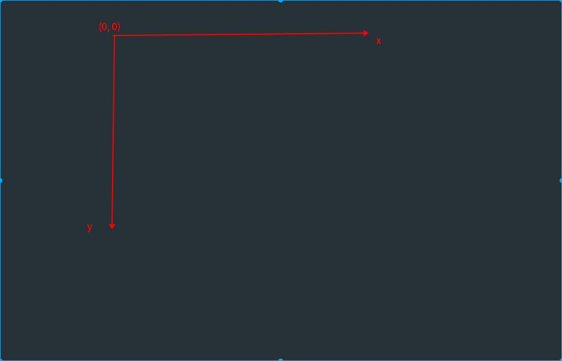
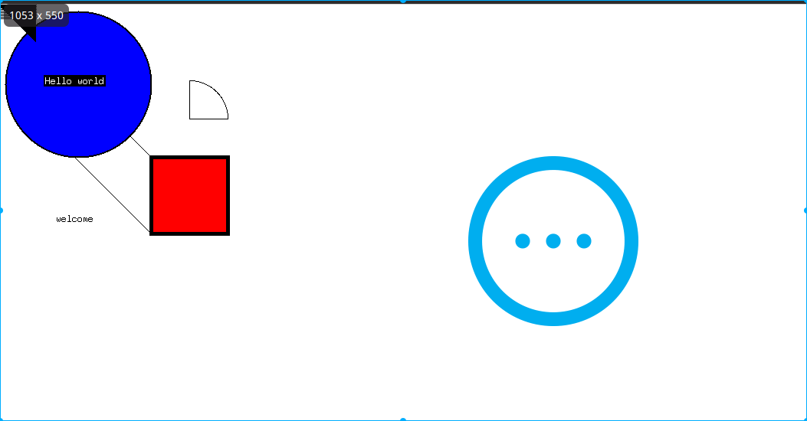
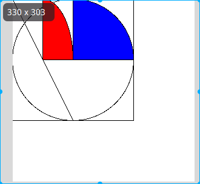
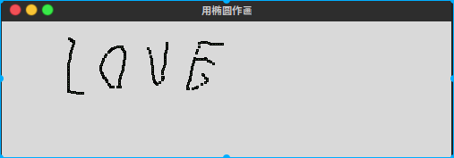

## Canvas图形绘制

> Canvas组件做图最为自由,它可以用来画各种形状,动态的移动其他对象,以及布局其他组件.
>
> 画布基于一个结构化的图像对象模型,所有画在画布上的东西都可以当做`item`(项目) 来处理.
>
> 画布依赖与一个坐标系统,用于定义唯一的绘画方法,并用标识符或标签来命名对象.
>
> #### 坐标
>
> 所有在画布上的都是`item` 而不是真正的组件.在画布上的`item` 是通过坐标,标识符,标签来完成定位和移动的.
>
> 
>
> #### 对象构建
>
> 画布允许绘制和显示,线条,椭圆,矩形,弧形,多边形等等,还可以出入 文本,图片和其他tkinter的组件
>
> #### 对象标识符
>
> `a = Canvas(....)` 前面赋值的变量`a` 就是对象标识符,标识符可以稍后用来传递给其他方法,比如`move` .其他常见的画布对象操作有:
>
> ```python
> canvas.delete(objectID_or_Tag) # 指定了ID(对象标识符),Tag(标签)  从画布删除对象
> canvas.tkraise(objectID_or_Tag) # 将对象移动到前端
> canvas.lower(objectID_or_Tag)  # 降低对象的层次
> canvas.itemconfig(objectID_or_Tag)  # 配置 item 的一些选项
> ```
>
> #### 标签
>
> 可以对一组对象进行操作,只需要和一个标签连接.标签名自己定义,要给对象添加标签,可以使用`tag` 选项,也可以使用`addtag_withtag(tag, objectId_or_Tag)` 方法

### 绘制基本的item

> ```python
> #!/usr/bin/env python
> # -*- coding: utf-8 -*-
> # @Author: chanafanghua
> # @Date:   2018-01-11 03:51:25
> # @Last Modified by:   chanafanghua
> # @Last Modified time: 2018-01-11 04:36:41
>
>
> """
>  绘制基本的canvas的item 
>
> """
>
>
> from tkinter import *
> root = Tk()
> # 为了跟明显的显示Canvas和root,将其设置为白色
> canvas = Canvas(root, width=800, height=300, bg='white')
> canvas.pack(expand=YES, fill=BOTH)
>
> """
> line
> oval  椭圆
> arc
> """
> # 线段item (from_x, from_y, to_x, to_y)
> canvas.create_line(100, 100, 200, 200)
> canvas.create_line(100, 200, 200, 300)
> for i in range(1, 20, 2):
>     canvas.create_line(0, i, 50, i)
>
> # 创建椭圆,其实是一个矩形中的圆形,确定的是矩形的对角线的两点
> canvas.create_oval(10, 10, 200, 200, width=2, fill='blue')
> # 创建弧度
> canvas.create_arc(200, 200, 300, 100)
> # 创建一个矩形
> canvas.create_rectangle(200, 200, 300, 300, width=5, fill='red')
> # 创建一个三角形
> canvas.create_polygon(0, 0, 50, 0, 50, 50)
>
>
> """
> 创建图像控件等
>
> """
> photo = PhotoImage(file='../giphy.gif')
> canvas.create_image(325, 10, image=photo, anchor=NW)
>
> widget = Label(canvas, text='Hello world', fg='white', bg='black')
> widget.pack()
> canvas.create_window(100, 100, window=widget)
> canvas.create_text(100, 280, text="welcome")
> mainloop()
>
> ```
>
> 
>
> 其中他们对应关系为
>
> ```python
>  from tkinter import *
> root = Tk()
> canvas = Canvas(root, bg='white', height=300, width=300)
> canvas.pack()
>
> # canvas.create_polygon(0, 0, 100, 100, 100, 0)
> canvas.create_rectangle(0, 0, 200, 200)
> canvas.create_oval(0, 0, 200, 200)
> canvas.create_arc(0, 0, 200, 200, fill='blue')
> canvas.create_line(0, 0, 100, 200)
> canvas.create_arc(0, 0, 100, 200, fill='red')
> mainloop()
> ```
>
> 
>
> #### 交互式绘图
>
> ```python
> from tkinter import *
> root = Tk()
>
>
> canvas_width = 500
> canvas_height = 150
>
>
> def paint(event):
>     python_green = "#476042"
>     x1, y1 = (event.x - 1), (event.y - 1)
>     x2, y2 = (event.x + 1), (event.y + 1)
>     w.create_oval(x1, y1, x2, y2, fill=python_green)
>
> root.title("用椭圆作画")
> w = Canvas(root, width=canvas_width, height=canvas_height)
> w.pack(expand=YES, fill=BOTH)
> w.bind('<B1-Motion>', paint)
>
> mainloop()
>
> ```
>
> 

### 分解方法

#### 1.创建一个item

> ```python
> #!/usr/bin/env python
> # coding=utf-8
>
> # 创建一个item
> # 创建一个矩形,指定画布的颜色为白色
>
> from tkinter import *
>
> root = Tk()
>
> # 创建一个Canvas,设置其背景色为白色
> cv = Canvas(root, bg='blue')
>
> # 创建一个矩形,左边为(10,10,110,110)
> cv.create_rectangle(10, 10, 110, 110)
> cv.pack()
> mainloop()
> ```

#### 2.指明item的填充色

> ```python
> # 创建一个矩形,指定画布的颜色为变色
> # 使用属性fill设置它的填充颜色
>
> from tkinter import *
> root = Tk()
> # 创建一个Canvas,设置其背景色为白色
> cv = Canvas()
> # 创建一个矩形,颜色为红色
> cv.create_rectangle(10, 10, 110, 110, fill='red')
> cv.pack()
> mainloop()
>
> ```

#### 3.指定item的边框颜色

> ```python
> from tkinter import *
>
> root = Tk()
> canvas = Canvas(root, bg='white')
> # 创建一个矩形,设置背景色为红色,宽度为5,注意和canvas的宽度是不同的
> # 设定矩形的边框颜色 outline 为红色
> canvas.create_rectangle(10, 10, 110, 110, outline='red', width=5)
> canvas.pack()
> mainloop()
>
> ```

#### 4.指定边框的宽度

> ```python
> from tkinter import *
>
> root = Tk()
> canvas = Canvas(root, bg='white')
> # 创建一个矩形,设置背景色为红色,宽度为5,注意和canvas的宽度是不同的
> # 设定矩形的边框颜色 outline 为红色
> canvas.create_rectangle(10, 10, 110, 110, outline='red', width=5)
> canvas.pack()
> mainloop()
>
> ```

#### 5.画虚线

> ```python
> # 指定画布的背景色为白色
> # 使用属性dash,这个值只能为奇数
>
> from tkinter import *
>
> root = Tk()
>
> # 创建一个canvas ,背景色为白色
>
> canvas = Canvas(root, bg='white')
>
> # 创建一个矩形,填充设为green , 边框为red, dash(画虚线) 为10
>
> canvas.create_rectangle(10, 10, 110, 110, outline='red', dash=10, fill='green')
> canvas.pack()
>
> mainloop()
>
> ```

#### 6.使用画刷

> ```python
> # 指定画布的背景色为白色
> # 使用属性stipple
>
> from tkinter import *
> root = Tk()
>
> # 创建一个canvas ,背景颜色为白色
>
> cv = Canvas(root, bg='white')
>
> # 创建一个矩形区域,边框为红色,填充为绿色,自定义画刷
> cv.create_rectangle(10, 10, 110, 110,
>                     outline='red',
>                     fill='green',
>                     stipple='gray12'   # 使用画刷
>                     )
> cv.pack()
> mainloop()
>
> ```

#### 7.修改item的坐标

> ```python
> from tkinter import *
>
>
> root = Tk()
> # 指定画布的颜色为白色,使用 Canvas的方法来重新设置item的坐标
> cv = Canvas(root, bg='white')
> # 创建一个矩形,边色为红色,填充为绿色, 画刷
> rt = cv.create_rectangle(10, 10, 110, 110,
>                          outline='red',
>                          fill='green',
>                          stipple='gray12'
>                          )
> cv.pack()
> # 重新设置rt 的坐标(相当于移动一个item)
> # 动态修改item的坐标
> cv.coords(40, 40, 80, 80)
> mainloop()
>
> ```

#### 8.创建item的tags

> ```python
> # 使用属性tags 设置item 的tag
> # 使用Canvas的方法gattags获取自动item的tags
>
> from tkinter import *
> root = Tk()
>
> # 创建一个Canvas,设置背景色为白色
> cv = Canvas(root, bg='white')
>
> # 使用tags 指定一个tag('r1')
> rt = cv.create_rectangle(10, 10, 110, 110, tags='r1')
> cv.pack()
>
> print(cv.gettags(rt))
>
> # 使用tags 属性指定多个tags,即重新设置tags的属性
>
> cv.itemconfig(rt, tags=('r2', 'r3', 'r4'))
> print(cv.gettags(rt))
> mainloop()
> ```

#### 9.多个item使用同一个tag

> ```python
> """
> tags 对象标签,可以为对象添加标签,通过标签来控制对象的属性
>
> """
> from tkinter import *
> root = Tk()
> # 创建一个Canvas,设置其 背景色为白色
> canvas = Canvas(root, bg='white')
> # 使用tags指定一个tag(r1)
> rt = canvas.create_rectangle(10, 10, 110, 110, tags=('r1', 'r2', 'r3'))
> canvas.pack()
>
> canvas.create_rectangle(20, 20, 80, 80, tags='r3')
>
> # find_withtag 返回所有与tag绑定的item
> print(canvas.find_withtag('r3'))
>
> mainloop()
>
> ```

####  10.通过tag来访问item

> ```python
>
> """
> 得到了tag值,也就得到了这个item,可以对这个item进行相关的设置
> """
>
> from tkinter import *
> root = Tk()
>
> # 创建一个Canvas,设置其背景色为白色
> canvas = Canvas(root, bg='white')
> canvas.pack()
>
> # 使用tags指定一个tag('r1')
> rt = canvas.create_rectangle(10, 10, 110, 110, tags=('r1', 'r2', 'r3'))
> canvas.create_rectangle(20, 20, 80, 80, tags='r3')
> # 将所有与tags('r3') 绑定的item 边框颜色设置为蓝色
> for item in canvas.find_withtag('r3'):
>     canvas.itemconfig(item, outline='blue')
> mainloop()
> # 动态修改与tag('r3')绑定的item边框颜色
>
> ```

#### 11.向其他item中添加tag

> ```python
> """
> 向其他item中添加tag
> 使用addtag 来想上一个或者下一个item中添加tag
> """
>
> from tkinter import *
> root = Tk()
> # 创建一个Canvas,设置器背景色为白色
> canvas = Canvas(root, bg='white')
> canvas.pack()
>
> # 创建3个矩形框
>
> rt1 = canvas.create_rectangle(
>     10, 10, 110, 110,
>     tags=('r1', 'r2', 'r3')
> )
>
> rt2 = canvas.create_rectangle(
>     20, 20, 110, 110,
>     tags=('s1', 's2', 's3')
> )
>
>
> rt3 = canvas.create_rectangle(
>     30, 30, 110, 110,
>     tags=('y1', 'y2', 'y3')
> )
>
> # 在rt2的上一个item添加r4
> canvas.addtag_above('r4', rt2)
> # 在rt2的下一个item中添加r5
> canvas.addtag_below('r5', rt2)
>
> for item in [rt1, rt2, rt3]:
>     print(canvas.gettags(item))
>
> mainloop()
> # Canvas使用了stack的技术，新创建的item总是位
> # 于前一个创建的item之上，故调用above时，它会
> # 查找rt2上面的item为rt3,故rt3中添加了tag('r4')
> # 同样add_below会查找下面的item。
> ```

#### 12.返回其他item

> ```python
> """
> 使用 find_xxx查找上一个或下一个 item
> """
>
> from tkinter import *
> root = Tk()
>
> # 创建一个Canvas,设置器背景色为白色
> canvas = Canvas(root, bg='white')
> canvas.pack()
> # 创建3个矩形框
> rt1 = canvas.create_rectangle(
>     10, 10, 110, 110,
>     tags=('r1', 'r2', 'r3')
> )
>
> rt2 = canvas.create_rectangle(
>     20, 20, 110, 110,
>     tags=('s1', 's2', 's3')
> )
>
>
> rt3 = canvas.create_rectangle(
>     30, 30, 110, 110,
>     tags=('y1', 'y2', 'y3')
> )
>
> # 查找rt2的上一个item,并将其边框设置为空色
> canvas.itemconfig(canvas.find_above(rt2), outline='red')
> # 查找rt2的下一个item,并将其边框颜色设置为绿色
> canvas.itemconfig(canvas.find_below(rt2), outline='green')
>
> mainloop()
> # Canvas使用了stack的技术，新创建的item总是位
> # 于前一个创建的item之上，故调用above时，它会
> # 查找rt2上面的item为rt3,故rt3中添加了tag('r4')
> # 同样add_below会查找下面的item。
> ```