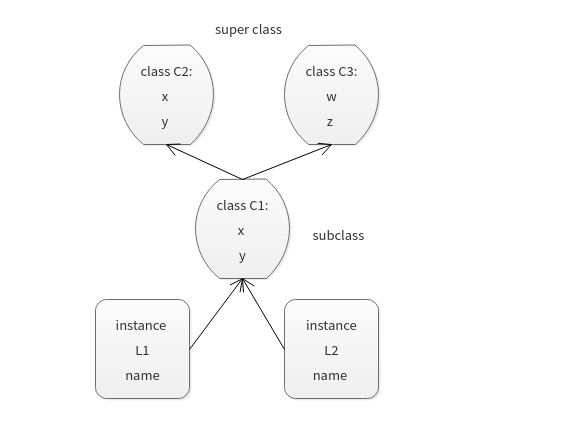

## 类的命名空间和类树

### 类的命名空间

> 就像函数和模块一样,类能够构造自己的命名空间 `namespace` ,类是实例的工厂,类中的实例会拥有自己的命名空间,访问遵循`LEGB` 规则,
>
> 以下实现一个简单的类命名空间
>
> ```Python
> def scope_test():
>     def do_local():
>         spam = "local spam"
>     def do_nonlocal():
>         nonlocal spam
>         spam = "nonlocal spam"
>     def do_global():
>         global spam 
>         spam = "global spam"
>     
>     spam = "test spam"
>     
>     do_local()
>     print("After local assignment:",spam)
>     do_nonlocal()
>     print("After nonlocal assignmenet:",spam)
>     do_global()
>     print("After global assignment:",spam)
> scope_test()
> print("In global scope:", spam)	
>
> class A:
>     x = 5
>     y = 7 
>     z = locals()
>     def __init__(self,name,age,sex):
>         self.name = name
>         self.age = age
>         self.sex = sex 
>         self._local = locals()
>         
> foo = A('Jack','24','man')
> print("class A namespace:",foo.z)
> print("instance foo namespace:",foo._local)
> ```
>
> 输出
>
> ```python
> After local assignment: test spam
> After nonlocal assignmenet: nonlocal spam
> After global assignment: nonlocal spam
> In global scope: global spam
>     
> class A namespace: {'__module__': '__main__', '__init__': <function A.__init__ at 0x7f2ad025ae18>, 'x': 5, '__qualname__': 'A', 'z': {...}, 'y': 7}
> instance foo namespace: {'sex': 'man', 'self': <__main__.A object at 0x7f2ad02f4ac8>, 'name': 'Jack', 'age': '24'}
> ```
>
> **类是实例的工厂,通过类可以生成多个实例,每个实例都拥有自己的命名空间,命名空间互不影响**

### 类和字典的关系

> 命名空间对象的属性通常都以字典的形式实现的.而类树只是连接到其他字典的字典而已
>
> 一个字典对象
>
> ```python
> rec = {}
> rec['name']  = 'Jack'
> rec['age'] = 19
> rec['job'] = 'writer'
> print(rec)
> print(rec['name'])
> ```
>
> 类属性通常都会保存在一个字典的内置方法中,比如,我们创建一个基本的类,通过点号运算,实现给类属性的赋值.
>
> ```python
> class rec:
>     pass
>
> rec.name = 'Ross'
> rec.age = '19'
> rec.job = 'actor'
> print(rec.name,rec.age,rec.job)
> ```
>
> 新式类都是继承子类`object` ,他们拥有一个内置的属性`__dict__` 用来保存类中的各种信息和可写属性:
>
> ```python
> object.__dict__
> A dictionary or other mapping object used to store an object’s (writable) attributes.
> ```
>
> 对于类而言,我们可以打印出的它的`__dict__` ,查看其保存的可写属性包含了刚才的赋值.
>
> ```python
> print(rec.__dict__)
> #{'__doc__': None, '__weakref__': <attribute '__weakref__' of 'rec' objects>, '__module__': '__main__', 'name': 'Ross', '__dict__': <attribute '__dict__' of 'rec' objects>, 'age': '19', 'job': 'actor'}
> ```
>
> **`__dict__`保存了类的命名空间中的值**,当把类实例化时:会产生新的独立的命名空间,新的`__dict__`对象.
>
> ```python
> class rec:
>     pass 
> x = rec()
> y = rec()
> x.name = 'cat'
> x.age =1
> y.name = 'dog'
> y.age = 2
>
> print(x.__dict__)
> print(y.__dict__)
> print(rec.__dict__)
> ```
>
> 实例会各自产生自己的独立命名空间,而且和类的命名空间不冲突.
>
> 类树的搜索是根据命名空间的链接进行的搜索.
>
> ```python
> class A:
>     x = 5 
>     y = 3 
>     
> class B(A):
>     z = 3
>     def __init__(self,num):
>         self.num = num
>         
> foo = B(7)
> print(foo.z,foo.x,foo.y,foo.num)
> ```
>
> 打印结果
>
> ```python
> 3 5 3 7
> ```
>
> 可以使用内置的方法 `instance.__calss__` 来找到实例所属的类,使用`class.__bases__` 找到类队形的基类的元组.当使用`object.X` 时,应该遵循这个规则
>
> ```python
> print(foo.__dict__)
> print(foo.__class__)
> print(foo.__class__.__name__)
> print(B.__dict__)
> print(B.__bases__)
> print(A.__dict__)
> print(A.__bases__)
> ```
>
> 值会一直找到基类,对于不存在的值,返回异常.

### 类树(Method Resolution Order，或MRO)

> 当我们对 `class` 语句产生的对象使用这个方式时,这个表达式会自动的在Python中启动搜索,来寻找`Attribute` 首次出现的对象,
>
> 取出属性(`object.attribute`)只是简单的搜索 `树` ,我们称这种搜索程序为继承. 因为,数中较低位置的对象继承了树中位置较高的对象拥有的属性,当 **从下向上** 搜索时,连接树中的对象就是树中所有上层对象所定义的属性的集合体.直到树的最顶端.
>
> 搜索的规则是:
>
> * **实例继承自类,从下至上,从左至右,找到首个对象即停止搜索,**
>
> 一个简单的例子:
>
> 
>
> 当我们使用`object.attribute` 时,比如`L2.w`,自动开始搜索继承树
>
> *  L2 的命名空间,`L2.__dict__` ,如果找不到,`L2.__class__`,搜索实例L2的继承类C1
> *  C1 的命名空间 `C1.__dict__`,如果找不到,`C1.__bases__`,按照从左至右,搜索C2
> *  C2 的命名空间`C2.__dict__`.如果找不到,就搜索 `C3`
> *  C3 的命名空间 `C3.__dict__`,找到了`w` 首次出现的地方,停止搜索
>
> 如果针对于复杂的多继承,Python3采用的是 `C3` 算法
>
> * [C3算法](./class_c3.md) 

### 类属性,实例属性 修改

> 事实上,因为类树的所有对象都是命名空间对象,可以通过设置变量名设置任何的属性,意味着类和实例都可以动态的改变的命名空间(去除`__slots__`),但是他们产生的影响是不一样的.当然,他们的搜索规则依然依照上方的规则.
>
> ```python
> class C1:
>     x = 5
>     y = 7
>     def __init__(self,name,age):
>         self.name = name 
>         self.age = age 
>          
>         
> foo = C1("Jack",18)
>
> print(foo.name,foo.age)
> print(foo.x,foo.y)
> print('before foo setting(foo.__dict__):',foo.__dict__)
> print('before foo setting(c1.__dict__):',C1.__dict__)
>
> foo.sex = 'man'
> print(foo.sex)
> print("after foo setting(foo.__dict__):",foo.__dict__)
> print("after foo setting(C1.__class__):",C1.__dict__)
>
> C1.z = 6
> print(C1.z)
> print(foo.z)
> print("after C1 setting(C1.__claclass C1:
>     x = 5
>     y = 7
>     def __init__(self,name,age):
>         self.name = name 
>         self.age = age 
>          
>         
> foo = C1("Jack",18)
>
> print(foo.name,foo.age)
> print(foo.x,foo.y)
> print('before foo setting(foo.__dict__):',foo.__dict__)
> print('before foo setting(c1.__dict__):',C1.__dict__)
>
> foo.sex = 'man'
> print(foo.sex)
> print("after foo setting(foo.__dict__):",foo.__dict__)
> print("after foo setting(C1.__class__):",C1.__dict__)
>
> C1.z = 6
> print(C1.z)
> print(foo.z)
> print("after C1 setting(C1.__class__):",C1.__class__)
> print("atter c1 setting(foo.__dict__):",foo.__class__)ss__):",C1.__class__)
> print("atter c1 setting(foo.__dict__):",foo.__class__)
> ```

### 特殊属性

> * `object.__dict__`[¶](https://docs.python.org/3/library/stdtypes.html?highlight=__mro__#object.__dict__)
>
>   A dictionary or other mapping object used to store an object’s (writable) attributes.
>
>
> * `instance.__class__`
>
>   The class to which a class instance belongs.
>
>
> * `class.__bases__`
>
>   The tuple of base classes of a class object.
>
>
> * `definition.__name__`
>
>   The name of the class, function, method, descriptor, or generator instance.
>
>
> * `definition.__qualname__`
>
>   The [qualified name](https://docs.python.org/3/glossary.html#term-qualified-name) of the class, function, method, descriptor, or generator instance.

