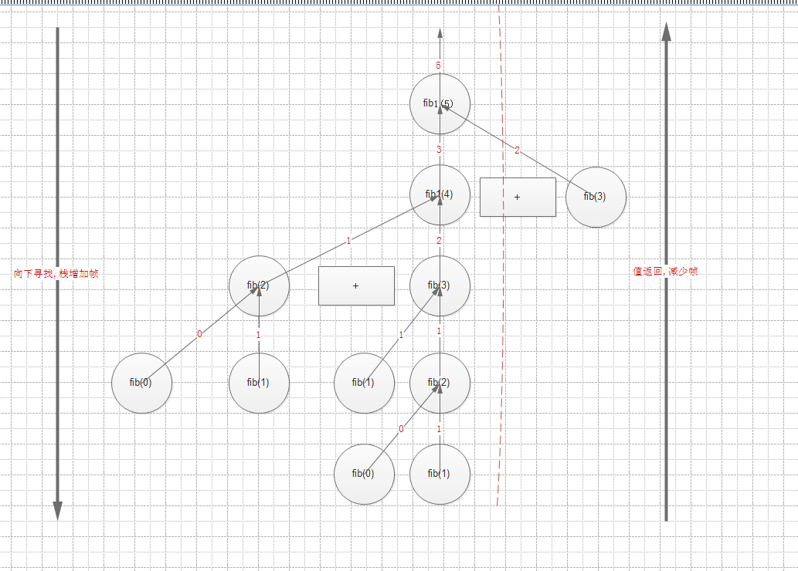
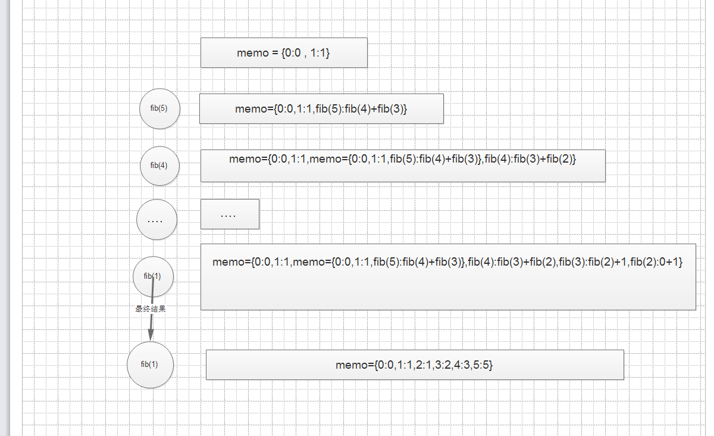

###  斐波那契数列

> 费波那契数列（意大利语：Successione di Fibonacci），又译费波拿契数、斐波那契数列、斐波那契数列、黄金分割数列。
>
> 在数学上，费波那契数列是以递归的方法来定义：
>
> ```markdown
> F0 = 0     (n=0)
> F1 = 1    (n=1)
> Fn = F[n-1]+ F[n-2](n=>2)
> ```
>
> 用文字来说，就是费波那契数列由0和1开始，之后的费波那契系数就是由之前的两数相加而得出。首几个费波那契系数是：
>
> ```markdown
> 0, 1, 1, 2, 3, 5, 8, 13, 21, 34, 55, 89, 144, 233……
> ```
>
> **特别指出**：[0](https://zh.wikipedia.org/wiki/0)不是第一项，而是第零项.
>
> 几乎所有的高级语言都要拿Fibonacci数列为例子，解释递归、循环等概念。来看一下它的实现方法:

####  循环实现

> ```python
> def fibon(n):
>     a = b = 1
>     result = []
>     for i in range(n):
>         result.append(a)
>         a, b = b, a + b
>     return result
>
>
> aa = fibon(10)
> print(aa)
> ```
>
> ```python
> [1, 1, 2, 3, 5, 8, 13, 21, 34, 55]
> ```

#### 迭代--使用生成器实现

> ```python
> # 使用生成器实现,一种迭代方式
>
> def fibonx(max):
>     # n, a, b = (1, 1, 1)
>     n = a = b = 1
>     while n < max:
>         yield a
>         a, b = b, a + b
>         n += 1
>
>     return "DONE"
>
>
> for x in fibonx(10):
>     print(x)
> ```

#### 递归实现1

> ```python
> # 按照定义,直接递归,执行速度慢
>
> def fib1(n):
>     if n == 0:
>         return 0
>     elif n == 1:
>         return 1
>     else:
>         print('fib1 ,', locals())
>         return fib1(n - 1) + fib1(n - 2)
>
>
> fib1(5)
> ```

> 执行速度慢主要是因为,这种递归方式会在每次进入一个函数调用,栈会增加一层帧,每当函数返回,栈就会减少一层帧,
>
> ```python
> fib1 , {'n': 5}
> fib1 , {'n': 4}
> fib1 , {'n': 3}
> fib1 , {'n': 2}
> fib1 , {'n': 2}
> fib1 , {'n': 3}
> fib1 , {'n': 2}
> ```
>
> 

> 这种方法不是一个好方法，因为它的开销太大，比如计算fib1(100),就需要耐心等待较长一段时间了。所以，这是一种不实用的方法。但是，因为简单，列为第一种。

#### 递归实现2 

> ```python
> memo = {0: 0, 1: 1}
>
>
> def fib2(n):
>     if not n in memo:
>         print('fib2 ,', locals())
>         memo[n] = fib2(n - 1) + fib2(n - 2)
>         print(memo)
>     return memo[n]
>
>
> fib2(5)
> ```
>
> ```python
> fib2 , {'n': 5}
> fib2 , {'n': 4}
> fib2 , {'n': 3}
> fib2 , {'n': 2}
> {0: 0, 1: 1, 2: 1}
> {0: 0, 1: 1, 2: 1, 3: 2}
> {0: 0, 1: 1, 2: 1, 3: 2, 4: 3}
> {0: 0, 1: 1, 2: 1, 3: 2, 4: 3, 5: 5}
> ```
>
> 这种方法,其实是把值存储在字典中了,这样,可以直接在外部查询字典得到值.
>
> 
>
> 

#### 递归实现3

> 使用尾递归
>
> ```python
> def fib3(n, a=0, b=1):
>     print('fib3',locals())
>     if n == 0:
>         return a   #返回的斐波那契数列值
>     return fib3(n - 1, b, a + b)
>
>
> fib3(5)
> print(fib3(5))
> ```
>
> ```python
> fib3 {'n': 5, 'a': 0, 'b': 1}
> fib3 {'n': 4, 'a': 1, 'b': 1}
> fib3 {'n': 3, 'a': 1, 'b': 2}
> fib3 {'n': 2, 'a': 2, 'b': 3}
> fib3 {'n': 1, 'a': 3, 'b': 5}
> fib3 {'n': 0, 'a': 5, 'b': 8}
> 5
> ```
>
> 

####  测试时间:

> 这几种函数,统一测试fib(300)
>
> ```python
> #!/usr/bin/env python
> # -*- coding:utf-8 -*-
> """
> @author:ning
> @file:fib_time.py
> @time:12/5/20172:05 PM
> """
> import time
>
>
> def fib1(n):
>     if n == 0:
>         return 0
>     elif n == 1:
>         return 1
>     else:
>
>         return fib1(n - 1) + fib1(n - 2)
>
>
> memo = {0: 0, 1: 1}
>
>
> def fib2(n):
>     if not n in memo:
>         memo[n] = fib2(n - 1) + fib2(n - 2)
>
>     return memo[n]
>
>
> def fib3(n, a=0, b=1):
>     if n == 0:
>         return a
>     return fib3(n - 1, b, a + b)
>
>
> def fib_time(func, x):
>     start_time = time.time()
>     func(300)
>     end_time = time.time()
>     print("{},用时{}us".format(x, (end_time - start_time) * 1000000))
>
>
> if __name__ == '__main__':
>     fib_time(fib1, '普通递归')
>     fib_time(fib2, '字典递归')
>     fib_time(fib3, '尾递归')
>
> ```
>
> 

