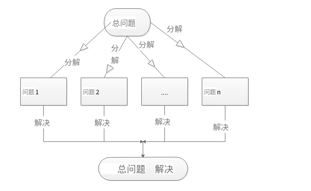
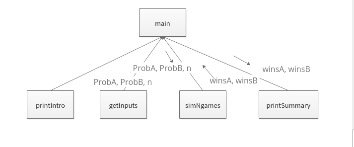
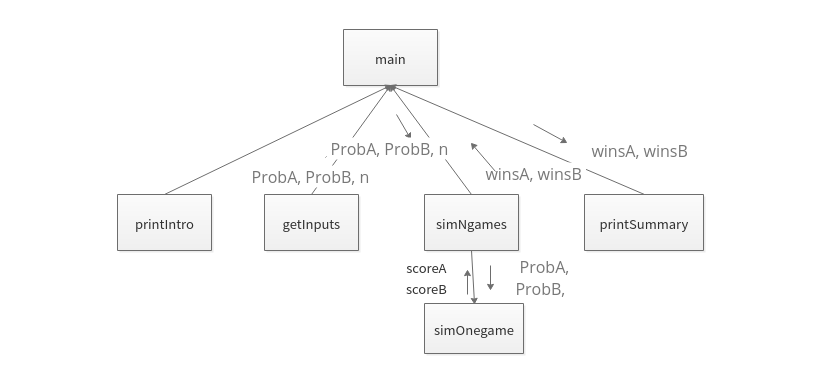
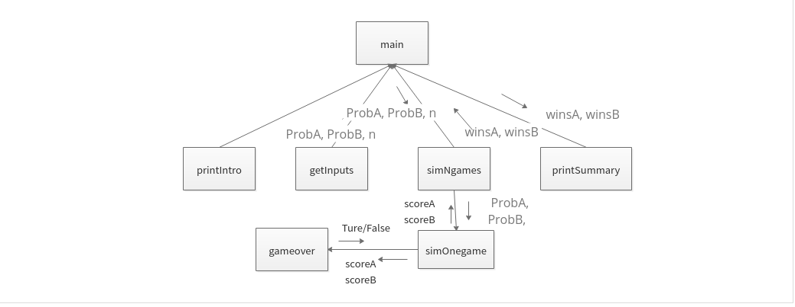

## 自顶向下的设计

> 面向对象,面向过程都可以使用这种方法:

### 基本思想

> 

### 顶层设计

> 步骤1: 打印程序的介绍信息就
>
> * pintIntro()
>
> 步骤2: 获得程序运行所需要的参数: ProbA, ProbB, n
>
> * probA, probB , n = getInputs()
>
> 步骤3:模拟n次比赛
>
> * winsA, winsB = simNgames(n, probA, probB) 
>
> 步骤4: 输出球员A和球员B获胜的比赛的次数和概率
>
> * printSummary(winsA, winsB)
>
> #### 第一阶段
>
> 
>
> #### 第二阶段
>
> 
>
> #### 第三阶段
>
> 

### 代码设计

> 

