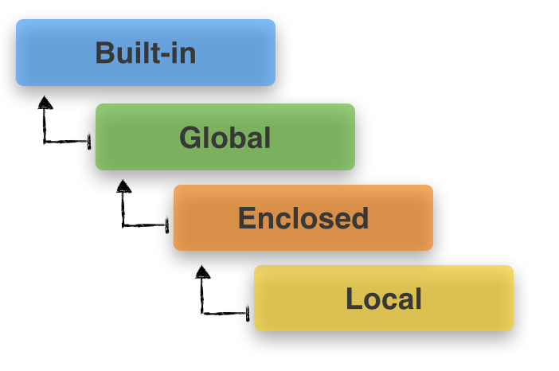

###  函数命名空间和作用域

##### 简析

> 函数 `scope`
>
> python函数在运行的时候会创建自己的`scope ` 即作用域或者说是函数自己的`namespace`.执行函数时,如果在函数体中遇到了变量名,python会首先在该函数的`namespace`中寻找该变量.
>
> Python有一些内置函数,可以让我们来查看函数的`namespace`,下面例子,可以查看一个函数的`global`和`local`作用域.
>
> ```python
> globals()
>     Return the dictionary containing the current scope's global variables.
>     
>     NOTE: Updates to this dictionary *will* affect name lookups in the current global scope and vice-versa.
>     
> locals()
>     Return a dictionary containing the current scope's local variables.
>     
>     NOTE: Whether or not updates to this dictionary will affect name lookups in the local scope and vice-versa is *implementation dependent* and not covered by any backwards compatibility guarantees.
> ```
>
> 实例
>
> ```python
> #!/usr/bin/env python
> #coding=utf-8
>
> a_string = "This is a global variable"
> def foo():
>     print("locals")
>     print(locals())
>
> print('globals')
> print(globals())
> foo()
>
> ```
>
> 运行结果
>
> ```python
> ningyanke@ningpython:~/python3_file$ python3 5.py 
> globals
> {'__spec__': None, '__builtins__': <module 'builtins' (built-in)>, '__loader__': <_frozen_importlib_external.SourceFileLoader object at 0xb706ee2c>, 'a_string': 'This is a global variable', '__package__': None, '__file__': '5.py', '__name__': '__main__', 'foo': <function foo at 0xb70fb6a4>, '__cached__': None, '__doc__': None}
> locals
> {}
>
> ```
>
> 函数的命名空间包括函数名和函数代码块,整个函数块都是他的命名空间.

##### Python LEGB规则

> 目标:
>
> - 命名空间和作用域-Python在哪里查找变量名?
> - 我们可以同时为多个对象定义/重用变量名吗?
> - Python在不同的命名空间中以哪种顺序搜索变量名
>
> 命名空间和作用域简介
>
> #####  `Namespace`
>
> `namespace`  只是将变量名映射到对象的容器.Python中的所有一切,都是对象(`string,list,tuple,dict,functions,class`等).像这样的`name-to-object`的映射,允许我们通过分配给对象(object)的名字(name)来访问对象,比如,我们创建了一个简单的字符串`a_string = "hello world"` 我们创建了一个对该`hello world`对象的引用(name),然后我们通过变量名`a_string`来访问它.
>
> 在Python中用字典来表示一个命名空间,命名空间中保存了变量(name)和对象(object)的映射关系,比如:
>
> ```python
> a_namespace = {'name_a':object1,'name_b':object2,.....}
> ```
>
> 现在,混绕的部分是 我们在Python中有多个独立命名空间,变量名可能重复出现在不同的命名空间(但是对应的对象都是唯一的).比如:
>
> ```python
> a_namespace = {'name_a':object1,'name_b':object2,.....}
> b_namespace = {'name_a':object3,'name_b':object4,.....}
> ```
>
> 比如,每次我们调用一个`for`循环,或者是定义一个函数,它都会创建自己的命名空间,命名空间会产生不同的层次机构(即`scope`),我们会在下面详细讨论.
>
> #####  `Scope`
>
> 以上,我们知道了命名空间可以彼此独立存在,并且有不同的层次结构,这就给我们带来了作用域(`scope`)的概念.
>
> 在Python中,`scope`作用域定义了在不同的层次结构中,我们应该怎么搜索 `name-to-object` 的映射.比如:
>
> ```python
> i = 1 
> def foo():
>     i = 5
>     print(i, 'in foo()')
> print(i,'global'
> foo()
> ```
>
> ```python
> 1 global
> 5 in foo()
> ```
>
> 我们定义了2次变量名`i`,其中 有一次定义在了`foo`函数内:
>
> * `foo_namespace = {'i':object_3, ...}`
> * `global_namespace = {'i':object_1, 'name_b':object_2, ...}`
>
> Python是如何寻找变量名的?,这就是我们要讨论的`LEGB`
>
> ##### 通过`LEBG` 规则解析变量名作用域(`scope`)
>
> 我们已经知道: 多个命名空间可以彼此独立的存在,并且他们可以在不同的层次上包含相同的变量名.
>
> 作用域`scope`定义了Python在层次搜索与变量名对应的对象.那么Python是以那种顺序来执行作用域的操作?
>
> 答案是`LGEB` 规则,它定义了寻找的优先级.
>
> `Local --> Enclosed --> Global  --> Built-in`
>
> ```python
> L-lcoal(function):函数内的命名空间
> E-Enclosing function locals: 外层嵌套函数的命名空间
> G-Global(module):函数定义所在模块(文件)的命名空间
> B-Buitin(Python):Python内置模块的命名空间
> ```
>
> 命名空间其实就是一个字典,在其内部保存了变量名称和对象之间的映射关系,因此,查找变量名就是在命名空间字典中查找 键-值对.
>
> **注意**
>
> 命名空间是可以进一步嵌套的,例如,如果我们导入模块,或者我们正在定义新的类,在这种情况下,我们必须使用前缀来访问这些嵌套的命名空间:
>
> ```python
> import  math
> import time
> print(math.pi,"from the math module")
> print(time.time, "from the time module")
> ```
>
> (这也是我们为什么必须小心,如果我们通过`from a_module import * ` 导入模块,它会将变量名加载到`global`命名空间中,有可能会覆盖已经存在的变量名称)
>
> 
>
> ###### 1. LG-----`Local and Global scopes`
>
> eg.1
>
> ```python
> a_var = 'global varriable'
> def a_func():
>     print(a_var,'[a_var inside a_func()]')
>     
> a_func()
> print(a_var,'[a_var outside a_func()]')
> ```
>
> ```python
> global varriable', '[a_var inside a_func()]
> global varriable', '[a_var outside a_func()]
> ```
>
> 当我们调用`a_func()`,首先会看到他的本地作用域(L),变量名`a_var`并没有被定义,所以它会寻找它的上层作用域:(G)全局作用域.然后在输出结果
>
> eg.3
>
> 如果我们使用了`global`关键字,则会调用全局变量,并且修改全局变量.
>
> ```python
> a_var = 'global varriable'
> def a_func():
>     global a_var
>     a_var = 'local varriable'
>     print(a_var,'[a_var inside a_func()]')
>
> print(a_var,'[a_var outside a_func()]')
> a_func()
> print(a_var,'[a_var outside a_func()]')
> ```
>
> ```python
> global value [ a_var outside a_func() ]
> local value [ a_var inside a_func() ]
> local value [ a_var outside a_func() ]
> ```
>
> eg.4
>
> 但我们必须小心顺序: 如果我们没有明确的告诉Pyhton我们想要使用全局作用域,并尝试修改一个变量的值,那么很容易返回`UnboundLocalError`.(赋值的操作是右侧的先执行)
>
> ```python
> a_var = 1
>
> def a_func():
>     a_var = a_var  + 1
>     print(a_var, 'a_var inside a_func()')
>
> print(a_var, 'a_var outside a_func()')
>
> a_func()
> ```
>
> ```python
> UnboundLocalError: local variable 'a_var' referenced before assignment
> ```
>
> 这是因为,当我们调用`a_func`函数时, 会把变量`a_var` 自动视为本地变量,语句`a_var = a_var +1`这是一个赋值语句,首先他会把后一个`a_var`变量当作是自己的本地作用域的变量,这样我们希望为本地作用域变量`a_var`赋的值却是基于变量本身,而这个变量没有被定义,所以会返回错误,类似我们的python解释器中直接使用一个未知的变量.
>
> ###### 2. LEG-`Local,Enclosed,Global Scope`
>
> 加上外层嵌套函数时作用域的判断
>
> eg.2.1
>
> ```python
> a_var = 'global value'
>
> def outer():
>     a_var = "enclosed value"
>
>     def inner():
>         a_var = "local value"
>         print(a_var)
>     inner()
>
> outer()
> ```
>
> ```python
> local value
> ```
>
> 我们调用了`outer()`,它定义了一个局部变量`a_var`(在全局作用域已经存在一个`a_var`).接下来,`outer()`函数调用了`inner()`,该函数也定义了一个名称为`a_var`的变量。在`inner()`内的`print()`函数首先在局部作用域内搜索(L->E)，因此会打印出在局部作用域内所赋的值。
>
> 类似于上一节所说的`global`关键字,我们也可以在内部函数中使用`nonlocal`关键字来明确地访问外部(外围函数)作用域的变量，也可以修改它的值。
>
> 注意`nonlocal`关键字是在Python 3.x才新加的，而且在Python 2.x中没有实现（目前还没有).
>
> eg. 2.2
>
> ```python
> a_var = 'global value'
>
> def outer():
>        a_var = 'local value'
>        print('outer before:', a_var)
>        def inner():
>            nonlocal a_var
>            a_var = 'inner value'
>            print('in inner():', a_var)
>        inner()
>        print("outer after:", a_var)
> outer()
> ```
>
> ```python
> outer before: local value
> in inner(): inner value
> outer after: inner value
> ```
>
> ###### 3. LEGB-`lcoal,Enclosed,Global,Built-in`
>
> eg. 3.1
>
> ```python
> a_var = 'global variable'
>
> def len(in_var):
>     print('called my len() function')
>     l = 0
>     for i in in_var:
>         l += 1
>     return l
>
> def a_func(in_var):
>     len_in_var = len(in_var)
>     print('Input variable is of length', len_in_var)
>
> a_func('Hello, World!')
> ```
>
> ```python
> called my len() function
> Input variable is of length 13
> ```

##### 总结

> 在实践中,修改函数范围内的全局变量通常是一个坏注意,因为这经常造成混乱或者很难调试的奇怪错误.如果你想要通过一个函数来修改一个全局变量,建议把它作为一个变量传入，然后重新指定返回值.
>
> 比如:
>
> ```python
> a_var = 2
>
> def a_func(some_var):
>     return 2**3
>
> a_var = a_func(a_var)
> print(a_var)
> ```
>
> ```python
> 8
> ```

##### For循环变量泄漏到全局命名空间

> Python中的for循环会使用它所在的作用域,而且把它所定义的循环变量加在后面.
>
> ```python
> for a in range(5):
>     if a == 4:
>         print(a, '-> a in for-loop')
> print(a, '-> a in global')
> ```
>
> ```python
> 4 -> b in for-loop
> 4 -> b in global
> ```
>
> **如果我们提前在全局命名空间中明确定义了for循环变量，也是同样的结果！**在这种情况下，它会重新绑定已有的变量
>
> ```python
> b = 1
> for b in range(5):
>     if b == 4:
>         print(b, '-> b in for-loop')
> print(b, '-> b in global')
>
>
> 4 -> b in for-loop
> 4 -> b in global
> ```
>
> 不过，在**Python 3.x**中，我们可以使用闭包来防止for循环变量进入全局命名空间
>
> ```python
> i = 1
> print([i for i in range(5)])
> print(i, '-> i in global')
> ```
>
> ```python
> [0, 1, 2, 3, 4]
> 1 -> i in global
> ```
>
> 为什么要强调“Python 3.x”？因为在Python 2.x下执行同样的代码，打印结果是：
>
> ```python
> 4 -> i in global
> ```

资料来源:

[LEGB GUIDE](http://sebastianraschka.com/Articles/2014_python_scope_and_namespaces.html) 