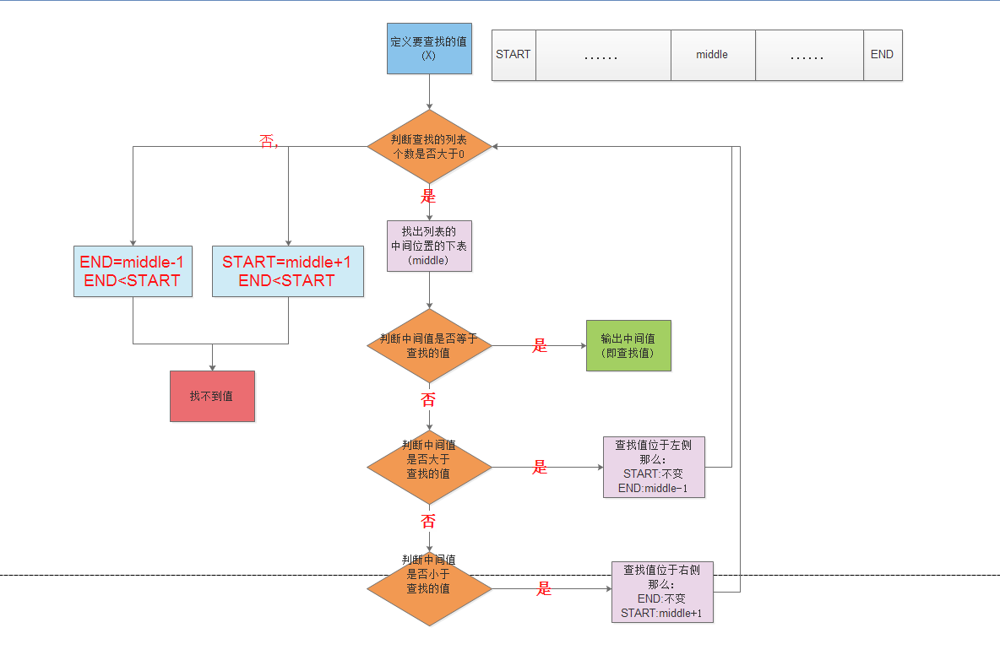

### 递归

> 递归:[维基百科](https://zh.wikipedia.org/wiki/%E9%80%92%E5%BD%92)
>
> ```markdown
> 递归（Recursion），又译为递回，在数学与计算机科学中，是指在函数的定义中使用函数自身的方法。递归一词还较常用于描述以自相似方法重复事物的过程。
> 在数学和计算机科学中，递归指由一种（或多种）简单的基本情况定义的一类对象或方法，并规定其他所有情况都能被还原为其基本情况。
> ```
>
> Python中的递归是指:函数在定义中使用函数自身的方法

### 函数是一种对象

> 正像前面学习到的,Python中一切皆对象,函数是一种对象.
>
> 函数可以想变量一样,既可以用来传递值,又可以用来作为另外一个函数的参数,或者返回值.而递归中,函数在函数体中调用函数自身.
>
> 高阶函数:对函数a和函数b
>
> * 当一个函数a作为参数传入时, `filter,map,reduce,sorted`
> * 当一个函数a作为返回值时:闭包,装饰器
>
> 高阶函数,一个函数
>
> * 函数返回函数本身: 递归方法

### 有用的递归函数

> 有用的递归函数包括:
>
> *  当函数直接返回值时有基本实例(最小可能性问题)
> *  递归实例,包括一个或者多个基例是不需要递归的
> *  所有的递归链都要以一个基例来结尾
>
> 递归的特征:
>
> * 递归每次调用都会引起一个新函数的开始
> * 递归有本地副本,包括该值的参数
>
> 这里的关键是将问题分解为小部分,递归不能永远继续下去,因为它总是以最小可能性问题结束,而这些问题有存储在基本实例中.所以才会让函数调用自己本身,每次函数被调用时,针对这个调用的新命名空间会被创建,意味着,当函数调用自己本身时,实际上运行的是两个不同的函数(拥有着不同的命名空间).

### 实例

> 经典的递归实例是阶乘.
>
> 阶乘的定义:
> $$
> n! = n * (n-1)!
> $$
> 这是一个典型的,可以用简单的基例来解释的,
>
> ```markdown
> 1的阶乘是1
>
> 2的阶乘是2*(2-1)!
>
> ....
>
> n的阶乘是 n!=n*(n-1)!
> ```
>
> ```python
> def fact(n):
>     if n == 1:
>         return 1
>     return n * fact(n-1)
> ```
>
> ```pyhon
> >>> fact(5)
> 120
> ```
>
> 如果计算`fact(5)` 根据定义 我们可以看到如下的计算过程
>
> ```python
> ==> fact(5)
> ===> 5 * fact(4)
> ===> 5 * (4 * fact(3))
> ===> 5 * (4 * (3 * fact(2)))
> ===> 5 * (4 * (3 * (2 * fact(1))))
> ===> 5 * (4 * (3 * (2 * 1)))
> ===> 5 * (4 * (3 * 2))
> ===> 5 * (4 * 6)
> ===> 5 * 24
> ===> 120
> ```
>
> 
>
> 计算幂
>
> 考虑一个例子,假设需要计算幂,就像内建的`pow` 函数或者`**` 运算符号一样,可以用很多中方法定义一个数的幂.也可以使用循环实现:
>
> ```python
> def power(x, n):
>     rusult = 1
>     for i in n:
>         rusult = x * result
>      return result   
> ```
>
> 当然也可以使用递归来实现:
>
> $ x^n = x * x^{n-1} $
>
> ```python
> def power(x,n):
> 	if n == 1:
>     	return x 
>     return x * power(x,n-1)
> ```
>
> 如果计算$2^5$ ,过程应该是
>
> ```python
> ==> power(2,5)
> ===> 2 * power(2,4)
> ===> 2 * (2 * power(2,3))
> ===> 2 * (2 * (2 * power(2,2)))
> ===> 2 * (2 * (2 * (2 * power(2,1))))
> ===> 2 * (2 * (2 * (2 * 2)))
> ===> 2 * (2 * (2 * 4))
> ===> 2 * (2 * 8)
> ===> 2 * 16
> ===> 32
> ```

### 用递归求和

> 如果要对一个数字列表(或者其他序列)求和,我们可以使用内置的`sum()` 函数,或者自己写一个使用递归方法的函数.
>
> ```python
> def mysum(L):
>     if not L:
>         return 0
>     else:
>         return L[0] + mysum(L[1:])
> ```
>
> ```python
> mysum([1,2,3,4,5])
> 15
> ```
>
> 在每一层,这个函数都递归的调用自己来计算列表剩余的值的和.这个和随后加到前面的每一项中,当列表为空时,递归循环结束并返回0,但是,在计算机中，函数调用是通过栈（stack）这种数据结构实现的，每当进入一个函数调用，栈就会加一层栈帧，每当函数返回，栈就会减一层栈帧。
>
> ```python
> def mysum(L):
>     print(locals())
>
>     if not L:
>         return 0
>     else:
>
>         return L[0] + mysum(L[1:])
> ```
>
> ```python
> {'L': [1, 2, 3, 4, 5]}
> {'L': [2, 3, 4, 5]}
> {'L': [3, 4, 5]}
> {'L': [4, 5]}
> {'L': [5]}
> {'L': []}
> ```
>
> 由于栈的大小不是无限的，所以，递归调用的次数过多，会导致栈溢出。比如上面的`fact(1000)`
>
> ```python
> >>> fact(1000)
> Traceback (most recent call last):
>   File "<stdin>", line 1, in <module>
>   File "<stdin>", line 4, in fact
>   ...
>   File "<stdin>", line 4, in fact
> RuntimeError: maximum recursion depth exceeded in comparison
> ```
>
> 解决递归调用栈溢出的方法是通过**尾递归**优化，事实上尾递归和循环的效果是一样的，所以，把循环看成是一种特殊的尾递归函数也是可以的。
>
> 尾递归是指，在函数返回的时候，调用自身本身，并且，return语句不能包含表达式。这样，编译器或者解释器就可以把尾递归做优化，使递归本身无论调用多少次，都只占用一个栈帧，不会出现栈溢出的情况。
>
> 上面的`fact(n)`函数由于`return n * fact(n - 1)`引入了乘法表达式，所以就不是尾递归了。要改成尾递归方式，需要多一点代码，主要是要把每一步的乘积传入到递归函数中：
>
> ```python
> def fact(n):
>     return fact_iter(n, 1)
>
> def fact_iter(num, product):
>     if num == 1:
>         return product
>     return fact_iter(num - 1, num * product)
>
> ```
>
> 可以看到，`return fact_iter(num - 1, num * product)`仅返回递归函数本身，`num - 1`和`num * product`在函数调用前就会被计算，不影响函数调用。
>
> `fact(5)`对应的`fact_iter(5, 1)`的调用如下：
>
> ```python
> ===> fact_iter(5, 1)
> ===> fact_iter(4, 5)
> ===> fact_iter(3, 20)
> ===> fact_iter(2, 60)
> ===> fact_iter(1, 120)
> ===> 120
>
> ```
>
> 尾递归调用时，如果做了优化，栈不会增长，因此，无论多少次调用也不会导致栈溢出。
>
> 遗憾的是，大多数编程语言没有针对尾递归做优化，Python解释器也没有做优化，所以，即使把上面的`fact(n)`函数改成尾递归方式，也会导致栈溢出。

### 编码替代方案

> 我们也可以利用Python的三元表达式简化代码,可以利用Python3的解包序列来简化代码:
>
> ```python
> # 三元表达式
> def mysum1(L1):
>     print("L1 ,", locals())
>     return 0 if not L1 else L[0] + mysum(L1[1:])
>
>
> mysum1([1, 2, 3, 4, 5])
>
>
> # 假定输入中的一项
> def mysum2(L2):
>     print("L2 ,", locals())
>     return L2[0] if len(L2) == 1 else L2[0] + mysum2(L2[1:])
>
>
> mysum2([1, 2, 3, 4, 5])
> mysum2([1])
>
>
> # 序列解包
> def mysum3(L3):
>     print("L3 ,", locals())
>     first, *rest = L3
>     return first if not rest else first + mysum3(rest)
>
>
> mysum3([1, 2, 3, 4, 5])
> mysum3([1])
> ```
>
> 上面都是直接实现,当然也可以间接的实现,与直接效果相同.
>
> ```python
> def mysum4(L4):
>     print("l4,,",locals())
>     if not L4: return 0
>     return nonempty(L4)
>
>
> def nonempty(L4):
>     print("stack", locals())
>     return L4[0] + mysum(L4[1:])
>
>
> mysum4([1.1, 2.2, 3.3, 4.4])
> ```

###  处理任意结构

> 对于一些嵌套的值列表结构,递归可以很好的解决.
>
> ```python
> def sumtree(L):
>     tot = 0
>     for x in L:
>         if not isinstance(x, list):
>             tot += x
>         else:
>             tot += sumtree(x)
>
>     return tot
>
>
> L = [1, [2, [3, 4], 5], 6, [7, 8]]
>
> print(sumtree(L))
>
> print(sumtree([1, [2, [3, [4, [5]]]]]))
>
> print(sumtree([[[[[1], 2], 3], 4], 5]))
> ```
>
> 

### 斐波那契数列

> [斐波那契](../code/Fibonacci.md)

### 二元查找(binary search)

> 二元查找针对的是一个有序的序列.
>
> 它的定义是:
>
> ```markdown
> 1.把一个有序序列平均二分
> 2.如果上下限相同,那么就在数字所在位置返回
> 3.否则找到两者的重点(上下限的平均值),查找数字是在左侧还是在右侧,继续查找数字所在的那一部分
> ```
>
> 它的逻辑图为:
>
> 
>
> 他的关键在于`START <= END` ,只有满足这个条件,才能得到返回值,所以利用条件判断可以写为:
>
> ```python
> alist = [1, 3, 5, 7, 9, 11, 13, 15, 17, 19]
>
>
> def main(fin_nu, lit):
>     start = 0
>     end = len(lit)
>     while start <= end:
>         middle = (start + end) // 2
>         if lit[middle] == fin_nu:
>             break
>         elif lit[middle] > fin_nu:
>             end = middle - 1
>         else:
>             start = middle + 1
>
>     if start <= end:
>         print("找到了,第 %d 个数是 %d" % (middle + 1, fin_nu))
>     else:
>         print("没有找到{}".format(fin_nu))
>
>
> main(3, alist)
> ```
>
> 从定义出发,二元查找也是完全满足于**递归** 的操作的:
>
> ```python
> def foo(fin_nu, lit, start, end):
>     if start == end:
>         assert fin_nu == lit[end]
>         return end
>     else:
>         middle = (start + end) // 2
>         if lit[middle] > fin_nu:
>             return foo(fin_nu, lit, 0, middle - 1)
>         else:
>             return foo(fin_nu, lit, middle + 1, end)
>
>
> print("index 索引值是")
> print(foo(3, alist, 0, len(alist)))
> ```
>
> 或者:
>
> ```python
>
> def foo1(fin_nu, lit):
>     start = 0
>     end = len(lit) - 1
>     middle = (start + end) // 2
>     if lit:
>         if lit[middle] > fin_nu:
>             return foo1(fin_nu, lit[:middle])
>         elif lit[middle] < fin_nu:
>             return foo1(fin_nu, lit[(middle + 1):])
>         else:
>             print("索引值为")
>             return middle
>     else:
>         print("找不到值")
>
>
> print(foo1(3, alist))
>
> ```
>
> 

