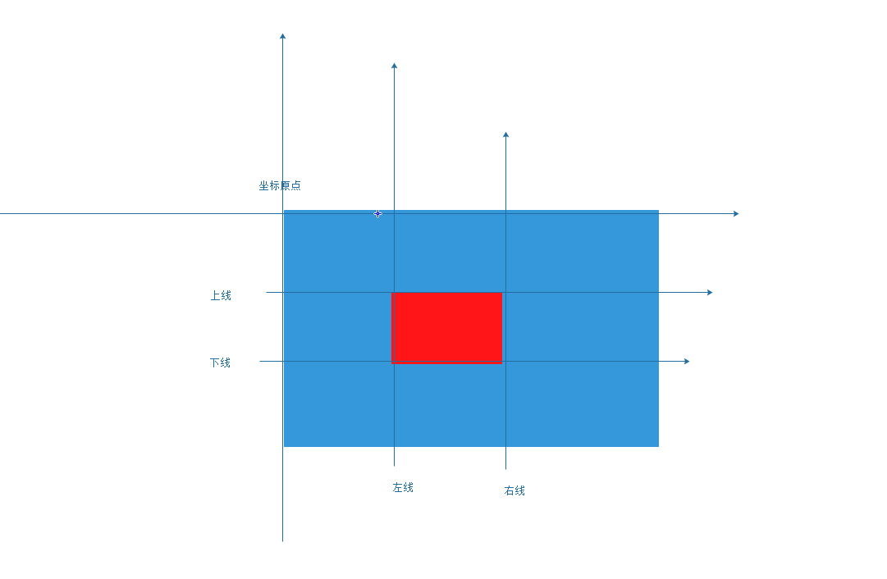
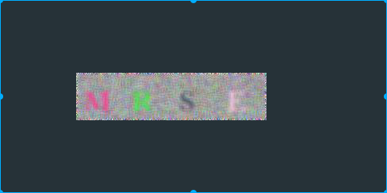

## Pillow

### 基本概念

> Python Imaging Library 使用笛卡尔坐标系, 使用 (0,0) 表示左上角. 值得注意的是, 坐标点表示的是一个像素的左上角, 而表示像素的中央则是 (0.5,0.5).
>
> 坐标系通常使用含有两个元素的元组进行交互. 表示矩形则使用以左上角的坐标打头的包含四个元素的元组, 例如, 一个 800x600 像素可以表示为 (0, 0, 800, 600).

### 基本操作

> 只记录一些常用的,自己用过的,其他的没有用过的,需要从手册上查询:
>
> [中文手册](http://pillow-zh-cn.readthedocs.io/zh_CN/latest/handbook/concepts.html)

#### 1.安装

> ```bash
> $ pip install pillow
> ```

#### 2.使用Image类

> PIL最重要的是Image class，可以通过多种方法创建这个类的实例：可以从文件加载图像，或者处理其他图像，或者从sratck创建.
>
> 从文件中加载图像，可以使用open()函数:
>
> ```python
> In [1]: from PIL import Image 
> In [2]: im = Image.open('thumbnail.jpg')
> ```
>
> 加载成功后，将返回一个图像对象，可以通过使用示例属性查看文件内容
>
> ```python
> In [9]: print (im.format,im.size,im.mode)
> ('JPEG', (106, 119), 'RGB')
> #format：格式，这个属性标识了图像来源
> #size：尺寸，如果图像不是从文件读取，他的值没有大小，返回结果是一个二元组(宽度，高度)单位是像素
> #mode:模式属性定了图像带的数量和名称，以及像素类型和深度。常见的模式有'L'(亮度)表示灰度图像，'RGB'标识真彩色图像，'CMYK'表示出版图像
> ```
>
> 显示图像: 在图片上邮件,还有选项,你能相信.......
>
> ```python
> n [8]: im.show()
> ```

#### 2.读写图像

> Python的图像处理库支持绝大多数的图片格式. 直接使用来自 [`Image`](http://pillow-zh-cn.readthedocs.io/zh_CN/latest/reference/Image.html#module-PIL.Image) 模块的 [`open()`](http://pillow-zh-cn.readthedocs.io/zh_CN/latest/reference/Image.html#PIL.Image.open) 方法就能从硬盘读取图片文件. 不需要你来区分不同的图片格式, 这个库会自动匹配对应的解码器来打开图片文件.
>
> 直接使用来自 [`Image`](http://pillow-zh-cn.readthedocs.io/zh_CN/latest/reference/Image.html#module-PIL.Image) 模块的 [`save()`](http://pillow-zh-cn.readthedocs.io/zh_CN/latest/reference/Image.html#PIL.Image.Image.save) 方法来保存图片文件. 当你保存图片文件的时候, 文件名显得尤为重要. 除非你指定扩展名, 默认情况下是自动沿袭本地存储格式的.
>
> ```python
> #!/usr/bin/evn python
> # coding=utf-8
> from __future__ import print_function
> import os
> import sys
> from PIL import Image
>
> """
> sys.argv[0] 是脚本的文件名称,
> sys.argv[1:] 是要作用于的所有图片的名字
> os.path.splitext  返回的是一个列表,前面是所有的内容,后面是扩展名
>
> """
> for infile in sys.argv[1:]:
>     f, e = os.path.splitext(infile)
>     outfile = f + '.jpg'
>     if infile != outfile:
>         try:
>             Image.open(infile).save(outfile) # save方法的第二个参数可以指定格式
>         except IOError:
>             print("不能转换格式")
>     else:
>         print("不需要转换格式")
>
> ```

#### 3.创建缩略图

> 缩略图是网络开发或图像软件预览常用的一种基本技术，使用Python的Pillow图像库可以很方便的建立缩略图，其中要用到[glob](../../Built_in_func/py3_glob.md)模块如下:
>
> ```PYTHON
> #!/usr/bin/env python
> # coding=utf-8
>
> """
> glob 是python的标准模块
> 是一种智能化的文件名匹配基数,在图像处理中经常会用到
> """
>
> from PIL import Image
> import glob
> import os
>
> size = (128, 128)
> for infile in glob.glob('test1.jpg'):
>     f, ext = os.path.split(infile)
>     img = Image.open(infile)
>     img.thumbnail(size, Image.ANTIALIAS)
>     img.save(f + 'suoluotu' + '.png')
>
> ```
>
> 注意：pillow不会直接解码或者加载图像数据。当你打开一个文件，只会读取文件头信息用来确定格式，颜色模式，大小等等，文件的剩余部分不会主动处理，这意味着打开一个文件的操作十分快速，跟图片的大小和压缩方式无关

#### 4.图像的剪切粘贴和合并操作

> Image类包含的方法允许操作图像部分选区，PIL.Image.crop方法获取图像的一个矩形选区。例如:
>
> ```python
> #!/usr/bin/env python
> # coding=utf-8
>
> from PIL import Image
>
>
> im = Image.open('test1.jpg')
> """
> 矩形选区有一个4元元组,分别表示,左上,右下,(from_x, from_y, to_x, to_y)左上角为原点,单位是px
> """
>
> # 复制一个200*200的矩形区域
>
> box = (100, 100, 300, 300)
>
> region = im.crop(box)
> region.show()
>
> ```
>
> 
>
> 这个选区可以复制到其他地方
>
> ```python
> #!/usr/bin/env
> #coding=utf-8
> from PIL import Image
> #
> #
> #
> #
> #
> #crop,paste and merge
> im = Image.open('./shaonian.jpg')
> # 矩形选区有一个4元元组定义，分别表示左，上，右，下的坐标。这个库以左上角为远点，单位是px,
> #复制一个200x200px的矩形选区
> #
> #
> box = (100,100,300,300)
> region = im.crop(box)
> #
> #
> #处理复制的矩形选区并粘贴到原图
> #当你粘贴矩形选区的时候必须保证尺寸一致。此外，矩形选区不能在图像外。然而你不必保证矩形选区和原图的颜色模式一致，因为矩形选区会被自动转换颜色。
> region = region.transpose(Image.ROTATE_180)
> im.paste(region,box)
> ```

#### 5.图像滤镜

> 图像滤镜在 PIL.ImageFilter() 模块中，在该模块中，预先定义了很多的增强滤镜，可以通过filter()函数使用，其中包括:
>
> | 滤镜                | 含义         |
> | ----------------- | ---------- |
> | BLUR              | 模糊滤镜       |
> | CONTOUR           | 轮廓         |
> | DETAIL            | 细节滤镜       |
> | EDGE_ENHANCE      | 边界加强       |
> | EDGE_ENHANCE_MORE | 边界加强(阈值更大) |
> | EMBOSS            | 浮雕滤镜       |
> | FIND_EDGES        | 边界滤镜       |
> | SMOOTH            | 平滑滤镜       |
> | SMOOTH_MORE       | 平滑滤镜(阈值更大) |
> | SHARPEN           | 锐化滤镜       |
>
> [更详细操作](http://pillow-cn.readthedocs.io/zh_CN/latest/handbook/tutorial.html#id6)
>
> ```python
> #!/usr/bin/env python
> # coding=utf-8
>
> from PIL import Image
> from PIL import ImageFilter
> img = Image.open("2.png")
> test1 = img.filter(ImageFilter.EMBOSS)
> test1.show()
> ```

#### 6.生成字母验证图片

> ```python
> #!/usr/bin/env python
> # coding=utf-8
>
> """
> 这是一个随机生成字母验证图片的小程序
> """
>
> from PIL import Image, ImageDraw, ImageFont, ImageFilter
> import random
>
> # 生成随机字母,根据ASCII表中得到的数据为65-90为A-Z 的大写字母
>
>
> def rndChar():
>     return chr(random.randint(65, 90))
>
> # 生成随机颜色1:
>
>
> def rndColor():
>     cor = (random.randint(64, 255), random.randint(
>         64, 255), random.randint(64, 255))
>     return cor
>
> # 生成随机颜色2
>
>
> def rndColor1():
>     cor = (random.randint(64, 255), random.randint(
>         64, 255), random.randint(64, 255))
>     return cor
>
>
> # 生成一个窗口
> width = 60 * 4
> height = 60
> img = Image.new('RGB', (width, height), (255, 255, 255))
>
> # 创建Font对象
> # ubuntu的字体目录为/usr/share/fonts 随便从中取一款字体配对使用即可
> font = ImageFont.truetype(
>     font='/usr/share/fonts/opentype/stix/STIXGeneral-Bold.otf', size=36)
> # 创建draw对象
> draw = ImageDraw.Draw(img)
> # 填充每个像素
> for x in range(width):
>     for y in range(height):
>         draw.point((x, y), fill=rndColor())
> # 输出文字
>
> for t in range(4):
>     draw.text((60 * t + 10, 10), rndChar(), font=font, fill=rndColor1())
>
>
> # 模糊
> image = img.filter(ImageFilter.BLUR)
> image.save('code.jpg', 'jpeg')
>
> ```
>
> 

