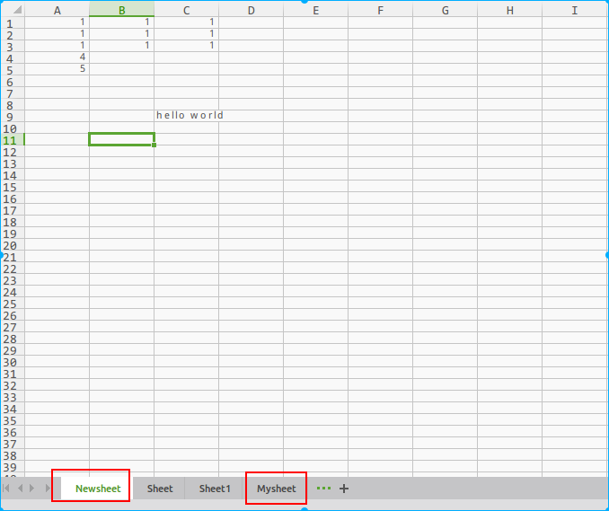

## openpyxl

> 几个基本的概念
>
> | excel术语 | openpyxl对应 |
> | ------- | ---------- |
> | 工作簿     | workbook   |
> | 表单      | worksheet  |
> | 行       | row        |
> | 列       | column     |
> | cell    | 单元格        |
>

### 官网

> [查询官网](https://openpyxl.readthedocs.io/en/default/tutorial.html)

### 创建一个workbook

> 使用openpyxl没有必要先在系统中新建一个`.xlsx`，我们需要做的只需要引入`Workbook`这个类，接着开始调用它
>
> ```python
> from openpyxl import *
>
> wb = Workbook()
> ```
>
> 一个工作簿(workbook)在创建的时候同时至少也新建了一张工作表(worksheet),得到正在运行工作表可以通过
>
> ```python
> # 得到正在运行的工作表
> ws = wb.active
> print(ws) 
> # <Worksheet "Sheet"> 默认工作表的名称
> ```
>
> [^注意]: `active` 默认调用了工作表的索引值,默认是0
>
> 通过`create_sheet` 来创建`worksheet`
>
> ```python
> # 创建worksheet
> ws1 = wb.create_sheet()               # 创建sheet,默认是在末尾
> ws2 = wb.create_sheet('Mysheet')      # 创建命名的sheet,默认是在末尾
> ws3 = wb.create_sheet('Newsheet', 0)  # 根据索引,创建命名sheet
> ```
>
> 在创建工作表的时候系统自动命名。他们按照序列依次命名 (Sheet, Sheet1, Sheet2, ...),可以调用`title` 属性修改工作表的名称
>
> ```python
> ws.title = 'New Title'
> ```
>
> 标签栏的背景色默认为白色。你可以通过提供一个RRGGBB颜色码改变标签栏的字体颜色
>
> ```python
> ws.sheet_properties.tabColor = "1072BA"
> ```
>
> 查看所有工作表(worksheet)的名称
>
> ```python
> # 查看所有工作表的名称
> print(wb.sheetnames)
>
> # 使用循环获取工作表名称
> for name in wb:
>     print(name.title)
> ```
>
> 可以在一个工作簿中创建工作表副本
>
> ```python
> >>> source = wb.active
> >>> target = wb.copy_worksheet(source)
> ```
>
> 注意:只有单元格（包括值，样式，超链接和注释）和某些工作表属性（包括尺寸，格式和属性）被复制。所有其他工作簿/工作表属性不会被复制 - 例如图像，图表。

### 数据操作

> #### 访问一个单元格
>
> `cell` 单元格可以直接作为`worksheet` 的一个`key` 来访问.类似字典,但是这样得到的是这个单元格对象,并不是值
>
> ```python
> ws = wb.active
> print(ws.title)
>
> c = ws['A4'] # A列第4行
> print(c)     # 单元格对象 
> # <Cell 'Newsheet'.A4>   
> ```
>
> 这样,将会返回`A4` 处的单元格对象,如果不存在,将会创建.注意,在内存中创建工作表时,未来优化内存,它不包含单元格。它们在第一次访问时创建。由于这个特性,即使不赋值,也可以通过`ws.cell(row,column)` 来创建单元格对象.
>
> 对应的值可以直接赋值
>
> ```python
> # 通过给对象 value属性赋值
> c.value = 4
> print(c.value)
> # 直接对类字典对象赋值
> ws['A5'] = 4
> print(ws['A5'].value)
> # 效果等同
> ```
>
> ##### 除了类字典方式,还可以通过`cell` 来使用行和列符号提供访问单元格对象(推荐,便于遍历)
>
> ```python
> d = ws.cell(row=5, column=1)  # 得到了上方 A5 对象
> print(d.value)
> # 4 
> # 直接修改 A5 的值
> d1 = ws.cell(row=5, column=1, value=5)
> print(d1.value)  
> print(ws['A5'].value)
> # 5
> # 5
> # 两种不同的访问形式,但是得到的结果都是一样的
> ```
>
> #### 访问多个单元格
>
> 可以使用切片的方式来访问单元格的范围
>
> ```python
> # 使用切片来获取一个单元格范围
> cell_range = ws['A1':'C2']  
>
> # 行,列的 范围,可以使用类似的方法获得
> colC = ws['C']   # c列
> col_range = ws['C':'D']   # c列到D所有值
> row10 = ws[10]  # 第10行
> row_range=ws[5:10]   # 第5行,到第10行
> ```
>
> 可以使用迭代的方式访问(推荐)迭代行,或者迭代列都可以
>
> ```python
> # 对行进行迭代,默认是以行为单位,一行一行的访问
> for row in ws.iter_rows(min_row=1, max_row=3, min_col=1, max_col=3):
>     for cell in row:
>         print(cell)
>         cell.value = 1
>
> '''
> <Cell 'Newsheet'.A1>
> <Cell 'Newsheet'.B1>
> <Cell 'Newsheet'.C1>
> <Cell 'Newsheet'.A2>
> <Cell 'Newsheet'.B2>
> <Cell 'Newsheet'.C2>
> <Cell 'Newsheet'.A3>
> <Cell 'Newsheet'.B3>
> <Cell 'Newsheet'.C3>
> '''        
>         
> # 对列进行迭代,默认以列为单位,一列一列访问
> for col in ws.iter_cols(min_row=1, max_row=3, min_col=1, max_col=3):
>     for cell in col:
>         print(cell)
>         print(cell.value)
>  
> '''
> <Cell 'Newsheet'.A1>
> 1
> <Cell 'Newsheet'.A2>
> 1
> <Cell 'Newsheet'.A3>
> 1
> <Cell 'Newsheet'.B1>
> 1
> <Cell 'Newsheet'.B2>
> 1
> <Cell 'Newsheet'.B3>
> 1
> <Cell 'Newsheet'.C1>
> 1
> <Cell 'Newsheet'.C2>
> 1
> <Cell 'Newsheet'.C3>
> 1
> '''
> ```
>
> 如果要遍历所有的行和列,可以使用`Worksheet.rows() \Worksheet.columns` 方法中的一种	
>
> ```python
> ws = wb.active
> ws['C9'] = 'hello world'
> tuple(ws.rows)    # 每一行是一个元组,整体是一个元组
> tuple(ws.columns)  # 每一列是一个元组,整体是一个元组
> ```
>
> 获取文件一共有多少行,多少列
>
> ```python
> print('{} 一共有{}行,{}列'.format(ws.title, ws.max_row, ws.max_column))
> # Newsheet 一共有10行,4列
> ```
>
> 

###  单元格赋值

> 如果修改\创建了单元格,就可以给单元格赋值
>
> ```python
> >>> c.value = 'hello, world'
> >>> print(c.value)
> 'hello, world'
>
> >>> d.value = 3.14
> >>> print(d.value)
> 3.14
> ```
>
> 也可以开启类型和格式推断
>
> ```python
> >>> wb = Workbook(guess_types=True)
> >>> c.value = '12%'
> >>> print(c.value)
> 0.12
>
> >>> import datetime
> >>> d.value = datetime.datetime.now()
> >>> print d.value
> datetime.datetime(2010, 9, 10, 22, 25, 18)
>
> >>> c.value = '31.50'
> >>> print(c.value)
> 31.5
> ```

### 保存到文件

> 利用`Workbook.save()` 方法保存文件
>
> ```python
> >>> wb = Workbook()
> >>> wb.save('balances.xlsx')
> ```
>
> 这个操作会覆盖现有的文件而不发出警告
>
> 可以指定属性template = True，将工作簿保存为模板
>
> ```python
> >>> wb = load_workbook('document.xlsx')
> >>> wb.template = True
> >>> wb.save('document_template.xltx')
> ```
>
> 或者将此属性设置为False（默认），以另存为文档
>
> ```python
> >>> wb = load_workbook('document_template.xltx')
> >>> wb.template = False
> >>> wb.save('document.xlsx', as_template=False)
> ```
>
> 

### 加载现有文件

> 和写入一样,可以加载一个现有的文件
>
> ```python
> from openpyxl import load_workbook
> wb2 = load_workbook('./test1.xlsx')
> print(wb2.get_sheet_names())
> # ['Newsheet', 'Sheet', 'Sheet1', 'Mysheet']
> ```

### 转换列名为数字,转换行名为字母 

> ```python
> from openpyxl.utils import get_column_letter,column_index_from_string
>
> print(get_column_letter(11))
> print(column_index_from_string('ASS'))
>
> # K
> # 1189
> ```
>
> 

### 实例

> #### 写入一个工作簿
>
> ```python
> # worksheet.appent
>
> append(iterable) method of openpyxl.worksheet.worksheet.Worksheet instance
>     Appends a group of values at the bottom of the current sheet.
>     
>     * If it's a list: all values are added in order, starting from the first column
>     * If it's a dict: values are assigned to the columns indicated by the keys 
>     (numbers or letters)
>     
>     :param iterable: list, range or generator, or dict containing values to append
>     :type iterable: list|tuple|range|generator or dict
>
>     Usage:
>
>     * append(['This is A1', 'This is B1', 'This is C1'])
>     * **or** append({'A' : 'This is A1', 'C' : 'This is C1'})
>     * **or** append({1 : 'This is A1', 3 : 'This is C1'})
>     
>     :raise: TypeError when iterable is neither a list/tuple nor a dict
> ```
>
> `append` 添加到最后`workshett` 的最底部一行中(除去前面有数据的行),
>
> * `list` 对象,是按照 列一列一列的添加
> * `dict` 按照键(key) 值指定的列添加
> * `list, dict` 的添加前提都是在最底部一行中(只要前面有数据,就不会添加)
>
> ```python
> #!/usr/bin/env python
> # -*- coding: utf-8 -*-
> # @Author: ningyanke
> # @Date:   2018-01-21 21:16:56
> # @Last Modified by:   ningyanke
> # @Last Modified time: 2018-01-22 00:57:31
>
>
> from openpyxl import Workbook
> from openpyxl.compat import range
> from openpyxl.utils import get_column_letter
>
> # 创建一个工作簿
> wb = Workbook()
>
> dest_name = './empty_book.xlsx'
>
> # 接受默认激活的工作表
> ws1 = wb.active
>
> # 修改名字
> ws1.title = 'range name'
>
>
> # openpyxl.compat.range和 python range 功能相同
> # 来自于append append会在当前工作表的底部添加值,前面有值的就不会添加,这样的循环添加方法
> for row in range(1, 40):
>     ws1.append(range(600))
>
>
> # 创建一个新的 sheet
> ws2 = wb.create_sheet(title='Pi')
>
> ws2['F5'] = 3.14  # F行第5列的值
>
> ws3 = wb.create_sheet(title='Data')
> for row in range(10, 20):
>     for col in range(27, 54):
>         ws3.cell(column=col, row=row, value='{0}'.
>                  format(get_column_letter(col)))
>
> print(ws3['AA10'].value)
>
> # 生成一个新的 worksheet
> ws4 = wb.create_sheet(title='Dict')
> # 指定3个字典 ,每次添加到excel表格的最后一行中
> product = {
>     1: "this is test1",
>     2: "this is test2"
> }
>
> product1 = {
>     'A': "this is test1",
>     'B': "this is test2"
> }
>
> product2 = {
>     'C': "this is test1",
>     'D': "this is test2"
> }
> ws4.append(product)
> ws4.append(product1)
> ws4.append(product2)
> # 保存
> wb.save(filename=dest_name)
> ```
>
> #### 读取一个工作簿
>
> 注意:读取工作薄的时候可以设置相应的标志位
>
> * `guess_type` ,默认是关闭,启用后会对单元格内容进行类型推断,比如日期类型
> * `data_only`控制具有公式的单元格是否具有公式（默认）或上次Excel读取工作表时存储的值
> * `keep_vba` 控制是否保留任何Visual Basic元素（默认）。如果他们保留，他们仍然是不可编辑的
>
> openpyxl当前不会读取Excel文件中所有可能的项目，因此如果打开并保存相同的名称，图像和图表将从现有文件中丢失,
>
> 最好的做法是操作完毕后保存为另外一个文件
>
> ```python
> >>> from openpyxl import load_workbook
> >>> wb = load_workbook(filename = 'empty_book.xlsx')
> >>> sheet_ranges = wb['range names']
> >>> print(sheet_ranges['D18'].value)
> ```
>
> #### 格式化输出
>
> 在读入数据的时候,根据自己的需要启用类型判断
>
> ```python
> >>> import datetime
> >>> from openpyxl import Workbook
> >>> wb = Workbook()
> >>> ws = wb.active
> >>> # set date using a Python datetime
> >>> ws['A1'] = datetime.datetime(2010, 7, 21)
> >>>
> >>> ws['A1'].number_format
> 'yyyy-mm-dd h:mm:ss'
> >>> # You can enable type inference on a case-by-case basis
> >>> wb.guess_types = True
> >>> # set percentage using a string followed by the percent sign
> >>> ws['B1'] = '3.14%'
> >>> wb.guess_types = False
> >>> ws['B1'].value
> 0.031400000000000004
> >>>
> >>> ws['B1'].number_format
> '0%'
> ```
>
> #### 使用公式
>
> ```python
> >>> from openpyxl import Workbook
> >>> wb = Workbook()
> >>> ws = wb.active
> >>> # add a simple formula
> >>> ws["A1"] = "=SUM(1, 1)"
> >>> wb.save("formula.xlsx")
> ```
>
> 注意，必须使用英文名称作为函数，而函数参数必须用逗号分隔，而不要使用其他标点符号（如分号)
>
> openpyxl 不计算公式,但是可以检查公式正确
>
> #### 合并/取消单元格
>
> 合并单元格时，将从工作表中删除左上角的单元格
>
> ```python
> >>> from openpyxl.workbook import Workbook
> >>>
> >>> wb = Workbook()
> >>> ws = wb.active
> >>>
> >>> ws.merge_cells('A2:D2')
> >>> ws.unmerge_cells('A2:D2')
> >>>
> >>> # or equivalently
> >>> ws.merge_cells(start_row=2,start_column=1,end_row=2,end_column=4)
> >>> ws.unmerge_cells(start_row=2,start_column=1,end_row=2,end_column=4)
> ```
>
> #### 插入image
>
> ```python
>
> >>> from openpyxl import Workbook
> >>> from openpyxl.drawing.image import Image
> >>>
> >>> wb = Workbook()
> >>> ws = wb.active
> >>> ws['A1'] = 'You should see three logos below'
> >>> # create an image
> >>> img = Image('logo.png')
> >>> # add to worksheet and anchor next to cells
> >>> ws.add_image(img, 'A1')
> >>> wb.save('logo.xlsx')
> ```
>
> #### 折叠列(大纲)
>
> ```python
> >>> import openpyxl
> >>> wb = openpyxl.Workbook()
> >>> ws = wb.create_sheet()
> >>> ws.column_dimensions.group('A','D', hidden=True)
> >>> wb.save('group.xlsx')
>
> ```

### 单元格样式

> openpyxl的单元格样式由6种属性决定，每一种都是一个类，需要注意的是这在对样式属性赋值时，样式实例一经创建，样式实例的属性就不可更改，只能新建样式实例。如下所示（中文是我自己翻译的，不太准确，领会精神）：
>
> * font(字体类)：字号、字体颜色、下划线等
> * fill(填充类)：颜色等
> * border(边框类)：设置单元格边框
> * alignment(位置类)：对齐方式
> * number_format(格式类)：数据格式
> * protection(保护类)：写保护
>
> 单元格默认样式如下：
>
> ```python
> >>> from openpyxl.styles import PatternFill, Border, Side, Alignment, Protection, Font
> >>> font = Font(name='Calibri',
> ...                 size=11,
> ...                 bold=False,
> ...                 italic=False,
> ...                 vertAlign=None,
> ...                 underline='none',
> ...                 strike=False,
> ...                 color='FF000000')
> >>> fill = PatternFill(fill_type=None,
> ...                 start_color='FFFFFFFF',
> ...                 end_color='FF000000')
> >>> border = Border(left=Side(border_style=None,
> ...                           color='FF000000'),
> ...                 right=Side(border_style=None,
> ...                            color='FF000000'),
> ...                 top=Side(border_style=None,
> ...                          color='FF000000'),
> ...                 bottom=Side(border_style=None,py
> ...                             color='FF000000'),
> ...                 diagonal=Side(border_style=None,
> ...                               color='FF000000'),
> ...                 diagonal_direction=0,
> ...                 outline=Side(border_style=None,
> ...                              color='FF000000'),
> ...                 vertical=Side(border_style=None,
> ...                               color='FF000000'),
> ...                 horizontal=Side(border_style=None,
> ...                                color='FF000000')
> ...                )
> >>> alignment=Alignment(horizontal='general',
> ...                     vertical='bottom',
> ...                     text_rotation=0,
> ...                     wrap_text=False,
> ...                     shrink_to_fit=False,
> ...                     indent=0)
> >>> number_format = 'General'
> >>> protection = Protection(locked=True,
> ...                         hidden=False)123456789101112131415161718192021222324252627282930313233343536373839
> ```
>
> **以上几种样式（字体、填充、边框、位置和保护）实例一旦被创建实例的属性就不可更改，只能重新创建实例。**
>
> ```python
> >>> from openpyxl.styles import colors
> >>> from openpyxl.styles import Font, Color
> >>> from openpyxl.styles import colors
> >>> from openpyxl import Workbook
> >>> wb = Workbook()
> >>> ws = wb.active
> >>>
> >>> a1 = ws['A1']
> >>> d4 = ws['D4']
> >>> ft = Font(color=colors.RED)
> >>> a1.font = ft
> >>> d4.font = ft
> >>>
> >>> a1.font.italic = True # 不会生效，样式实例一旦创建，实例的属性就不可改变
> >>>
> >>> # 若要改变样式，必须新建样式实例
> >>>
> >>> a1.font = Font(color=colors.RED, italic=True) # 创建字体实例（红色、斜体，其他属性默认）123456789101112131415161718
> ```
>
> #### 复制样式
>
> 样式可以被复制：
>
> ```python
> >>> from openpyxl.styles import Font
> >>>
> >>> ft1 = Font(name='Arial', size=14)
> >>> ft2 = ft1.copy(name="Tahoma") # 复制时指定字体为“Tahoma”，其他属性均复制自ft1
> >>> ft1.name
> 'Arial'
> >>> ft2.name
> 'Tahoma'
> >>> ft2.size
> 14.012345678910
> ```
>
> #### 基本字体颜色
>
> 字体颜色有一些颜色常量，可以直接调用:
>
> ```python
> from openpyxl.styles import Font
> from openpyxl.styles.colors import RED
> font = Font(color=RED)
> font = Font(color="00FFBB00")1234
> ```
>
> 也可以按索引创建实例：
>
> ```python
> from openpyxl.styles.colors import Color
> c = Color(indexed=32)
> c = Color(theme=6, tint=0.5)123
> ```
>
> 说到颜色，V2.3.5版本必须使用“00XXXXXX”的格式，不能使用“#XXXXXX”的格式。如果颜色不生效请查看版本后修改。
>
> #### 应用样式
>
> 可以直接应用到单元格:
>
> ```python
> from openpyxl.workbook import Workbook
> from openpyxl.styles import Font, Fill
> wb = Workbook()
> ws = wb.active
> c = ws['A1']
> c.font = Font(size=12)123456
> ```
>
> 可以对整行整列设置样式，前提是单元格已创建。
>
> ```python
> col = ws.column_dimensions['A']
> col.font = Font(bold=True)
> row = ws.row_dimensions[1]
> row.font = Font(underline="single")1234
> ```
>
> #### 数据格式
>
> 数据格式属性number_format的值是字符串类型，不为对象，直接赋值即可。 
> openpyxl内置了一些数据格式查看`openpyxl.styles.numbers`，也支持excel自定义格式，以下两种方式效果相同：
>
> ```python
> # 使用openpyxl内置的格式
> from openpyxl.styles import numbers
> ws.cell['D2'].number_format = numbers.FORMAT_GENERAL
> ws.cell(row=2, column=4).number_format = numbers.FORMAT_DATE_XLSX151234
> ```
>
> ```python
> # 直接使用字符串
> ws.cell['D2].number_format = 'General'
> ws.cell(row=2, column=4).number_format = 'd-mmm-yy'123
> ```
>
> #### 编辑页面设置
>
> ```python
> from openpyxl.workbook import Workbook
>
> wb = Workbook()
> ws = wb.active
>
> ws.page_setup.orientation = ws.ORIENTATION_LANDSCAPE
> ws.page_setup.paperSize = ws.PAPERSIZE_TABLOID
> ws.page_setup.fitToHeight = 0
> ws.page_setup.fitToWidth = 1123456789
> ```
>
> #### 编辑打印选项
>
> ```python
> from openpyxl.workbook import Workbook
>
> wb = Workbook()
> ws = wb.active
>
> ws.print_options.horizontalCentered = True
> ws.print_options.verticalCentered = True
> ```

### worksheet 表格

> worksheet中表格是对单元格的引用
>
> ```python
> from openpyxl import Workbook
> from openpyxl.worksheet.table import Table, TableStyleInfo
>
> wb = Workbook()
> ws = wb.active
>
> data = [
>     ['Apples', 10000, 5000, 8000, 6000],
>     ['Pears',   2000, 3000, 4000, 5000],
>     ['Bananas', 6000, 6000, 6500, 6000],
>     ['Oranges',  500,  300,  200,  700],
> ]
>
> # add column headings. NB. these must be strings
> ws.append(["Fruit", "2011", "2012", "2013", "2014"])
> for row in data:
>     ws.append(row)
>
> tab = Table(displayName="Table1", ref="A1:E5")
>
> # Add a default style with striped rows and banded columns
> style = TableStyleInfo(name="TableStyleMedium9", showFirstColumn=False,
>                        showLastColumn=False, showRowStripes=True, showColumnStripes=True)
> tab.tableStyleInfo = style
> ws.add_table(tab)
> wb.save("table.xlsx")
> ```
>
> 默认情况下，表格是使用第一行的标题和所有列的过滤器创建的。 样式使用TableStyleInfo对象进行管理。这允许您分割行或列，并应用不同的配色方案。
>
> 表名在工作簿和表头中必须是唯一的，并且过滤器范围必须始终包含字符串。如果情况并非如此，则Excel可能会将该文件视为无效并删除该表

### 高级应用

> 高级应用查阅官网