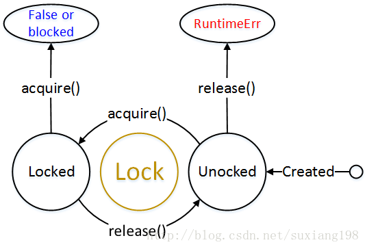

## 3.使用互斥锁

### 多线程共享全局变量

> ```python
> # global_variable.py
>
> # 多线程,共享全局变量
> # 一个进程中所有的线程共享全局变量,能够在不使用其他方式的前提下,完成多线程之间的数据
> # 共享
>
> import threading
> import time
>
> global_num = 100
>
>
> def work1():
>     global global_num
>     for i in range(3):
>         global_num += 1
>     print("in work1, global_num is %d" % global_num)
>
>
> def work2():
>     global global_num
>     print('in work2, global_num is %d' % global_num)
>
>
> print("---线程创建之前g_num is %d----" % global_num)
>
> t1 = threading.Thread(target=work1)
> t1.start()
>
> time.sleep(1)
>
> t2 = threading.Thread(target=work2)
> t2.start()
> ```
>
> 在一个进程内的所有线程,会共享全局变量,共享内存资源,这样所有的线程并发修改全局变量 ,会造成全局变量的混乱

### 同步的概念

> 多线程开发可能遇到的问题:
>
> 假设两个线程t1和t2都要对num=0进行增1运算,t1和t2都各对num修改10次,num的最终的结果应该为20。但是由于是多线程访问,有可能出现下面情况:在num=0时,t1取得num=0。此时系统把t1调度为”sleeping”状态,把t2转换为”running”状态,t2也获得num=0。然后t2对得到的值进行加1并赋给num,使得num=1。然后系统又把t2调度为”sleeping”,把t1转为”running”。线程t1又把它之前得到的0加1后赋值给num。这样,明明t1和t2都完成了1次加1工作,但结果仍然是num=1。
>
> ```python
> # 10001.py
>
> # 共享内存资源时,由于多方线程更改一个数据,造成的混乱
>
> import threading
> import time
>
>
> count = 0
>
>
> class MyThread(threading.Thread):
>
>     def __init__(self):
>         super(MyThread, self).__init__()
>
>     def run(self):
>         global count
>         time.sleep(1)
>         for i in range(1000000):
>             count += 1
>         print("thead {} add 1000000, count is {}".format(self.name, count))
>
>
> def main():
>     print("Start main threading")
>     for i in range(10):
>         MyThread().start()
>
>     print("End amin threading")
>
> if __name__ == '__main__':
>     main()
> ```
>
> 执行结果
>
> ```python
> $ python 10001.py 
> Start main threading
> End amin threading
> thead Thread-1 add 1000000, count is 1087128
> thead Thread-2 add 1000000, count is 1420188
> thead Thread-3 add 1000000, count is 1662834
> thead Thread-9 add 1000000, count is 1766686
> thead Thread-4 add 1000000, count is 2430695
> thead Thread-10 add 1000000, count is 2427131
> thead Thread-6 add 1000000, count is 2629461
> thead Thread-8 add 1000000, count is 3134165
> thead Thread-7 add 1000000, count is 3240762
> thead Thread-5 add 1000000, count is 3283053
> ```
>
> 可以看到,虽然每个线程加的都是整数,但是得到的结果却都不是整数.
>
> 问题产生的原因就是没有控制多个线程对同一资源的访问，对数据造成破坏，使得线程运行的结果不可预期。这种现象称为“线程不安全”
>
> #### 同步的概念
>
> 同步就是协同进行,按照预定的先后次序进行运行.如进程、线程同步,可理解为进程或线程A和B一块配合,A执行到一定程度时要依靠B的某个结果,于是停下来,示意B运行;B依言执行,再将结果给A;A再继续操作。

### 互斥锁同步

> 上面的例子引出了多线程编程的最常见问题：数据共享。当多个线程都修改某一个共享数据的时候，需要进行同步控制.
>
> 线程同步能够保证多个线程安全访问竞争资源，最简单的同步机制是引入互斥锁。互斥锁为资源引入一个状态：锁定/非锁定。某个线程要更改共享数据时，先将其锁定，此时资源的状态为“锁定”，其他线程不能更改；直到该线程释放资源，将资源的状态变成“非锁定”，其他的线程才能再次锁定该资源。互斥锁保证了每次只有一个线程进行写入操作，从而保证了多线程情况下数据的正确性.
>
> threading模块中定义了`Lock`，可以方便的处理锁定.Lock即primitive lock，原始锁，只会处于两个状态中的一个，“locked”（初始态）或“unlocked”。并有acquire()和release()两个方法。acquire()有阻塞和非阻塞两种方式，阻塞是会一直等待直到锁释放，而非阻塞是如果获取不到锁就立即返回false。相关图示如下： 
>
>  
>
> - 创建锁
>   - `mutex = threading.Lock()`
> - 锁定
>    - `mutex.acquire([timeout])` #可以拥有一个超时时间参数timeout,如果设定了timeout,则在超时后通过返回值可以判断是否得到了锁，从而可以进行一些其他处理
> - 释放
>    - `mutex.release()`
>
> 上面的程序重新获取锁,再次计算
>
> ```python
> # 10002.py
> import threading
> import time
>
>
> count = 0
>
> # 创建锁定池
> lock = threading.Lock()
>
>
> class MyThread(threading.Thread):
>
>     def __init__(self):
>         super(MyThread, self).__init__()
>
>     def run(self):
>         global count
>         time.sleep(1)
>         for i in range(1000000):
>             # 上锁
>             lock.acquire()
>             count += 1
>             # 去除锁
>             lock.release()
>         print("thead {} add 1000000, count is {}".format(self.name, count))
>
>
> def main():
>     print("Start main threading")
>     for i in range(10):
>         MyThread().start()
>
>     print("End amin threading")
>
> if __name__ == '__main__':
>     main()
> ```
>
> 计算结果
>
> ```python
> $ python 10002.py 
> Start main threading
> End amin threading
> thead Thread-3 add 1000000, count is 9842169
> thead Thread-9 add 1000000, count is 9864184
> thead Thread-2 add 1000000, count is 9908790
> thead Thread-5 add 1000000, count is 9917902
> thead Thread-1 add 1000000, count is 9946277
> thead Thread-7 add 1000000, count is 9947100
> thead Thread-8 add 1000000, count is 9954403
> thead Thread-4 add 1000000, count is 9974617
> thead Thread-10 add 1000000, count is 9988279
> thead Thread-6 add 1000000, count is 10000000
> ```

### 同步阻塞

> 当一个线程调用锁的`acquire()`方法获取锁后，锁就进入`locked`状态，每次只有一个线程可以获取锁，如果此时另一个线程试图获取这个锁，该线程就会变成 blocked状态，称为'同步阻塞'，直到拥有锁的线程调用锁的release()方法释放锁后，锁进入unlocked状态，线程调度程序从出入同步阻塞的线程中选择一个来获取锁，并使的该线程进入 `running`状态