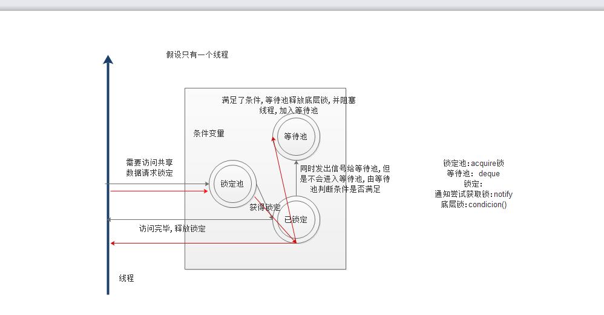
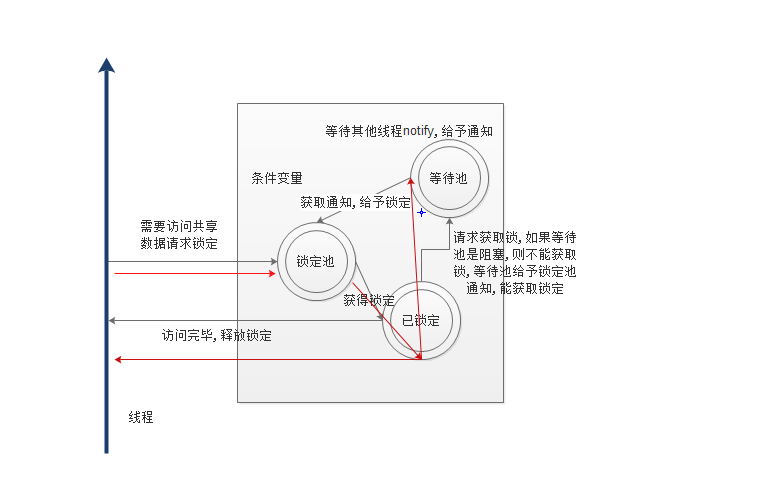

## 5.条件变量同步

> 互斥锁是最简单的线程同步机制，Python提供的`Condition` 对象提供了对复杂线程同步问题的支持。`Condition`被称为条件变量，除了提供与`Lock`类似的`acquire和release`方法外，还提供了`wait和notify`方法。
> - 线程首先acquire一个条件变量，然后判断一些条件。如果条件不满足则wait；
> - 如果条件满足，进行一些处理改变条件后，通过notify方法通知其他线程，
> - 其他处于wait状态的线程接到通知后会重新判断条件。
> - 不断的重复这一过程，从而解决复杂的同步问题。
>
> 可以认为Condition对象维护了一个锁(`Lock/RLock`)和一个`waiting`池(这里的waitting池指的是deque双端队列)。线程通过`acquire`获得`Condition`对象，当调用wait方法时，线程会释放Condition内部的锁并进入blocked状态，同时在waiting池中记录这个线程。当调用notify方法时，Condition对象会从waiting池中挑选一个线程，通知其调用acquire方法尝试取到锁。
> ​	
> Condition对象的构造函数可以接受一个Lock/RLock对象作为参数，如果没有指定，则Condition对象会在内部自行创建一个RLock。除了notify方法外，Condition对象还提供了notifyAll方法，可以通知waiting池中的所有线程尝试acquire内部锁。由于上述机制，处于waiting状态的线程只能通过notify方法唤醒，所以notifyAll的作用在于防止有线程永远处于沉默状态。

### 源码分析

> ```python
> # condithon 是一把高级的锁
> class Condition:
>
>     def __init__(self, lock=None):  # 默认是没有锁
>         if lock is None:            # 加入锁也会编程可重入的锁
>             lock = RLock()
>         self._lock = lock
>         self.acquire = lock.acquire     # 实例化对象获取到的底层锁
>         self.release = lock.release     # 实例化对象释放底层锁
>
>         try:
>             self._release_save = lock._release_save 
>         except AttributeError:
>             pass
>         try:
>             self._acquire_restore = lock._acquire_restore
>         except AttributeError:
>             pass
>         try:
>             self._is_owned = lock._is_owned
>         except AttributeError:
>             pass
>         # 双端队列,会在调用wait 时添加一个原始锁,个数变为1
>         self._waiters = _deque()  # 等待池,deque是一个双端队列
>         
> 	# 以下方法,实现了__enter__,实现了__exit__ ,可以用上下文管理器调用
>     def __enter__(self):
>         return self._lock.__enter__()
>
>     def __exit__(self, *args):
>         return self._lock.__exit__(*args)
>
>     def __repr__(self):
>         return "<Condition(%s, %d)>" % (self._lock, len(self._waiters))
>
>     def _release_save(self):
>         # 释放实例化对象获得锁
>         self._lock.release()           # No state to save
>
>     def _acquire_restore(self, x):
>         self._lock.acquire()           # Ignore saved state
>
>     def _is_owned(self):
>         if self._lock.acquire(0):
>             self._lock.release()
>             return False
>         else:
>             return True
>
>     def wait(self, timeout=None):
> 		
>         if not self._is_owned():
>             raise RuntimeError("cannot wait on un-acquired lock")
>         # _allocat_lock = thread.lock,是一个原始锁
>         waiter = _allocate_lock()
>         # 获取原始锁
>         waiter.acquire()
>         # 双端队列添加原始锁
>         self._waiters.append(waiter)
>         # 释放底层锁,即实例化对象获得的锁
>         # 返回 True /False
>         saved_state = self._release_save()
>         gotit = False
>         try:    # restore state no matter what (e.g., KeyboardInterrupt)
>             if timeout is None:
>                 # 尝试去获取原始锁
>                 # 阻塞waitting池中的所有线程
>                 # 使得gotit = True
>                 waiter.acquire()
>                 gotit = True
>             else:
>                 if timeout > 0:
>                     gotit = waiter.acquire(True, timeout)
>                 else:
>                     gotit = waiter.acquire(False)
>             return gotit
>         finally:
>             # 如果获取不到锁则立即返回False
>             # 
>             self._acquire_restore(saved_state)
>             # 如果阻塞了所有线程,不执行,
>             # 没有阻塞线程
>             if not gotit:
>                 try:
>                     # 释放了watting池的锁
>                     self._waiters.remove(waiter)
>                 except ValueError:
>                     pass
>
>     def wait_for(self, predicate, timeout=None):
>
>         endtime = None
>         waittime = timeout
>         result = predicate()
>         while not result:
>             if waittime is not None:
>                 if endtime is None:
>                     endtime = _time() + waittime
>                 else:
>                     waittime = endtime - _time()
>                     if waittime <= 0:
>                         break
>             self.wait(waittime)
>             result = predicate()
>         return result
>
>     def notify(self, n=1):
>         if not self._is_owned():
>             raise RuntimeError("cannot notify on un-acquired lock")
>         all_waiters = self._waiters   # 等于 deque  一个双端队列
>         # 获取双端队列中的锁/或者里面没有锁
>         waiters_to_notify = _deque(_islice(all_waiters, n))
>         if not waiters_to_notify:
>             return
>         # 针对有锁的情况下, 把锁去掉,可以让下一个线程重新去获取锁.
>         for waiter in waiters_to_notify:
>             waiter.release()   # 等待池中线程释放锁
>             try:
>                 all_waiters.remove(waiter)  # 移除已经释放了锁的线程
>             except ValueError:
>                 pass
>
>     def notify_all(self):
>
>         self.notify(len(self._waiters))
>
>     notifyAll = notify_all
>
> ```
>
> 这样,很明显的看出是有2个阶段的,第一阶段,没有调用`wait` ,第二阶段,调用了`wait`
>
> 
>
> 	

> 演示条件变量同步的经典问题是生产者与消费者问题：
>
> 假设有一群生产者(Producer)和一群消费者（Consumer）通过一个市场来交互产品。生产者的”策略“是如果市场上剩余的产品少于1000个，那么就生产100个产品放到市场上；而消费者的”策略“是如果市场上剩余产品的数量多余100个，那么就消费3个产品。用Condition解决生产者与消费者问题的代码如下:
>
> ```python
> #!/usr/bin/env python
> # -*- coding: utf-8 -*-
> # @Author: ningyanke
> # @Date:   2018-01-07 02:03:14
> # @Last Modified by:   ningyanke
> # @Last Modified time: 2018-01-07 02:26:51
>
> import threading
> import time
>
>
> class Producer(threading.Thread):
>
>     def run(self):
>         global count
>         while True:
>             if con.acquire():
>                 if count > 1000:
>                     con.wait()   #
>                 else:
>                     count += 100
>                     msg = self.name + \
>                         'produce 100, count:{}'.format(str(count))
>                     print(msg)
>                     con.notify()
>                 con.release()
>                 time.sleep(1)
>
>
> class Consumer(threading.Thread):
>
>     def run(self):
>         global count
>         while True:
>             if con.acquire():
>                 if count < 100:
>                     con.wait()
>                 else:
>                     count -= 3
>                     msg = self.name + 'consumer 3, count={}'.format(str(count))
>                     print(msg)
>                     con.notify()
>                 con.release()
>                 time.sleep(1)
>
>
> count = 500
> con = threading.Condition()
>
>
> def test():
>     for i in range(2):
>         p = Producer()
>         p.start()
>     for i in range(5):
>         c = Consumer()
>         c.start()
>
>
> if __name__ == '__main__':
>     test()
> ```
>
> | 类与方法                              | 详细说明                                     |
> | --------------------------------- | ---------------------------------------- |
> | threading.Condition               | class threading.Condition(lock=None)，用于实现条件变量对象，允许多个线程wait一个条件变量，直到被一个线程notify。如果lock参数非None，必须是从外部传入的Lock或RLock。如果lock参数是None,会新建一个RLock |
> | acquire(*args)                    | acquire上面提到的传入的或新建的lock                  |
> | release()                         | release上面提到的传入的或新建的lock                  |
> | wait(timeout=None)                | 等待notify或到timeout发生，其实就是相当于acquire()一个lock，然后等待有人将其release() |
> | wait_for(predicate, timeout=None) | 等待直到condition为True，predicate是可调用的且其结果是boolean值 |
> | notify(n=1)                       | 默认唤醒一个等待condition的线程。这个方法可以唤醒最多n个等待condition的线程 |
> | notify_all()                      | 唤醒所有等待condition的线程                       |
>
> condition机制如下图所示： 
>  
> 即Consumer等待条件满足，而Producer则触发条件满足，这样来做线程间的同步和通信。

### 条件举例

> ```python
> import threading
> import time
> import random
>
>
> class Producer(threading.Thread):
>     """
>     向列表中添加随机整数
>     """
>
>     def __init__(self, integers, condition):
>         """
>         构造器,
>         integers 整数列表
>         condition 条件同步对象
>         """
>         super(Producer, self).__init__()
>         self.integers = integers
>         self.condition = condition
>
>     def run(self):
>         """
>         实现 Thread 的run方法,在随机时间向列表中添加一个随机整数
>         """
>         while True:
>             integer = random.randint(0, 255)
>             self.condition.acquire()  # 获取条件锁
>             print("condition acquire by %s" % self.name)
>             self.integers.append(integer)
>             print("%d appended to list by %s " % (integer, self.name))
>             print('condition notified by %s' % self.name)
>             self.condition.notify()  # 唤醒消费者线程
>             print('condition released by %s' % self.name)
>             self.condition.release()  # 释放条件锁
>             time.sleep(1)  # 休眠一秒
>
>
> class Consumer(threading.Thread):
>     """
>     从列表中消费整数
>     """
>
>     def __init__(self, integers, condition):
>         super(Consumer, self).__init__()
>         self.integers = integers
>         self.condition = condition
>
>     def run(self):
>         while True:
>             self.condition.acquire()  # 获取条件锁
>             print('condition acquired by %s ' % self.name)
>             while True:
>                 if self.integers:  # 判断是否为空
>                     integer = self.integers.pop()
>                     print('%d poped from list by %s' % (integer, self.name))
>                     break
>                 print('conditon wait by %s' % self.name)
>                 self.condition.wait()  # 等待商品,并且释放资源
>                 print('condition release by %s' % self.name)
>                 self.condition.release()  # 最后释放条件锁
>
>
> def main():
>     integers = []
>     condition = threading.Condition()  # 创建的条件变量
>     t1 = Producer(integers, condition)
>     t2 = Consumer(integers, condition)
>     t1.start()
>     t2.start()
>     t1.join()
>     t2.join()
>
>
> if __name__ == '__main__':
>     main()
> ```
>
> 