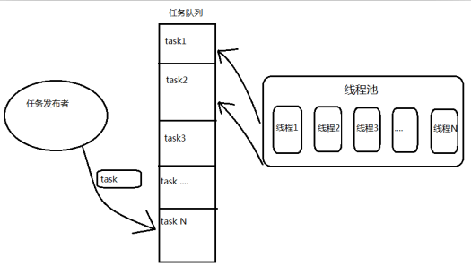
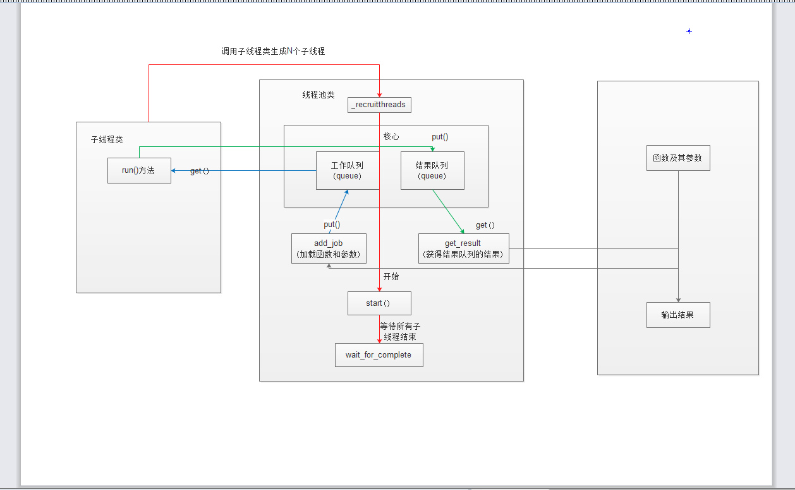

## 线程池

> 从生命周期上看,一个线程大致会经过3个阶段:线程的启动时间、线程体的运行时间和线程的销毁时间。在多线程处理的情景中，如果线程不能被重用，就意味着每次创建都需要经过启动、销毁和运行3个过程。这必然会增加系统相应的时间，降低了效率。由于Python 自带的GIL的限制,Python中又不是真真的多线程,导致多线程效率不高.
>
>  线程池的基本原理如下图，它是通过将事先创建多个能够执行任务的线程放入池中，所需要执行的任务通常要被安排在队列任务中。一般情况下，需要处理的任务比线程数目要多，线程执行完当前任务后，会从队列中取下一个任务，直到所有的任务完成。
>
> 
>
> 由于线程预先被创建并放入线程池中，同时处理完当前任务之后并不销毁而是被安排处理下一个任务，因此能够避免多次创建线程，从而节省线程创建和销毁的开销，能带来更好的性能和系统稳定性。所以，说白了，Python的线程池也没有利用到多核或者多CPU的优势，只是跟普通的多线程相比，它不用去多次创建线程，节省了线程创建和销毁的时间，从而提高了性能。
>
> ​    Python中 线程池技术适合处理突发性大量请求或者需要大量线程来完成任务、但每个任务实际处理时间较短的场景，它能有效的避免由于系统创建线程过多而导致性能负荷过大、响应过慢等问题。

### 线程池模型

> ```python
> #!/usr/bin/env python
> # coding=utf-8
> """
> 利用队列的特性,结合线程池操作
> """
>
> from queue import Queue
> import time
> import threading
>
>
> # 创建队列实例,用于存储任务
> my_queue = Queue()
>
>
> # 定义需要线程池执行的任务
>
> def foo():
>     while True:
>         i = my_queue.get()
>         time.sleep(1)
>         print('线程:{} ,从队列中取出:{}'.format(threading.current_thread().name, i))
>         my_queue.task_done()  # 发送信号,表示入列任务已经完成
>
> if __name__ == '__main__':
>     # 创建3个线程的线程池
>     for i in range(3):
>         t = threading.Thread(target=foo)
>         t.daemon = True  # 设置守护线程,主线程退出子线程也会停止
>         t.start()
>
>     # 模拟线程池 3秒后塞进10个任务到队列
>     time.sleep(3)
>     for i in range(10):
>         my_queue.put(i)
>
>     my_queue.join()
> ```
>
> 运行结果
>
> ```python
> 线程:Thread-2 ,从队列中取出:1
> 线程:Thread-1 ,从队列中取出:0
> 线程:Thread-3 ,从队列中取出:2
> 线程:Thread-1 ,从队列中取出:4
> 线程:Thread-2 ,从队列中取出:3
> 线程:Thread-3 ,从队列中取出:5
> 线程:Thread-1 ,从队列中取出:6
> 线程:Thread-2 ,从队列中取出:7
> 线程:Thread-3 ,从队列中取出:8
> 线程:Thread-1 ,从队列中取出:9
> ```
>
> 可以看出,所有的任务都在这几个线程中完成.

### 自定义一个线程池

> ```python
> #!/usr/bin/env python
> # coding=utf-8
>
> """
> 原理:
>     把任务放到队列中,然后开启N个线程,每个线程都去队列中取一个任务,执行完毕后通知系统,然后接着去队列中取出
>     下一个任务,直到队列中为空,退出线程.
> pollthread.py
> """
>
> import threading
> import queue
>
> # 定义一个线程的子类
>
>
> class Worker(threading.Thread):
>
>     def __init__(self, workqueue, resultqueue):
>         super(Worker, self).__init__()
>         self.workqueue = workqueue
>         self.resultqueue = resultqueue
>
>     def run(self):
>         while True:
>             try:
>                 callable, args, kwargs = self.workqueue.get(
>                     block=False)  # 默认是True, False表示为空时,马上弹出多错误
>                 res = callable(*args, **kwargs)
>                 self.resultqueue.put(res)
>             except Exception as e:
>                 break
>
>
> class WorkerManager:
>     """
>     定义一个线程池的类
>     """
>
>     def __init__(self, num=10):  # 假设线程为10
>         self.workqueue = queue.Queue()        # 工作队列,任务一般都是函数
>         self.resultqueue = queue.Queue()      # 结果队列
>         self.workers = []                     # 所有的任务会加入到这个列表中
>         self._recruitthreads(num)             # 创建线程
>
>     def _recruitthreads(self, num):
>         """
>         生成子线程
>         """
>         for i in range(num):
>             # 生成了10个线程,并把线程对象加入到了空列表中
>             worker = Worker(self.workqueue, self.resultqueue)  # 调用类实例
>             self.workers.append(worker)
>
>     def start(self):
>         """
>         开始子线程
>         """
>         for work in self.workers:
>             work.start()
>
>     def wait_for_complete(self):
>         """
>         等待所有的子线程完成后结束
>         """
>         while len(self.workers):
>             worker = self.workers.pop()
>             worker.join()
>             # 线程是存活的,而且wokerqueue队列中为空
>             # 会把线程重新加入到列表中,直到工作队列为空,才不会加入
>             if worker.isAlive() and not self.workqueue.empty():
>                 self.workers.append(worker)
>
>     def add_job(self, callable, *args, **kwargs):
>         """
>         向任务队列中添加任务,
>         callabel: 传入一个可调用对象
>         *args, **kwargs 是可调用对象的参数
>         """
>         self.workqueue.put((callable, args, kwargs))
>
>     def get_result(self, *args, **kwargs):
>         """
>         获取队列的结果
>         """
>         return self.resultqueue.get(*args, **kwargs)
>
>     def add_result(self, result):
>         self.resultqueue.put(result)
> ```
>
> 运行
>
> ```python
> import pollthread
> import urllib2,datetime
> def open_url(url):
>     try:
>         res = urllib2.urlopen(url).getcode()
>     except urllib2.HTTPError, e:
>         res = e.code
>     #print res
>     res = str(res)
>     with open('1.txt','w+') as f:
>         f.write(res)
>     return res
> if __name__ == "__main__":
>     urls = [
>         'http://www.python.org',
>         'http://www.python.org/about/',
>         'http://www.onlamp.com/pub/a/python/2003/04/17/metaclasses.html',
>         'http://www.python.org/doc/',
>         'http://www.python.org/download/',
>         'http://www.python.org/getit/',
>         'http://www.python.org/community/',
>         'https://wiki.python.org/moin/',
>         'http://planet.python.org/',
>         'https://wiki.python.org/moin/LocalUserGroups',
>         'http://www.python.org/psf/',
>         'http://docs.python.org/devguide/',
>         'http://www.python.org/community/awards/'
>     ]
>     t1 = datetime.datetime.now()
>     w = WorkerManger(2)
>     for url in urls:
>         w.add_job(open_url,url)
>     w.start()
>     w.wait_for_complete()
>     t2 = datetime.datetime.now()
>     print t2 - t1
> ```
>
> 可以看出,主题思想就是利用队列的`get,put` 方法,如图:
>
> 

### 使用线程池模块

> 安装
>
> ```python
> pip install threadpool
> ```
>
> 该模块主要的类和方法:
>
> - 1.`threadpool.ThreadPool` 线程池类，主要是用来分派任务请求和收集运行结果。主要方法有:
>
>   - `__init__(self, number_workers, q_size, resq_size=0, poll_timeout=5)`: 建立线程池,并启动对应的`num_workers` 的线程,`q_size`表示任务请求的队列大小,`resq_size`表示存放运行结果队列的大小
>   - `createWorkers(self,num_workers，poll_timeout=5)`:将num_workers数量对应的线程加入线程池
>   - `dismissWorkers(self,num_workers,do_join=False)`:告诉num_workers数量的工作线程在执行完当前任务后退出
>   - `joinAllDismissWorkers(self)`:  在设置为退出的线程上执行Thread.join
>   - `putRequest(self,request,block=True,timeout=None)`:加入一个任务请求到工作队列
>   - `pool(self, block=False)`:处理任务队列中新请求。也就是循环的调用各个线程结果中的回调和错误回调。不过，当请求队列为空时会抛出 NoResultPending 异常，以表示所有的结果都处理完了。这个特点对于依赖线程执行结果继续加入请求队列的方式不太适合。
>   - `wait(self)`: 等待执行结果，直到所有任务完成。当所有执行结果返回后，线程池内部的线程并没有销毁，而是在等待新任务。因此，wait()之后依然可以在此调用pool.putRequest()往其中添加任务
>
> - 2.`threadpool.WorkerThread` :处理任务的工作线程，主要有run()方法和dismiss()方法
>
> - 3.`threadpool.WorkRequest` :任务请求类，包含有具体执行方法的工作请求类
>
>   `__init__(self,callable,args=None,kwds=None,requestID=None,callback=None,exc_callback=None)`创建一个工作请求。
>
> - 4.`makeRequests(callable_,args_list,callback=None,exc_callback=_handle_thread_exception)`主要函数，用来创建具有相同的执行函数但参数不同的一系列工作请求
>
> 它的使用步骤一般如下：
>
> （1）引入threadpool模块
>
> （2）定义线程函数
>
> （3）创建线程 池threadpool.ThreadPool()
>
> （4）创建需要线程池处理的任务即threadpool.makeRequests()
>
> （5）将创建的多个任务put到线程池中,threadpool.putRequest
>
> （6）等到所有任务处理完毕theadpool.pool()
>
> #### 创建线程池:
>
> ```python
> threadpool.ThreadPool(20)  # 线程池中有20个线程
> ```
>
> ####  线程池需要处理的任务
>
> ```python
> makeRequests(callable_,args_list,callback=None,exc_callback=_handle_thread_exception)
> # arg_list必须是包含2个元素的元组,第一个是list,第二个是dict
> ```
>
> 如果`args_list` 包含多个参数,需要拼接list或dict
>
> ```python
> # 方法1  
> lst_vars_1 = ['1', '2', '3']
> lst_vars_2 = ['4', '5', '6']
> func_var = [(lst_vars_1, None), (lst_vars_2, None)]
>
>  # 方法2
>  dict_vars_1 = {'m':'1', 'n':'2', 'o':'3'}
>  dict_vars_2 = {'m':'4', 'n':'5', 'o':'6'}
>  func_var = [(None, dict_vars_1), (None, dict_vars_2)]
> ```
>
> #### 将所有的多线程任务放入线程池中
>
> ```python
> [pool.putRequest(req) for req in requests]
>
> # 等同于
> for req in requests:  
>     pool.putRequest(req)
> ```
>
> #### 等待所有的线程完成后退出
>
> ```python
> poll.wait()
> ```
>
> #### 实例
>
> ```python
> # coding=utf-8
>
> import time
> import random
> import threadpool
>
> HEHE = dict()
>
> def sayhello(name, v):
>     global HEHE
>     if name in HEHE.keys():
>         HEHE[name] = HEHE[name] + '+' + v
>     else:
>         HEHE[name] = v
>     time.sleep(2)
>
> name_list = [
>     (['test1', '1'], None),
>     (['test1', '2'], None),
>     (['test2', '3'], None),
>     (['test2', '4'], None),
>     (['test3', '5'], None),
>     (['test3', '6'], None),
>     (['test4', '7'], None),
>     (['test4', '8'], None),
>     (['test5', '9'], None),
>     (['test5', '10'], None),
>     (['test6', '11'], None),
>     (['test6', '12'], None),
>             ]
>
> start_time = time.time()
> pool_t = threadpool.ThreadPool(4)
> request = threadpool.makeRequests(sayhello, name_list)
> [pool_t.putRequest(req) for req in request]
> pool_t.wait()
> print(HEHE)
> end_time = time.time()
> print("time:", end_time - start_time)
>
> ```

### multiprocessing.dummy 执行多线程任务

>  multiprocessing.dummy 模块与 multiprocessing 模块的区别： dummy 模块是多线程，而 multiprocessing 是多进程， api 都是通用的