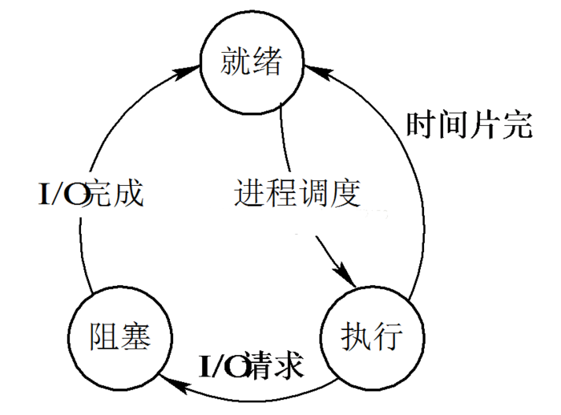
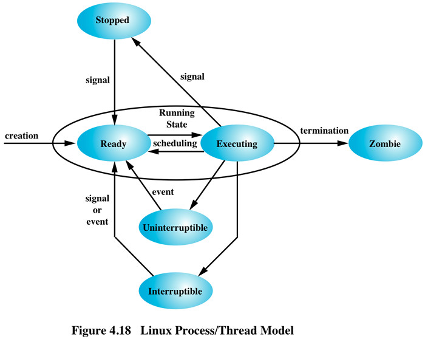

## linux进程状态

> linux进程的状态定义在[fs/proc/array.c](https://github.com/torvalds/linux/blob/b6da0076bab5a12afb19312ffee41c95490af2a0/fs/proc/array.c) 中其中一共定义了 7种状态
> ```c
> /*
> * The task state array is a strange "bitmap" of
> * reasons to sleep. Thus "running" is zero, and
> * you can test for combinations of others with
> * simple bit tests.
> */static const char * const task_state_array[] = {  "R (running)",        /*   0 */
>   "S (sleeping)",        /*   1 */
>   "D (disk sleep)",    /*   2 */
>   "T (stopped)",        /*   4 */
>   "t (tracing stop)",    /*   8 */
>   "X (dead)",        /*  16 */
>   "Z (zombie)",        /*  32 */};
> ```
>
> 其中`D(disk sleep)` 称为不可中断的睡眠(`uninterruptible sleep`)
>
> 我们通过linux命令`ps` 也可以明确的看到各种状态的描述信息
>
> ```bash
> # man ps
> PROCESS STATE CODES
> 	Here are the different values that the s, stat and state
>     output specifiers (header "STAT" or "S") will display to
>     describe the state of a process:
>
>     	D    uninterruptible sleep (usually IO)   #不可中断睡眠
>         R    running or runnable (on run queue)   #运行程序,可运行程序,运行队列程序
>         S    interruptible sleep (waiting for an event to complete) # 可中断睡眠
>         T    stopped by job control signal     # 通过工作控制信号暂停
>         t    stopped by debugger during the tracing  # 通过debugger追踪并暂停
>         W    paging (not valid since the 2.6.xx kernel)
>         X    dead (should never be seen)   # 程序销亡
>         Z    defunct ("zombie") process, terminated but not reaped by its parent
> ```
>
> #### 从大体上说,进程一共会经过3个状态:
>
> 
>
> * 就绪状态(READ)
>   * 当进程已分配到除CPU以外的所有必要资源后，只要再获得CPU，便可立即执行，进程这时的状态称为就绪状态。在一个系统中处于就绪状态的进程可能有多个，通常将它们排成一个队列，称为就绪队列。
> * 执行状态(RUNNING)
>   * 进程已获得CPU，其程序正在执行。在单处理机系统中，只有一个进程处于执行状态； 在多处理机系统中，则有多个进程处于执行状态。
> * 阻塞状态(BLOCKED)
>   * 正在执行的进程由于发生某事件而暂时无法继续执行时，便放弃处理而处于暂停状态，亦即进程的执行受到阻塞，把这种暂停状态称为阻塞状态，有时也称为等待状态或封锁状态。致使进程阻塞的典型事件有：请求I/O，申请缓冲空间等。通常将这种处于阻塞状态的进程也排成一个队列。有的系统则根据阻塞原因的不同而把处于阻塞状态的进程排成多个队列。
>
> #### 在Linux系统中，将各种状态进行了重新组织，由此得到了Linux进程的几个状态
>
> - R: TASK_RUNNING
>
> ```markdown
> 正在运行或者在就绪队列中等待运行的进程。也就是上面提到的运行态和就绪态进程的综合。一个进程处于RUNNING状态，并不代表他一定在被执行。由于在多任务系统中，各个就绪进程需要并发执行，所以在某个特定时刻，这些处于RUNNING状态的进程之中，只有一个能得到处理器，而其他进程必须在一个就绪队列中等待。
> 只有在该状态的进程才可能在CPU上运行。而同一时刻可能有多个进程处于可执行状态，这些进程的task_struct结构（进程控制块）被放入对应CPU的可执行队列中（一个进程最多只能出现在一个CPU的可执行队列中）。进程调度器的任务就是从各个CPU的可执行队列中分别选择一个进程在该CPU上运行。
>
> 很多操作系统教科书将正在CPU上执行的进程定义为RUNNING状态、而将可执行但是尚未被调度执行的进程定义为READY状态，这两种状态在linux下统一为 TASK_RUNNING状态。
> ```
>
> * D:TASK_UNINTERRUPTIBLE
>
> ```markdown
> 不可中断阻塞状态。处于这种状态的进程正在等待队列中，当资源有效时，可由操作系统进行唤醒，否则，将一直处于等待状态。
>
> 与TASK_INTERRUPTIBLE状态类似，进程处于睡眠状态，但是此刻进程是不可中断的。不可中断，指的并不是CPU不响应外部硬件的中断，而是指进程不响应异步信号。绝大多数情况下，进程处在睡眠状态时，总是应该能够响应异步信号的。否则你将惊奇的发现，kill -9竟然杀不死一个正在睡眠的进程了！于是我们也很好理解，为什么ps命令看到的进程几乎不会出现TASK_UNINTERRUPTIBLE状态，而总是TASK_INTERRUPTIBLE状态。
>
> 而TASK_UNINTERRUPTIBLE状态存在的意义就在于，内核的某些处理流程是不能被打断的。如果响应异步信号，程序的执行流程中就会被插入一段用于处理异步信号的流程（这个插入的流程可能只存在于内核态，也可能延伸到用户态），于是原有的流程就被中断了。（参见《linux内核异步中断浅析》）在进程对某些硬件进行操作时（比如进程调用read系统调用对某个设备文件进行读操作，而read系统调用最终执行到对应设备驱动的代码，并与对应的物理设备进行交互），可能需要使用TASK_UNINTERRUPTIBLE状态对进程进行保护，以避免进程与设备交互的过程被打断，造成设备陷入不可控的状态
> ```
>
> * S:STASK_INTERRUPTIBLE
>
> ```markdown
> 可中断阻塞状态。与不可中断阻塞状态一样，处于这种状态的进程在等待队列中，当资源有效时，可以有操作系统进行唤醒。与不可中断阻塞状态有所区别的是，处于此状态中的进程亦可被其他进程的信号唤醒。
> 处于这个状态的进程因为等待某某事件的发生（比如等待socket连接、等待信号量），而被挂起。这些进程的task_struct结构被放入对应事件的等待队列中。当这些事件发生时（由外部中断触发、或由其他进程触发），对应的等待队列中的一个或多个进程将被唤醒。
> ```
>
> * T :TASK_STOPPED or TASK_TRACED
>
> ```markdown
> 暂停状态或跟踪状态。
>
> 向进程发送一个SIGSTOP信号，它就会因响应该信号而进入TASK_STOPPED状态（除非该进程本身处于TASK_UNINTERRUPTIBLE状态而不响应信号）。（SIGSTOP与SIGKILL信号一样，是非常强制的。不允许用户进程通过signal系列的系统调用重新设置对应的信号处理函数。）向进程发送一个SIGCONT信号，可以让其从TASK_STOPPED状态恢复到TASK_RUNNING状态。
>
> 当进程正在被跟踪时，它处于TASK_TRACED这个特殊的状态。“正在被跟踪”指的是进程暂停下来，等待跟踪它的进程对它进行操作。比如在gdb中对被跟踪的进程下一个断点，进程在断点处停下来的时候就处于TASK_TRACED状态。而在其他时候，被跟踪的进程还是处于前面提到的那些状态。
>
> 对于进程本身来说，TASK_STOPPED和TASK_TRACED状态很类似，都是表示进程暂停下来。而TASK_TRACED状态相当于在TASK_STOPPED之上多了一层保护，处于TASK_TRACED状态的进程不能响应SIGCONT信号而被唤醒。只能等到调试进程通过ptrace系统调用执行PTRACE_CONT、PTRACE_DETACH等操作（通过ptrace系统调用的参数指定操作），或调试进程退出，被调试的进程才能恢复TASK_RUNNING状态。
> ```
>
> * Z :TASK_DEAD - EXIT_ZOMBIE
>
> ```markdown
> 进程在退出的过程中，处于TASK_DEAD状态。
>
> 在这个退出过程中，进程占有的所有资源将被回收，除了task_struct结构（以及少数资源）以外。于是进程就只剩下task_struct这么个空壳，故称为僵尸。之所以保留task_struct，是因为task_struct里面保存了进程的退出码、以及一些统计信息。而其父进程很可能会关心这些信息。比如在shell中，$?变量就保存了最后一个退出的前台进程的退出码，而这个退出码往往被作为if语句的判断条件。当然，内核也可以将这些信息保
>
> 存在别的地方，而将task_struct结构释放掉，以节省一些空间。但是使用task_struct结构更为方便，因为在内核中已经建立了从pid到task_struct查找关系，还有进程间的父子关系。释放掉task_struct，则需要建立一些新的数据结构，以便让父进程找到它的子进程的退出信息。
>
> 父进程可以通过wait系列的系统调用（如wait4、waitid）来等待某个或某些子进程的退出，并获取它的退出信息。然后wait系列的系统调用会顺便将子进程的尸体（task_struct）也释放掉。子进程在退出的过程中，内核会给其父进程发送一个信号，通知父进程来“收尸”。这个信号默认是SIGCHLD，但是在通过clone系统调用创建子进程时，可以设置这个信号。
> ```
>
> 
>
> 进程的生命周期
>
> 

#### 实验暂停状态(T)

> T :TASK_STOPPED or TASK_TRACED 暂停状态或跟踪状态
>
> 最简单的查看 状态`T` 是在`shell` 中使用`Ctrl + z` 把程序调入后台
>
> ```shell
> $ sleep 100
> ^Z      # Pressed CTRL+z
> [1]+  Stopped
> $ ps -o pid,state,command
>   PID S COMMAND
> 13224 T sleep 100    # 注意这个状态是 T
> [...]
> ```
>
> 在这个状态下,这个程序不能在调用`cpu` ,只有使用命令`fg/bg` 唤醒它的时候才可以再次执行`cpu`
>
> ```bash
> $ bg   # 把后台任务调用到前台执行
> [1]+ sleep 100 &
> $ ps -o pid,state,command
>   PID S COMMAND
> 13224 S sleep 100
> [...]
> ```
>
> 现在`sleep` 命令再次唤醒,它处于`S` 状态,属于可以再次中断的程序.
>
> 可以使用命令`yes > /dev/null` 参看当前程序处于`R` 状态
>
> ```bash
> $ yes > /dev/null
> # 使用另外一个终端进行查看
> $ ps -o pid,state,command
>   PID S COMMAND
>  3780 S bash
> 26606 R ps -o pid,state,command
> ```

#### `SIGSTOP, SIGCONT` 

> 这是2个`signal` 信号
>
> 在终端，可通过`kill -l`查看所有的signal信号
>
> | 取值   | 名称        | 解释               | 默认动作        |
> | ---- | --------- | ---------------- | ----------- |
> | 1    | SIGHUP    | 挂起               |             |
> | 2    | SIGINT    | 中断               |             |
> | 3    | SIGQUIT   | 退出               |             |
> | 4    | SIGILL    | 非法指令             |             |
> | 5    | SIGTRAP   | 断点或陷阱指令          |             |
> | 6    | SIGABRT   | abort发出的信号       |             |
> | 7    | SIGBUS    | 非法内存访问           |             |
> | 8    | SIGFPE    | 浮点异常             |             |
> | 9    | SIGKILL   | kill信号           | 不能被忽略、处理和阻塞 |
> | 10   | SIGUSR1   | 用户信号1            |             |
> | 11   | SIGSEGV   | 无效内存访问           |             |
> | 12   | SIGUSR2   | 用户信号2            |             |
> | 13   | SIGPIPE   | 管道破损，没有读端的管道写数据  |             |
> | 14   | SIGALRM   | alarm发出的信号       |             |
> | 15   | SIGTERM   | 终止信号             |             |
> | 16   | SIGSTKFLT | 栈溢出              |             |
> | 17   | SIGCHLD   | 子进程退出            | 默认忽略        |
> | 18   | SIGCONT   | 进程继续             |             |
> | 19   | SIGSTOP   | 进程停止             | 不能被忽略、处理和阻塞 |
> | 20   | SIGTSTP   | 进程停止             |             |
> | 21   | SIGTTIN   | 进程停止，后台进程从终端读数据时 |             |
> | 22   | SIGTTOU   | 进程停止，后台进程想终端写数据时 |             |
> | 23   | SIGURG    | I/O有紧急数据到达当前进程   | 默认忽略        |
> | 24   | SIGXCPU   | 进程的CPU时间片到期      |             |
> | 25   | SIGXFSZ   | 文件大小的超出上限        |             |
> | 26   | SIGVTALRM | 虚拟时钟超时           |             |
> | 27   | SIGPROF   | profile时钟超时      |             |
> | 28   | SIGWINCH  | 窗口大小改变           | 默认忽略        |
> | 29   | SIGIO     | I/O相关            |             |
> | 30   | SIGPWR    | 关机               | 默认忽略        |
> | 31   | SIGSYS    | 系统调用异常           |             |
>
> 对于signal信号，绝大部分的默认处理都是终止进程或停止进程，或dump内核映像转储。 上述的31的信号为非实时信号，其他的信号32-64 都是实时信号。
>
> [更多详细信号内容](./10002.md)
>
> 对于上一个程序`sleep 100` ,当按CTRL + Z时，内核终端驱动程序向前台进程发送一个SIGSTOP信号。同样，在`bg / fg` bash上发送一个SIGCONT信号。
>
> 调用`bg/fg` 可以同样采用发送信号的方式执行
>
> ```bash
> $ sleep 100 &
> [1] 28761
> $ ps -o pid,state,command
>   PID S COMMAND
> 28761 S sleep 100
> [...]
> $ kill -STOP 28761
> [1]+  Stopped                 sleep 100
> $ ps -o pid,state,command
>   PID S COMMAND
> 28761 T sleep 100
> [...]
> $ kill -CONT 28847
> $ ps -o pid,state,command
>   PID S COMMAND
> 28847 S sleep 100
> [...]
> ```
>
> 处于`S` 状态的进程可以接受来自其他进程的信息,比如:
>
> ```python
> python -c "import os, signal; os.kill(os.getpid(), signal.SIGSTOP)"
> [1]+  Stopped
> ```

#### `SIGCHLD and waitpid()`

> 当一个子进程发生改变时(`stopped, continues or exits` ) ,对于父进程来讲,会有2个操作:
>
> * 得到一个`SIGCHLD` 信号(子进程退出)
> * 阻塞并调用`waitpid(2)/wait` (使用`man wait`来查看详细内容)
>
> 默认情况下,`waitpad` 会一直阻塞到所有的子进程都退出为止,但是也可以设置特殊的`flag`来改变,比如:一个子进程被暂停(flag `WUNTRACED`) 或者子进程继续(flag `WCONTINUED`)
>
> ```markdown
> pid_t waitpid( pid_t pid, int * status, int options );
>
> 函数说明
>
> waitpid() 会暂时停止目前进程的执行，直到有信号来到或子进程结束。如果在调用 waitpid() 时子进程已经结束，则 waitpid() 会立即返回子进程结束状态值。子进程的结束状态值会由参数 status 返回，而子进程的进程识别码也会一并返回。如果不在意结束状态值，则参数 status 可以设成 NULL。 waitpid() 如果执行成功则返回子进程识别码(PID)，如果有错误发生则返回，返回值-1。失败原因存于 errno 中。
>
> 各参数意义如下:
>
> pid=pid 等待进程识别码为 pid 的子进程。
>
> pid=-1 等待任何子进程，相当于 wait()。
>
> pid= 0 等待进程组识别码与目前进程相同的任何子进程。
>
> 参数 option 可以为 0（不使用时） 或下面的 OR（” | “） 组合:
>
> WNOHANG : 如果没有任何已经结束的子进程则马上返回, 不予以等待。
>
> WUNTRACED: 如果子进程进入暂停执行情况则马上返回,但结束状态不予以理会。子进程的结束状态返回后存于 status,底下有几个宏可判别结束情况。
>
> 用于检查wait和waitpid两个函数返回终止状态的宏:
>
> 这两个函数返回的子进程状态都保存在statloc指针中, 用以下3个宏可以检查该状态:
>
> WIFEXITED(status): 若为正常终止，则为真. 此时可执行
>
> WEXITSTATUS(status): 取子进程传送给exit或_exit参数的低8位
>
> WIFSIGNALED(status): 若为异常终止，则为真。此时可执行
>
> WTERMSIG(status): 取使子进程终止的信号编号
>
> WIFSTOPPED(status): 若为当前暂停子进程，则为真。此时可执行
>
> WSTOPSIG(status): 取使子进程暂停的信号编号.
> ```
>
> Python实现
>
> ```python
> import os
> import sys
> import signal
>
> def waitpid():
>     (pid, status) = os.waitpid(-1,
>                                os.WUNTRACED | os.WCONTINUED)
>     if os.WIFSTOPPED(status):
>         s = "stopped sig=%i" % os.WSTOPSIG(status)
>     elif os.WIFCONTINUED(status):
>         s = "continued"
>     elif os.WIFSIGNALED(status):
>         s = "exited signal=%i" % os.WTERMSIG(status)
>     elif os.WIFEXITED(status):
>         s = "exited status=%i" % os.WEXITSTATUS(status)
>     print "waitpid received: pid=%i %s" % (pid, s)
>
> childpid = os.fork()
> if childpid == 0:
>     # Child
>     os.kill(os.getpid(), signal.SIGSTOP)
>     sys.exit()
>
> waitpid()
> os.kill(childpid, signal.SIGCONT)
> waitpid()
> waitpid()
> ```
>
> 控制流程如下图所示
>
> 

#### `Zombies`

> `Zombies` 进程是一个没有成功退出的进程,它的状态的改变没有得到父进程的承认,也就是说父进程并没有调用`wait()/waitpid()` 方法.
>
> [参考](https://idea.popcount.org/2012-12-11-linux-process-states/)