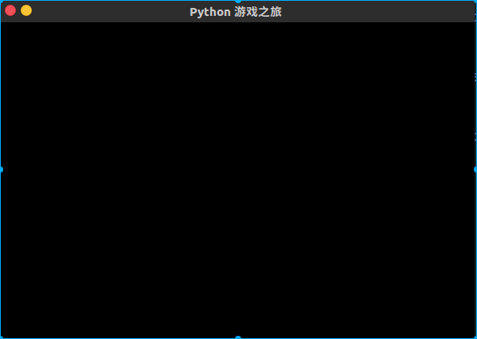

## Pygame

### 安装Pygame

#### 环境:

> * Ubnunt 16.04
> * 开发环境:python3.5,Pycharm,anoconda
> * ​

#### 安装pygame

> 使用annoconda的包管理机制
>
> ```bash
> source activate python35
> conda -h
> anaconda search -t conda pygame
> conda install -c cogsci pygame
> ```
>
> ```bash
> Fetching packages ...
> mkl-2017.0.3-0 100% |#########################################################################################################################| Time: 0:05:16 429.58 kB/s
> numpy-1.13.1-p 100% |#########################################################################################################################| Time: 0:00:30 244.52 kB/s
> pygame-1.9.2a0 100% |#########################################################################################################################| Time: 0:00:04 801.84 kB/s
> Extracting packages ...
> [      COMPLETE      ]|############################################################################################################################################| 100%
> Linking packages ...
>
> ```
>
> 安装依赖包
>
> ```bash
> sudo apt-get install libSDL-ttf2.0-0
> sudo apt-get install libsdl-mixer1.2
> ```
>
> 测试安装成功
>
> ```bash
>  python -m pygame.examples.aliens
> ```
>
> 能正常游戏,终端下没有报错为准.
>
> 或者使用python3的pip直接安装
>
> ```bash
> $ pip install pygame # 注意必须是对应的python版本
> $ pip --version
> pip 9.0.1 from /home/ning/anaconda3/envs/python35/lib/python3.5/site-packages (python 3.5)
> (python35)  ning@Kpython  ~/python3_learn/pythonfile/MOOC/week9/FlyFight  pip install pygame
> Collecting pygame
> Downloading pygame-1.9.3-cp35-cp35m-manylinux1_x86_64.whl (9.4MB)
>
> ```
>
> 安装pygame提示无法找到SDL.h文件(Mac)
>
> ```bash
> brew install sdl sdl_image sdl_mixer sdl_ttf portmidi  
> ```
>
> 


#### Pygame的hello world

> ```python
> #!/usr/bin/env python 
> # coding=utf-8
>
> import pygame,sys
>
> pygame.init()
> screen = pygame.display.set_mode((600,400))
> pygame.display.set_caption("Pygame游戏之旅")
>
> while True:
>     for event in pygame.event.get():
>         if event.type == pygame.QUIT:
>             sys.exit()
>         pygame.display.update()
> ```
>
> 测试效果
>
> 
>
> 

#### Pygame 的最小开发框架

> ```flow
> st=>start: 引入Pygame和sys
>
> op1=>operation: 初始化init()及设置
> sub1=>subroutine:  获取事件并逐类响应
> sub2=>subroutine: 刷新屏幕
> sub3=>subroutine: 结束
> cond1=>condition: Yes or No
>
>  
> st->op1->sub1->sub2->cond1
> cond1(yes)->sub1
> cond1(no)->sub3
> ```
>
> 

#### python 简易开发框架

> ```flow
> st=>start: 引入初始化
> op=>operation: 事件及刷新
> cond=>condition: yes or no
> op1=>operation: 结束
> st->op->cond
> cond(yes)->op
> cond(no)->op1
> ```
