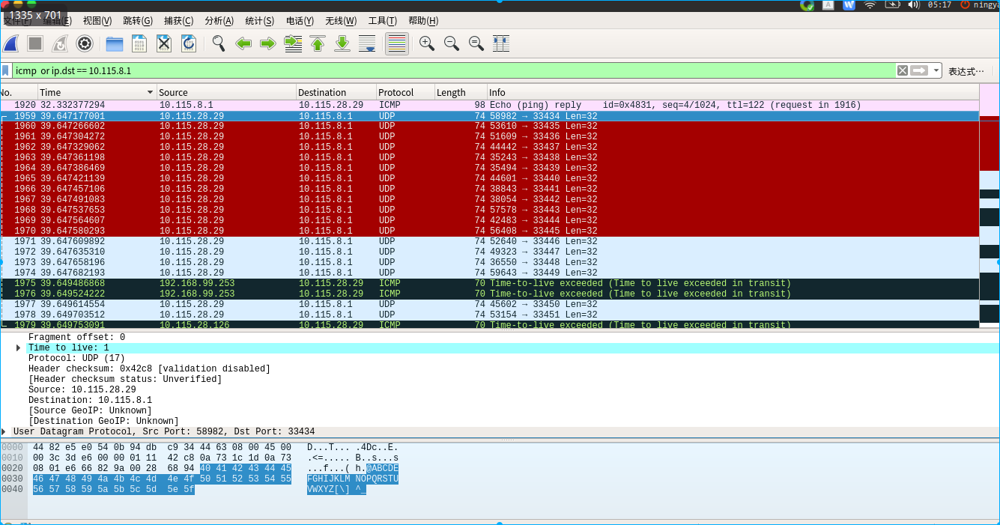
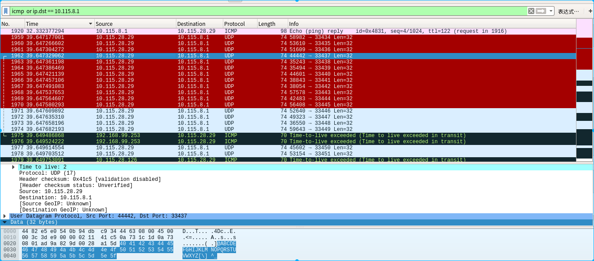
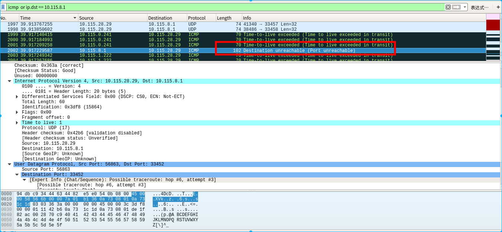
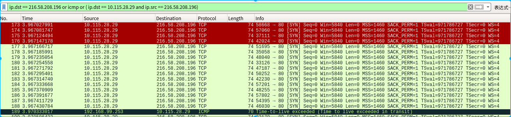
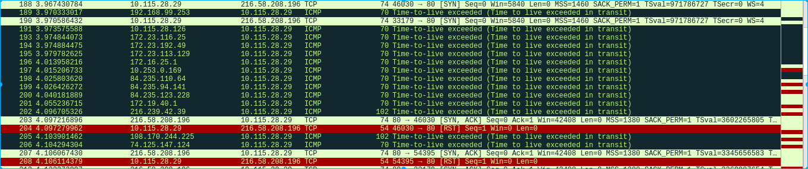
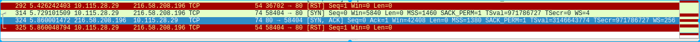

## traceroute

> traceroute工具,用来排除网络故障的命令

### 原理

> 典型的引用了IP数据包的存活时间(TTL) 的值来实现其功能.当一台计算机发送IP包时,会为数据包设置存活时间,每当数据包经过一个路由器,其存活的时间就减去1,当存活为0时,路由器将不再转发数据包,而是发送一个包ICMP TTL数据包给最初的发包的计算机.
>
> Traceroute 程序首先向目标主机发出 TTL 为 1 的数据包,发送数据包的计算机与目标主机之间的路径中的第一个路由器,在转发数据包时将数据包的 TTL 减 1,它发现 TTL 被减为了 0,于是向最初发出数据包的计算机发送一个 ICMP TTL 数据包,Traceroute 程序以此获得了与目标主机之间的路径上的第一个路由器的IP地址,后面 traceroute 程序依次向目标主机发送 TTL 为 2、3、4 . . . 的数据包,逐个探测出来与目标主机之间的路径上每一个路由器的 IP 地址.

### 实现

> 默认条件下，traceroute 首先发出 TTL = 1 的UDP 数据包，第一个路由器将 TTL 减 1 得 0 后就不再继续转发此数据包，而是返回一个 ICMP 超时报文，traceroute 从超时报文中即可提取出数据包所经过的第一个网关的 IP 地址。然后又发送了一个 TTL = 2 的 UDP 数据包，由此可获得第二个网关的 IP 地址。依次递增 TTL 便获得了沿途所有网关的 IP 地址。
>
> 需要注意的是，并不是所有网关都会如实返回 ICMP 超时报文。处于安全性考虑，大多数防火墙以及启用了防火墙功能的路由器缺省配置为不返回各种 ICMP 报文，其余路由器或交换机也可能被管理员主动修改配置变为不返回 ICMP 报文。因此 Traceroute 程序不一定能拿到所有的沿途网关地址。所以，当某个 TTL 值的数据包得不到响应时，并不能停止这一追踪过程，程序仍然会把 TTL 递增而发出下一个数据包。这个过程将一直持续到数据包发送到目标主机，或者达到默认或用参数指定的追踪限制（maximum_hops）才结束追踪。
>
> 依据上述原理，利用了 UDP 数据包的 Traceroute 程序在数据包到达真正的目的主机时，就可能因为该主机没有提供 [UDP](https://zh.wikipedia.org/wiki/UDP) 服务而简单将数据包抛弃，并不返回任何信息。为了解决这个问题，Traceroute 故意使用了一个大于 30000 的端口号，因 UDP 协议规定端口号必须小于 30000 ，所以目标主机收到数据包后唯一能做的事就是返回一个 `port unreachable`的 ICMP 报文，于是主叫方就将端口不可达报文当作跟踪结束的标志.

### 语法,选项

> 语法
>
> ```bash
> $ traceroute(选项)(参数)
> ```
>
> 选项
>
> ```bash
> -d：使用Socket层级的排错功能；
> -f<存活数值>：设置第一个检测数据包的存活数值TTL的大小；
> -F：设置勿离断位；
> -g<网关>：设置来源路由网关，最多可设置8个；
> -i<网络界面>：使用指定的网络界面送出数据包；
> -I：使用ICMP回应取代UDP资料信息；
> -m<存活数值>：设置检测数据包的最大存活数值TTL的大小；
> -n：直接使用IP地址而非主机名称；
> -p<通信端口>：设置UDP传输协议的通信端口；
> -r：忽略普通的Routing Table，直接将数据包送到远端主机上。
> -s<来源地址>：设置本地主机送出数据包的IP地址；
> -t<服务类型>：设置检测数据包的TOS数值；
> -v：详细显示指令的执行过程；
> -w<超时秒数>：设置等待远端主机回报的时间；
> -x：开启或关闭数据包的正确性检验
> -T:使用tcp SYN 来检测
> -q: 指定发包的个数,默认是3个
> ```

### wireshark抓包分析

> 源主机:10.115.28.29
>
> 目标主机: 10.115.8.1
>
> ```bash
> $ traceroute 10.115.8.1
> traceroute to 10.115.8.1 (10.115.8.1), 30 hops max, 60 byte packets
>  1  10.115.28.126 (10.115.28.126)  2.635 ms  3.398 ms  5.193 ms
>  2  192.168.99.253 (192.168.99.253)  2.165 ms  2.177 ms  2.716 ms
>  3  254.80.247.60.static.bjtelecom.net (60.247.80.254)  264.371 ms  264.269 ms  264.329 ms
>  4  10.115.0.241 (10.115.0.241)  269.659 ms  269.585 ms  269.635 ms
>  5  10.115.0.233 (10.115.0.233)  271.373 ms  272.473 ms  272.410 ms
>  6  10.115.1.222 (10.115.1.222)  269.577 ms  267.673 ms  267.609 ms
> ```
>
> wireshark 过滤器:
>
> ```bash
> icmp or ip.dst == 10.115.8.1
> ```
>
> 
>
> 可以很明显的看到第一个包的TTL的值是1,由于traceroute默认发包3个,所以查看第四个包,它的TTL的值应该是2
>
> 
>
> 依次类推,可以找到更多的返回的TTL的值
>
> 数据包被发回给主机时,返回来`port unreachable` 
>
> 

### UDP之外的选择

> 使用 UDP 的 traceroute，失败还是比较常见的。这常常是由于，在运营商的路由器上，UDP 与 ICMP 的待遇大不相同。为了利于 troubleshooting，ICMP ECHO Request/Reply 是不会封的，而 UDP 则不同。UDP 常被用来做网络攻击，因为 UDP 无需连接，因而没有任何状态约束它，比较方便攻击者伪造源 IP、伪造目的端口发送任意多的 UDP 包，长度自定义。所以运营商为安全考虑，对于 UDP 端口常常采用白名单 ACL，就是只有 ACL 允许的端口才可以通过，没有明确允许的则统统丢弃。比如允许 DNS/DHCP/SNMP 等。
>
> 除了 UDP 之外，还可以用 TCP 或 ICMP 来探测网络路径.
>
> TCP:
>
> 首先是一堆的 TCP [SYN] 包，然后是中间网关返回的 ICMP TTL 超时。最后收到目标主机发回的 TCP [SYN ACK] 结束整个探测过程
>
> 
>
> 
>
> 

### 总结

> 总结一下，traceroute 主要利用 IP 数据包的 TTL 字段值 + ICMP 来实现，它发送的用于探测网络路径的数据包的 IP 之上的协议可以是 UDP、TCP或ICMP。不同模式下，探测过程中设计的数据包如下：
>
> UDP 模式
> UDP 探测数据包（目标端口大于 30000） + 中间网关发回 ICMP TTL 超时数据包 + 目标主机发回 ICMP Destination Unreachable 数据包
>
> TCP 模式
> TCP [SYN] 探测数据包（目标端口为 Web 服务的 80） + 中间网关发回 ICMP TTL 超时数据包 + 目标主机发回 TCP [SYN ACK] 数据包
>
> ICMP 模式
> ICMP Echo (ping) Request 探测数据包 + 中间网关发回 ICMP TTL 超时数据包 + 目标主机发回 ICMP Echo (ping) reply 数据包