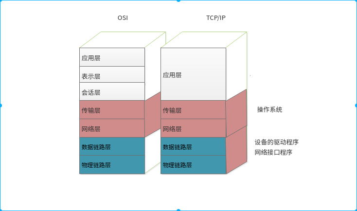

## OSI七层模型 TCP/IP 四层模型

### 模型概述

> 

### 为什么要分层

> 其实很简单，为了学习和管理的方便，每一层有自己独特的作用，便于排错

### 各层功能

> 首先需要说明的是`OSI` 七层模型是一种理论上的分层,实际中应用的是`TCP/IP` 的四层模型
>
> | 层次    | 功能                                |
> | ----- | --------------------------------- |
> | 物理链路层 | 硬件层,即负责数据传输的硬件,比如网线等              |
> | 数据链路层 | 网络驱动程序,与硬件直接交互,上承操作系统,下接硬件        |
> |       | 处理分组在网络中的活动,最主要的还是IP,ICMP,IGMP    |
> | 传输层   | 实现应用程序端到端的通信,主要协议有TCP/UDP         |
> | 应用层   | 处理特定应用的程序的细节,比如http,ftp,smtp,ssh等 |

### 数据的传输(以FTP为例)

> 
>
> 封装过程(大致,没有三次握手)
>
> - 用户需要发送的数据,在应用层选择FTP, 根据FTP的协议,在传输层封装了源端口目标端口,在网络层封装了源地址,目标地址,在链路层根据arp,封装源mac,目标mac,最后由交换机和路由器去转发
>
> 解封装过程(大致)
>
> * 根据目标mac确认是目标主机,在网络层解封装ip头,传输层解封装TCP,根据FTP协议,数据提交给FTP服务器
>
> 网络层负责点到点（point-to-point）的传输（这里的“点”指主机或路由器），而传输层负责端到端（end-to-end）的传输（这里的“端”指源主机和目的主机）。传输层可选择TCP或UDP协议。TCP是一种面向连接的、可靠的协议，有点像打电话，双方拿起电话互通身份之后就建立了连接，然后说话就行了，这边说的话那边保证听得到，并且是按说话的顺序听到的，说完话挂机断开连接。也就是说TCP传输的双方需要首先建立连接，之后由TCP协议保证数据收发的可靠性，丢失的数据包自动重发，上层应用程序收到的总是可靠的数据流，通讯之后关闭连接。UDP协议不面向连接，也不保证可靠性，有点像寄信，写好信放到邮筒里，既不能保证信件在邮递过程中不会丢失，也不能保证信件是按顺序寄到目的地的。使用UDP协议的应用程序需要自己完成丢包重发、消息排序等工作。
>
> 其实,整个过程和现实世界的淘宝买东西是一样的

### IP协议是非可靠传输协议

> IP协议是非可靠传输协议,TCP在不可靠的IP层上提供了一个可靠的传输层.
>
> 对应现实就是:
>
> 
>
> 不管是快递还是邮寄,按照你写下的地址尽管的发送,但是快件是否能够到达,并不能做出一定的保证,要确信录入的快件的信息,还是要靠最后的单号,TCP就相当于邮件的单号,根据号码可以确认是否收到了所需要的信息.

### TCP/IP 包的封装

> 
>
> * 不同的协议层对数据包有不同的称谓,在传输层叫做段（segment）,在网络层叫做数据报（datagram）,在链路层叫做帧（frame）.数据封装成帧后发到传输介质上,到达目的主机后每层协议再剥掉相应的首部,最后将应用层数据交给应用程序处理
> * 以太网数据帧的物理特性使其长度在46-1500 字节之间
> * 以太网头部有一个 16bit帧类型域(ip,arp,pppoe)(以太网协议号)
> * IP头部存在一个 8bit长度的数值,称为协议域(icmp,tcp,udp,esp,gre)(IP协议号)
> * TCP和UDP都有一个16bit的端口号来表示不同的应用程序(ftp,telnet,http,ssh)

### 协议号/端口号

> 以太网协议号:
>
> - 以太网帧是最底层协议,在以太网帧中使用协议号来说明承载的是那种协议(arp,ip,pppoe),根据协议来提交上层
> - 常用协议号(16进制)
>   - IP:0x0800
>   - ARP:0x0806
>   - PPPOE:0x8863,0x88664
>
> IP协议号:
>
> * IP是网络层协议,在IP报文中使用协议号来说明承载上层的那种协议(TCP/UDP),网络层协议(ICMP)
> * 常用协议
>   * ICMP:1
>   * TCP:6
>   * UDP:17
>   * GRE:47
>   * ESP:50
>   * AH:51
>
> 端口号:
>
> - TCP/UDP是传输层协议，TCP/UDP的端口号用来说明是哪种上层应用
> - 常用端口:
>   - TCP 80:WWW
>   - TCP 23:Telnet
>   - TCP 21, 20 :FTP
>   - TCP 22: SSH
>   - UDP 69:TFTP
>   - SMTP:25

###  补充:协议号,端口号

> 以太网协议号
>
> | **Ethertype(十六进制)** | **协议**                                   |
> | ------------------- | ---------------------------------------- |
> | 0x0000 - 0x05DC     | IEEE 802.3 长度                            |
> | 0x0101 – 0x01FF     | 实验                                       |
> | 0x0600              | XEROX NS IDP                             |
> | 0x0660 0x0661       | DLOG                                     |
> | 0x0800              | 网际协议（IP）                                 |
> | 0x0801              | X.75 Internet                            |
> | 0x0802              | NBS Internet                             |
> | 0x0803              | ECMA Internet                            |
> | 0x0804              | Chaosnet                                 |
> | 0x0805              | X.25 Level 3                             |
> | 0x0806              | 地址解析协议（ARP ： Address Resolution Protocol） |
> | 0x0808              | 帧中继 ARP （Frame Relay ARP） [RFC1701]      |
> | 0x6559              | 原始帧中继（Raw Frame Relay） [RFC1701]         |
> | 0x8035              | 动态 DARP（DRARP：Dynamic RARP）反向地址解析协议（RARP：Reverse Address Resolution Protocol） |
> | 0x8037              | Novell Netware IPX                       |
> | 0x809B              | EtherTalk                                |
> | 0x80D5              | IBM SNA Services over Ethernet           |
> | 0x 80F 3            | AppleTalk 地址解析协议（AARP：AppleTalk Address Resolution Protocol） |
> | 0x8100              | 以太网自动保护开关（EAPS：Ethernet Automatic Protection Switching） |
> | 0x8137              | 因特网包交换（IPX：Internet Packet Exchange）     |
> | 0x 814C             | 简单网络管理协议（SNMP：Simple Network Management Protocol） |
> | 0x86DD              | 网际协议v6 （IPv6，Internet Protocol version 6） |
> | 0x880B              | 点对点协议（PPP：Point-to-Point Protocol）       |
> | 0x 880C             | 通用交换管理协议（GSMP：General Switch Management Protocol） |
> | 0x8847              | 多协议标签交换（单播） MPLS：Multi-Protocol Label Switching <unicast>） |
> | 0x8848              | 多协议标签交换（组播）（MPLS, Multi-Protocol Label Switching <multicast>） |
> | 0x8863              | 以太网上的 PPP（发现阶段）（PPPoE：PPP Over Ethernet <Discovery Stage>） |
> | 0x8864              | 以太网上的 PPP（PPP 会话阶段） （PPPoE，PPP Over Ethernet<PPP Session Stage>） |
> | 0x88BB              | 轻量级访问点协议（LWAPP：Light Weight Access Point Protocol） |
> | 0x88CC              | 链接层发现协议（LLDP：Link Layer Discovery Protocol） |
> | 0x8E88              | 局域网上的 EAP（EAPOL：EAP over LAN）            |
> | 0x9000              | 配置测试协议（Loopback）                         |
> | 0x9100              | VLAN 标签协议标识符（VLAN Tag Protocol Identifier） |
> | 0x9200              | VLAN 标签协议标识符（VLAN Tag Protocol Identifier） |
> | 0xFFFF              | 保留                                       |
>
> 端口号(分为3类)
>
> - 公认端口(Well Known Ports):从0到1023,明确规定了服务和端口的对应
> - 注册端口(Registered Ports):从1024到49151,它们松散地绑定于一些服务.也就是说有许多服务绑定于这些端口,这些端口同样用于许多其它目的
> - 动态和/或私有端口(Dynamic and/or Private Ports):从49152到65535,理论上,不应为服务分配这些端口.实际上,机器通常从1024起分配动态端口
>
> | 应用协议        | 端口号/协议   | 说明                                      |
> | ----------- | -------- | --------------------------------------- |
> | ftp-data    | 20/tcp   | FTP, data                               |
> | ftp         | 21/tcp   | FTP. control                            |
> | telnet      | 23/tcp   |                                         |
> | smtp        | 25/tcp   | Simple Mail Transfer Protocol           |
> | time        | 37/tcp   | timserver                               |
> | time        | 37/udp   | timserver                               |
> | domain      | 53/tcp   | Domain Name Server                      |
> | domain      | 53/udp   | Domain Name Server                      |
> | tftp        | 69/udp   | Trivial File Transfer                   |
> | gopher      | 70/tcp   |                                         |
> | http        | 80/tcp   | www-http World Wide Web                 |
> | pop3        | 110/tcp  | Post Office Protocol-Version 3          |
> | nntp        | 119/tcp  | Network News Transfer Protocol          |
> | netbios-ns  | 137/tcp  | NETBIOS Name Service                    |
> | netbios-ns  | 137/udp  | NETBIOS Name Service                    |
> | netbios-dgm | 138/udp  | NETBIOS Datagram Service                |
> | netbios-ssn | 139/tcp  | NETBIOS Session Service                 |
> | imap        | 143/tcp  | Internet Message Access Protocol        |
> | snmp        | 161/udp  | SNMP                                    |
> | snmptrap    | 162/udp  | SNMP trap                               |
> | irc         | 194/tcp  | Internet Relay Chat Protocol            |
> | ipx         | 213/udp  | IPX over IP                             |
> | ldap        | 389/tcp  | Lightweight Directory Access Protocol   |
> | https       | 443/tcp  |                                         |
> | https       | 443/udp  |                                         |
> | uucp        | 540/tcp  |                                         |
> | ldaps       | 636/tcp  | LDAP over TLS/SSL                       |
> | doom        | 666/tcp  | Doom Id Software                        |
> | doom        | 666/udp  | Doom Id Software                        |
> | phone       | 1167/udp | Conference calling                      |
> | ms-sql-s    | 1433/tcp | Microsoft-SQL-Server                    |
> | ms-sql-s    | 1433/udp | Microsoft-SQL-Server                    |
> | ms-sql-m    | 1434/tcp | Microsoft-SQL-Monitor                   |
> | ms-sql-m    | 1434/udp | Microsoft-SQL-Monitor                   |
> | wins        | 1512/tcp | Microsoft Windows Internet Name Service |
> | wins        | 1512/udp | Microsoft Windows Internet Name Service |
> | l2tp        | 1701/udp | Layer Two Tunneling Protocol            |
> |             | 1720/tcp |                                         |
> | QICQ        | 4000/udp |                                         |
> | QICQ        | 8000/udp |                                         |
> | QQ          | 1080/UDP |                                         |