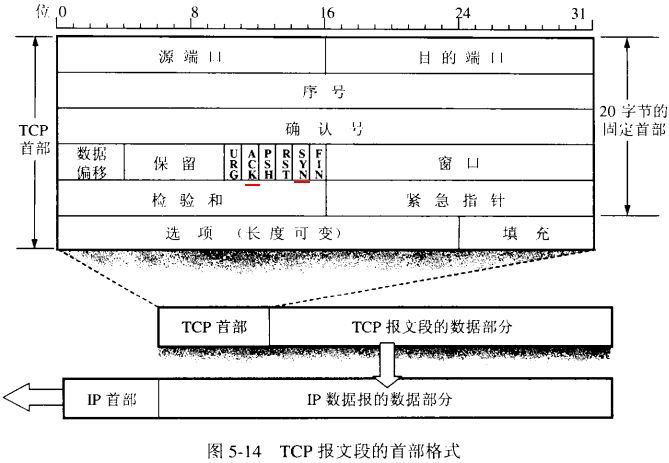
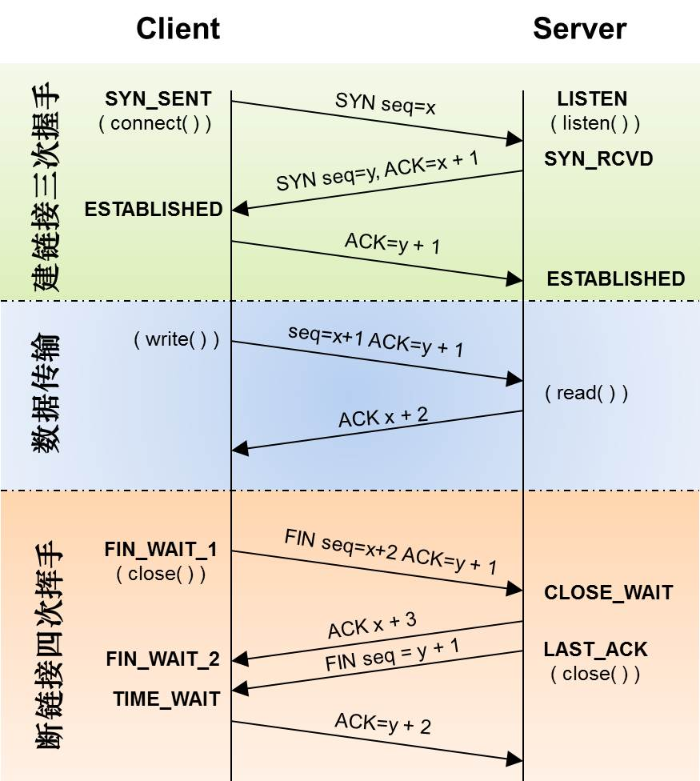
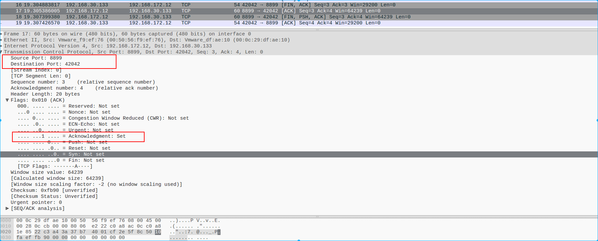

## TCP

> TCP（Transmission Control Protocol 传输控制协议）是一种面向连接的、可靠的、基于字节流的传输层通信协议.
>
> TCP 位于IP层之上,应用层之下, 不同主机的应用层之间经常需要可靠的,像管道一样的连接,但是IP层不提供这样的流机制,而是提供不可靠的包交换,
>
> 应用层向TCP层发送用于网间传输的、用8位字节表示的数据流，然后TCP把数据流分区成适当长度的报文段（通常受该计算机连接的网络的数据链路层的最大传输单元（MTU）的限制）。之后TCP把结果包传给IP层，由它来通过网络将包传送给接收端实体的TCP层。TCP为了保证不发生丢包，就给每个包一个序号，同时序号也保证了传送到接收端实体的包的按序接收。然后接收端实体对已成功收到的包发回一个相应的确认（ACK）；如果发送端实体在合理的往返时延（RTT）内未收到确认，那么对应的数据包就被假设为已丢失将会被进行重传。TCP用一个校验和函数来检验数据是否有错误；在发送和接收时都要计算校验和。
>
> 数据在TCP层称为Stream，数据分组称为分段（Segment）。作为比较，数据在IP层称为Datagram，数据分组称为分片（Fragment）。 UDP 中分组称为Message.

### TCP头部

> 
>
> 字段详细信息
>
> - Source Port和Destination Port:分别占用16位，表示源端口号和目的端口号；用于区别主机中的不同进程，而IP地址是用来区分不同的主机的，源端口号和目的端口号配合上IP首部中的源IP地址和目的IP地址就能唯一的确定一个TCP连接；
> - Sequence Number:用来标识从TCP发端向TCP收端发送的数据字节流，它表示在这个报文段中的的第一个数据字节在数据流中的序号；主要用来解决网络报乱序的问题；
> - Acknowledgment Number:32位确认序列号包含发送确认的一端所期望收到的下一个序号，因此，确认序号应当是上次已成功收到数据字节序号加1。不过，只有当标志位中的ACK标志（下面介绍）为1时该确认序列号的字段才有效。主要用来解决不丢包的问题；
> - Offset:给出首部中32 bit字的数目，需要这个值是因为任选字段的长度是可变的。这个字段占4bit（最多能表示15个32bit的的字，即4*15=60个字节的首部长度），因此TCP最多有60字节的首部。然而，没有任选字段，正常的长度是20字节；
> - TCP Flags:TCP首部中有6个标志比特，它们中的多个可同时被设置为1，主要是用于操控TCP的状态机的，依次为URG，ACK，PSH，RST，SYN，FIN。每个标志位的意思如下
>   - URG：此标志表示TCP包的紧急指针域有效，用来保证TCP连接不被中断，并且督促中间层设备要尽快处理这些数据；
>   - ACK：此标志表示应答域有效，就是说前面所说的TCP应答号将会包含在TCP数据包中；有两个取值：0和1，为1的时候表示应答域有效，反之为0；
>   - PSH：这个标志位表示Push操作。所谓Push操作就是指在数据包到达接收端以后，立即传送给应用程序，而不是在缓冲区中排队；
>   - RST：这个标志表示连接复位请求。用来复位那些产生错误的连接，也被用来拒绝错误和非法的数据包；
>   - SYN：表示同步序号，用来建立连接。SYN标志位和ACK标志位搭配使用，当连接请求的时候，SYN=1，ACK=0；连接被响应的时候，SYN=1，ACK=1；这个标志的数据包经常被用来进行端口扫描。扫描者发送一个只有SYN的数据包，如果对方主机响应了一个数据包回来 ，就表明这台主机存在这个端口；但是由于这种扫描方式只是进行TCP三次握手的第一次握手，因此这种扫描的成功表示被扫描的机器不很安全，一台安全的主机将会强制要求一个连接严格的进行TCP的三次握手；
>   - FIN： 表示发送端已经达到数据末尾，也就是说双方的数据传送完成，没有数据可以传送了，发送FIN标志位的TCP数据包后，连接将被断开。这个标志的数据包也经常被用于进行端口扫描。
> - Window:窗口大小，也就是有名的滑动窗口，用来进行流量控制

### TCP连接状态和过程

> 
>
> 正常一个TCP的连接都会经历3个状态
>
> - 3次握手,建立连接
> - 数据传输
> - 4次挥手,断开连接
>
> 这在之中,TCP会经历几个状态
>
> - LISTEN:首先服务端需要打开一个socket进行监听，状态为LISTEN.侦听来自远方TCP端口的连接请求 
> - SYN_SENT:客户端通过应用程序调用connect进行active open.于是客户端tcp发送一个SYN以请求建立一个连接.之后状态置为SYN_SENT. 在发送连接请求后等待匹配的连接请求 
> - SYN_RECV:服务端应发出ACK确认客户端的SYN,同时自己向客户端发送一个SYN. 之后状态置为SYN_RECV  在收到和发送一个连接请求后等待对连接请求的确认 
> - ESTABLISHED: 代表一个打开的连接，双方可以进行或已经在数据交互了。代表一个打开的连接，数据可以传送给用户 
> - FIN_WAIT1:主动关闭(active close)端应用程序调用close，于是其TCP发出FIN请求主动关闭连接，之后进入FIN_WAIT1状态 等待远程TCP的连接中断请求，或先前的连接中断请求的确认 
> - CLOSE_WAIT:被动关闭(passive close)端TCP接到FIN后，就发出ACK以回应FIN请求(它的接收也作为文件结束符传递给上层应用程序),并进入CLOSE_WAIT.  等待从本地用户发来的连接中断请求 
> - FIN_WAIT2:主动关闭端接到ACK后，就进入了FIN-WAIT-2 .从远程TCP等待连接中断请求 
> - LAST_ACK:被动关闭端一段时间后，接收到文件结束符的应用程序将调用CLOSE关闭连接。这导致它的TCP也发送一个 FIN,等待对方的ACK.就进入了LAST-ACK . 等待原来发向远程TCP的连接中断请求的确认
> - TIME_WAIT:在主动关闭端接收到FIN后，TCP就发送ACK包，并进入TIME-WAIT状态。.等待足够的时间以确保远程TCP接收到连接中断请求的确认 
> - CLOSING: 比较少见. 等待远程TCP对连接中断的确认 
> - CLOSED: 被动关闭端在接受到ACK包后，就进入了closed的状态。连接结束.没有任何连接状态 

### python建立客户端和服务端

> 用python编写TCP服务端和客户端,抓包检测TCP的过程
>
> ```python
> #!/usr/bin/env python
> # coding=utf-8
>
>
> from socket import *
>
> """
> 创建tcp服务端
> """
>
> # 创建socket套接字
> # 绑定ip 端口
> # 开启listen
> # 堵塞等待连接
> # 接收消息
> # 发送消息
>
>
> def main():
>     sersocket = socket(AF_INET, SOCK_STREAM)  # 服务于TCP
>     ip = '' # 绑定本地任意网卡
>     port = 8899
>
>     sersocket.bind((ip, port))
>     sersocket.listen(5)
>
>     while True:
>         # 等待连接
>         clisocket, ip_port = sersocket.accept()
>         while True:
>             data = clisocket.recv(1024)
>             if not data:
>                 break
>             print('<<<', data.decode(encoding='utf-8'))
>             msg = input(">>>")
>             clisocket.send(msg.encode(encoding='utf-8'))
>         clisocket.close()
>
>     sersocket.close()
>
> if __name__ == '__main__':
>     main()
> ```
>
> ```python
> #!/usr/bin/env python
> # coding=utf-8
>
> """
> tcp client
> """
> from socket import *
>
> # create socket
> # connect server
> # send/recive msg
>
> def main():
>     clisocket = socket(AF_INET, SOCK_STREAM)
>     ip = '192.168.172.12'
>     port = 8899
>     clisocket.connect((ip, port))
>    
>     while True:
>         data = input("<<<")
>         if not data:
>             break
>         clisocket.send(data.encode(encoding='utf-8'))
>         msg = clisocket.recv(1024)
>         print(msg.decode(encoding='utf-8'))
>
> if __name__ == '__main__':
>     main()
> ```

### TCP三次握手

> 第一次握手
>
> 
>
> 第二次握手
>
> 
>
> 第三次握手
>
> 
>
> 可以看到:
>
> - 客户端发送`SYN` 包,请求和服务器建立连接
> - 服务器回应了`SYN+ACK` 包,`ACK` 是在原客户端的`SYN`包的`seq` 基础上加1,确认可以建立请求,服务器自己发送了一个包含`seq` 的`SYN` ,请求和客户端建立连接
> - 客户端接收到包后,发送一个`ACK` 确认包,(`ACK` 在服务器发送的`seq`基础上加1),并添加`seq` 告诉服务器接下来自己发送的包序号.
> - 至此,客户端和服务器之间建立TCP连接,三次握手成功
>
> 握手成功之后,客户端和服务器之间进行正常的数据交换,可以对数据流进行追踪
>
> `wireshark` 点击追踪TCP流,可以看到服务器和客户端之间的数据交互
>
> 

### 四次挥手

> 第一次
>
> 
>
> 第二次
>
> 
>
> 第三次
>
> 
>
> 第四次
>
> 
>
> - 客户端向服务器发送`FIN+ACK` 包,告诉服务器发送端已经达到数据末尾,请求断开连接
> - 服务器向客户端发送`ACK` 确认收到消息报文
> - 服务器向客户端发送`FIN+ACK` 包,请求和客户端断开连接
> - 客户端向服务器发送`ACK`确认收到消息的报文
> - 客户端不会马上关闭连接,而是会等待`2MSL` 时间,随后关闭连接.

### 状态

> 对以上的TCP过程做流程图可以看到:
>
> 
>
> TCP在运行过程中处于不同的状态中(4次挥手状态):
>
> - `FIN_WAIT1`: 此时该socket在`ESTABLELISHED` 状态想要主动关闭连接,向对方发送了`FIN` 报文,此时该socket 处于`FIN_WAIT1` 状态,等待对方发送确认断开的回应.
> - `CLOSE_WAIT` : 被动关闭端接到FIN后，就发出ACK以回应FIN请求，并进入等待本地用户的连接终止请求的半关闭状态。这时可以发送数据，但不再接收数据.如果上面的代码,没有显示的去关闭socket` clisocket.close()`  那么TCP包中flagas`RESET=1` ,表示异常关闭的连接
> - `FIN_WAIT2`: 主动关闭端在FIN-WAIT-1状态下收到ACK确认包，进入等待远程TCP的连接终止请求的半关闭状态。这时可以接收数据，但不再发送数据,
> - `LAST_ACK`:被动关闭端全部数据发送完成之后，向主动关闭端发送FIN，进入等待确认包的状态
> - `TIME_WAIT`: 主动关闭端接收到FIN后，就发送ACK包，等待足够时间以确保被动关闭端收到了终止请求的确认包.按照RFC 793，一个连接可以在TIME-WAIT保证最大四分钟,即2倍SML(最大分片寿命)

### 为什么需要3次握手

> 从一种角度来说:
>
> - 如果只有一次握手，Client不能确定与Server的单向连接，更加不能确定Server与Client的单向连接；
> - 如果只有两次握手，Client确定与Server的单向连接，但是Server不能确定与Client的单向连接；
> - 只有三次握手，Client与Server才能相互确认双向连接，实现双工数据传输
>
> 从另外的角度来说;
>
> - 客户端发了两次请求链接的报文，第二条被服务器捕捉到，返回数据，完成了两次握手。数据传送完成之后，链接关闭。但是这时候，第一条拥塞的请求报文现在到达了服务器端，服务器还以为客户端要又一次建立连接，于是发送确认，然后把自己敞开，等着客户端发送过来数据。于是，很多的网络资源就是这样浪费掉了

### 为什么要4次挥手

> TCP协议是一种面向连接的、可靠的、基于字节流的运输层通信协议。TCP是全双工模式，这就意味着，当主机1发出FIN报文段时，只是表示主机1已经没有数据要发送了，主机1告诉主机2，它的数据已经全部发送完毕了；但是，这个时候主机1还是可以接受来自主机2的数据；当主机2返回ACK报文段时，表示它已经知道主机1没有数据发送了，但是主机2还是可以发送数据到主机1的；当主机2也发送了FIN报文段时，这个时候就表示主机2也没有数据要发送了，就会告诉主机1，我也没有数据要发送了，之后彼此就会愉快的中断这次TCP连接。

### 为什么要等待2倍SML

> - 客户端的最后一个ACK报文在传输的时候丢失，服务器并没有接收到这个报文。这个时候服务器就会超时重传这个FIN消息，然后客户端就会重新返回最后一个ACK报文，等待两个时间周期，完成关闭。如果不等待这两个时间周期，服务器重传的那条消息就不会收到。服务器就因为接收不到客户端的信息而无法正常关闭
>
> - 允许老的重复分节在网络中消逝,即握手时产生的分片
>
>   TCP分节可能由于路由器异常而“迷途”，在迷途期间，TCP发送端可能因确认超时而重发这个分节，迷途的分节在路由器修复后也会被送到最终目的地，这个 原来的迷途分节就称为lost duplicate。在关闭一个TCP连接后，马上又重新建立起一个相同的IP地址和端口之间的TCP连接，后一个连接被称为前一个连接的化身 （incarnation)，那么有可能出现这种情况，前一个连接的迷途重复分组在前一个连接终止后出现，从而被误解成从属于新的化身。为了避免这个情 况，TCP不允许处于TIME_WAIT状态的连接启动一个新的化身，因为TIME_WAIT状态持续2MSL，就可以保证当成功建立一个TCP连接的时 候，来自连接先前化身的重复分组已经在网络中消逝

### python检测TCP状态

> 客户端: 192.168.30.133
>
> 服务器: 192.168.30.129

#### RESET状态

> 服务端不启动,客户端主动连接服务端
>
> ```python
> # python3 tcp_client.py
> Traceback (most recent call last):
>   File "tcp_client.py", line 28, in <module>
>     main()
>   File "tcp_client.py", line 17, in main
>     clisocket.connect((ip, port))
> ConnectionRefusedError: [Errno 111] Connection refused
> ```
>
> 抓包:
>
> ```bash
> # tcpdump -nn -i eth0  tcp
> tcpdump: verbose output suppressed, use -v or -vv for full protocol decode
> listening on eth0, link-type EN10MB (Ethernet), capture size 262144 bytes
> 14:57:16.185237 IP 192.168.30.133.49816 > 192.168.30.129.8899: Flags [S], seq 2559896233, win 29200, options [mss 1460,sackOK,TS val 1317201898 ecr 0,nop,wscale 7], length 0
> 14:57:16.186480 IP 192.168.30.129.8899 > 192.168.30.133.49816: Flags [R.], seq 0, ack 2559896234, win 0, length 0
> ```
>
> 

#### LISTEN

> 服务端启动,而客户端不启动,则服务端处于`LISTEN` 状态
>
> ```bash
> # 启动服务
> $ python3 server_tcp.py
> ```
>
> ```bash
> # 系统抓包
> $ sudo tcpdump -nni ens38 port 8899
> [sudo] ningyanke 的密码：
> tcpdump: verbose output suppressed, use -v or -vv for full protocol decode
> listening on ens38, link-type EN10MB (Ethernet), capture size 262144 bytes
>
> $ sudo netstat -anpoc | grep 8899
> tcp        0      0 0.0.0.0:8899            0.0.0.0:*               LISTEN      22562/python3    关闭 (0.00/0/0)
> tcp        0      0 0.0.0.0:8899            0.0.0.0:*               LISTEN      22562/python3    关闭 (0.00/0/0)
>
> $ ss -ta
> State      Recv-Q Send-Q      Local Address:Port   Peer Address:Port
> LISTEN     0      5                *:8899                 *:*                              
> ```
>
> `tcpdump` 显示没有任何的TCP连接请求,`ss` 显示,系统正在对8899端口开启了`LISTEN` ,等待客户端的连接

#### ESTABLISHED

> 服务端开启,客户端开启
>
> ```bash
> $ python3 server_tcp.py
> $ python3 tcp_client.py
> ```
>
> 客户端`tcpdump` 抓包: 正常的TCP三次握手
>
> ```bash
> 15:16:44.362075 IP 192.168.30.133.49822 > 192.168.30.129.8899: Flags [S], seq 2333299575, win 29200, options [mss 1460,sackOK,TS val 1318370075 ecr 0,nop,wscale 7], length 0
> 15:16:44.362371 IP 192.168.30.129.8899 > 192.168.30.133.49822: Flags [S.], seq 2252188012, ack 2333299576, win 28960, options [mss 1460,sackOK,TS val 45917104 ecr 1318370075,nop,wscale 7], length 0
> 15:16:44.362407 IP 192.168.30.133.49822 > 192.168.30.129.8899: Flags [.], ack 1, win 229, options [nop,nop,TS val 1318370075 ecr 45917104], length 0
>
> ```
>
> 服务端`ss` 查看
>
> ```bash
> $ ss -ta
> State      Recv-Q Send-Q       Local Address:Port         Peer Address:Port               
> LISTEN     0      5            *:8899                       *:*
> ESTAB      0      0            192.168.30.129:8899        192.168.30.133:49822
> ```
>
> 代码中有2个`while True` ,所以这边抓到2个状态,外层循环处于`LISTEN` 侦听可能得客户端连接,内层循环是已经连接的客户端,状态已经变为`ESTABLISHED` ,说明双方3次握手成功,接下来可以进行数据交互
>
> 数据交互
>
> ```bash
> 15:24:38.057497 IP 192.168.30.129.8899 > 192.168.30.133.49822: Flags [F.], seq 1, ack 2, win 227, options [nop,nop,TS val 46035528 ecr 1318843769], length 0
> 15:24:38.061998 IP 192.168.30.133.49822 > 192.168.30.129.8899: Flags [.], ack 2, win 229, options [nop,nop,TS val 1318843775 ecr 46035528], length 0
> ```
>
> 

#### FIN-WAIT1, FIN-WAIT2, TIME-WAIT

> 客户端主动断开连接
>
> 客户端`tcpdump` 抓包:正常的4次挥手
>
> ```bash
> 15:28:30.437235 IP 192.168.30.133.49824 > 192.168.30.129.8899: Flags [F.], seq 1, ack 1, win 229, options [nop,nop,TS val 1319076150 ecr 46088893], length 0
> 15:28:30.439142 IP 192.168.30.129.8899 > 192.168.30.133.49824: Flags [.], ack 2, win 227, options [nop,nop,TS val 46093624 ecr 1319076150], length 0
> 15:28:30.540245 IP 192.168.30.129.8899 > 192.168.30.133.49824: Flags [F.], seq 1, ack 2, win 227, options [nop,nop,TS val 46093649 ecr 1319076150], length 0
> 15:28:30.540300 IP 192.168.30.133.49824 > 192.168.30.129.8899: Flags [.], ack 2, win 229, options [nop,nop,TS val 1319076253 ecr 46093649], length 0
> ```
>
> 服务端`ss, netstat`
>
> ````bash
> $ ss -ta
> State      Recv-Q Send-Q       Local Address:Port         Peer Address:Port               
> LISTEN     0      5            *:8899                     *:*                   
> CLOSE-WAIT 0      0            192.168.30.129:8899        192.168.30.133:49826
>
> $sudo netstat -anpoc | grep 8899
> tcp        0      0 0.0.0.0:8899            0.0.0.0:*               LISTEN      22628/python3    关闭 (0.00/0/0)
> tcp        0      0 192.168.30.129:8899     192.168.30.133:49826    CLOSE_WAIT  22628/python3    关闭 (0.00/0/0)
> ````
>
> `FIN-WAIT1, FIN-WAIT2` 时间很短暂,非常有可能抓不到

### 长连接,短连接

> TCP短连接
>
> 　　我们模拟一下TCP短连接的情况，client向server发起连接请求，server接到请求，然后双方建立连接。client向server 发送消息，server回应client，然后一次读写就完成了，这时候双方任何一个都可以发起close操作，不过一般都是client先发起 close操作。为什么呢，一般的server不会回复完client后立即关闭连接的，当然不排除有特殊的情况。从上面的描述看，短连接一般只会在 client/server间传递一次读写操作
>
> 短连接的优点是：管理起来比较简单，存在的连接都是有用的连接，不需要额外的控制手段
>
> TCP长连接
>
> 　　接下来我们再模拟一下长连接的情况，client向server发起连接，server接受client连接，双方建立连接。Client与server完成一次读写之后，它们之间的连接并不会主动关闭，后续的读写操作会继续使用这个连接。
>
> 首先说一下TCP/IP详解上讲到的TCP保活功能，保活功能主要为服务器应用提供，服务器应用希望知道客户主机是否崩溃，从而可以代表客户使用资源。如果客户已经消失，使得服务器上保留一个半开放的连接，而服务器又在等待来自客户端的数据，则服务器将应远等待客户端的数据，保活功能就是试图在服务 器端检测到这种半开放的连接。
>
> 如果一个给定的连接在两小时内没有任何的动作，则服务器就向客户发一个探测报文段，客户主机必须处于以下4个状态之一：
>
> 1. 客户主机依然正常运行，并从服务器可达。客户的TCP响应正常，而服务器也知道对方是正常的，服务器在两小时后将保活定时器复位。
> 2. 客户主机已经崩溃，并且关闭或者正在重新启动。在任何一种情况下，客户的TCP都没有响应。服务端将不能收到对探测的响应，并在75秒后超时。服务器总共发送10个这样的探测 ，每个间隔75秒。如果服务器没有收到一个响应，它就认为客户主机已经关闭并终止连接。
> 3. 客户主机崩溃并已经重新启动。服务器将收到一个对其保活探测的响应，这个响应是一个复位，使得服务器终止这个连接。
> 4. 客户机正常运行，但是服务器不可达，这种情况与2类似，TCP能发现的就是没有收到探查的响应。
>
>
>
> 长连接短连接操作过程
>
>
> 短连接的操作步骤是：
>
> - 建立连接——数据传输——关闭连接...建立连接——数据传输——关闭连接
>
> 长连接的操作步骤是：
>
> - 建立连接——数据传输...（保持连接）...数据传输——关闭连接
>
> 
>
>
> 长连接和短连接的优点和缺点
>
> 　　由上可以看出，**长连接**可以**省去较多的TCP建立和关闭的操作，减少浪费，节约时间**。对于频繁请求资源的客户来说，较适用长连接。不过这里**存在一个问题**，**存活功能的探测周期太长**，还有就是它只是探测TCP连接的存活，属于比较斯文的做法，遇到恶意的连接时，保活功能就不够使了。在长连接的应用场景下，client端一般不会主动关闭它们之间的连接，**Client与server之间的连接如果一直不关闭的话，会存在一个问题，随着客户端连接越来越多，server早晚有扛不住的时候**，这时候server端需要采取一些策略，如关闭一些长时间没有读写事件发生的连接，这样可 以避免一些恶意连接导致server端服务受损；如果条件再允许就可以以客户端机器为颗粒度，限制每个客户端的最大长连接数，这样可以完全避免某个蛋疼的客户端连累后端服务。
>
> **短连接**对于服务器来说管理较为简单，存在的连接都是有用的连接，不需要额外的控制手段。但如果客户**请求频繁**，将在**TCP的建立和关闭操作上浪费时间和带宽**。
>
> 长连接和短连接的产生在于client和server采取的关闭策略，具体的应用场景采用具体的策略，没有十全十美的选择，只有合适的选择。
>
>  
>
>  
>
> 什么时候用长连接，短连接？
>  　　**长连接**多用于操作频繁，点对点的通讯，而且连接数不能太多情况，。每个TCP连接都需要三步握手，这需要时间，如果每个操作都是先连接，再操作的话那么处理速度会降低很多，所以每个操作完后都不断开，次处理时直接发送数据包就OK了，不用建立TCP连接。例如：数据库的连接用长连接， 如果用短连接频繁的通信会造成socket错误，而且频繁的socket 创建也是对资源的浪费。 
> 　　而像WEB网站的http服务一般都用**短链接**，因为长连接对于服务端来说会耗费一定的资源，而像WEB网站这么频繁的成千上万甚至上亿客户端的连接用短连接会更省一些资源，如果用长连接，而且同时有成千上万的用户，如果每个用户都占用一个连接的话，那可想而知吧。所以并发量大，但每个用户无需频繁操作情况下需用短连好。