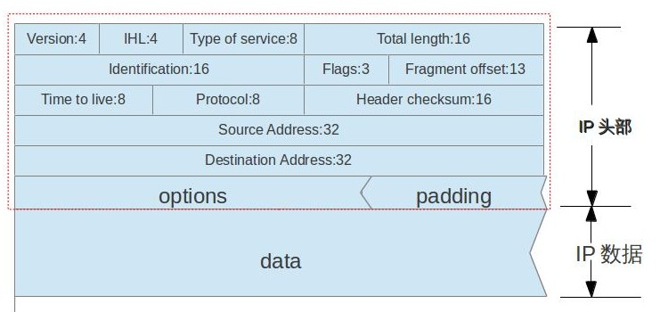
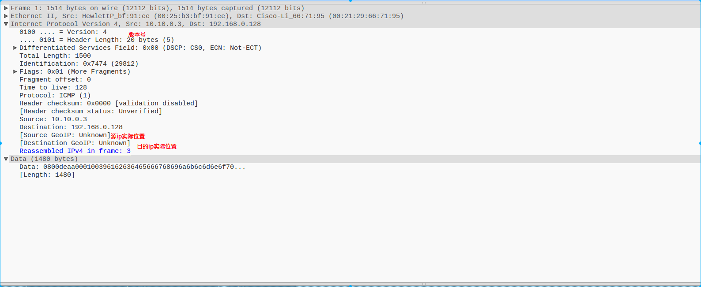

## IP网际协议

> 1. IP是TCP/IP协议族中最为核心的协议。所有的TCP，UDP，ICMP，IGMP数据都是以IP数据报格式传输。IP协议就是定义数据如何从源地址传送到目的地址，同时也定义在传输过程中的数据分片和重新组装
> 2. IP协议是被它的上层协议（TCP，UDP）调用，同时它也调用它的下层协议（以太网协议，IEEE802），把IP数据报传到下一个网关（gateway）或目的地址
> 3. IP协议主要实现两个基本功能：寻址和数据分片

### IP头部格式(IP HEADER FORMAT)

> 
>
> 各字段含义：
>
> - version(版本)： 指IP协议版本号，目前是4，也称IPv4,将来（现在已经在用了）会是IPv6
> - IHL(internet header length)：指头部长度数值，以4字节（32比特）为单位。因为IHL占四比特位置，所以最大值是：2^4 -1 = 15，则头部可能最大为：15 ＊ 4字节 ＝ 60字节，一般没有选项(options)数据时值为5（即5 * 4字节＝20字节）
> - Type of service(服务类型)： 前三个比特指优先权字段（已被忽略）。中间四个比特表示：最小时延，最大吞吐量，最高可靠性，最小费用。0表时一般，1表示最优。四个中只能一个置1。最后一比特预留，总置为0
> - Total length(IP数据总长度) ： IP数据报内容的长度，包括IP头部部分，以字节为单位。因为占16比特，所以最长为65535（2^16-1）。尽管IP数据报最长可以达65535字节，但是我们知道有些链路层有最大传输单元的限制（MTU），如以太网就是1500，这时候IP数据报就要分片（Fragmentation）传输。
> - Identification(唯一标识)： 每一个IP数据报都要有唯一的标识字段，这样在分片和重组时不至于混淆两个完全不同的分片数据。这在后面分组，重组中会讲到
> - Flages(标志)： 这个字段也是为IP数据报的分片和重组作用的。用于标识收到的分片后续是否还有分片待接收。
> - Fragment offset(分片偏移)：指当前分片数据在整体IP数据报中所处的偏移量，以8字节（64比特）为单位。由此可见,「identification」，「Flages」,「Fragment offset」这三个字段是为IP数据报分片和重组功能作用的字段
> - Time to live(生存时间) ： 设置IP数据报可以经过的最多路由器数目。每次经过一次处理它的路由器，它的值就减1，值到为0时，该数据报丢弃，并发送ICMP报文到源主机。
> - Protocol(协议) ： 指定它的上层协议，如TCP。
> - Header checksum(头检验和) ： 为了验证IP头数据的完整性，进行一系列计算求出的检验和值，当接收方收到后也要进行同样的计算并把求出的检验和与收到的相比较，以判断IP数据在传输的过程中是无误传输的。
>   关于计算检验和的算法，在[RFC1071](https://tools.ietf.org/html/rfc1071)里定义。我没有详细看这份rfc，但是这篇[文章](http://www.thegeekstuff.com/2012/05/ip-header-checksum/)介绍得挺详细的。
> - source address 和 destination address 分别指源IP地址和目的IP地址。
> - options(头部选项)：一些特定应用时定义的选项值。只需要注意几点：「选项」是可选的（optional），且如果有选项值的话，长度值必需以32比特为上界，不足的话补0。这是因为IP头部始终以32比特为单元。

### wireshark 抓包显示

> 