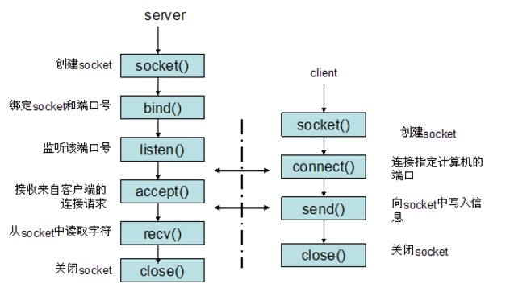

## socket

### 什么是socket

> Socket的英文原义是“孔”或“插座”。作为BSD UNIX的进程通信机制，取后一种意思。通常也称作"套接字"，用于描述IP地址和端口，是一个通信链的句柄，可以用来实现不同虚拟机或不同计算机之间的通信。在Internet上的主机一般运行了多个服务软件，同时提供几种服务。每种服务都打开一个Socket，并绑定到一个端口上，不同的端口对应于不同的服务。Socket正如其英文原意那样，像一个多孔插座。一台主机犹如布满各种插座的房间，每个插座有一个编号，有的插座提供220伏交流电， 有的提供110伏交流电，有的则提供有线电视节目。 客户软件将插头插到不同编号的插座，就可以得到不同的服务。

### socket函数

> ```python
> socket.socket(family[,type[,proto]])
> ```
>
> 参数:
>
> - familiy:使用的地址簇
> - type:使用的类型,可以为tcp，也可以是udp
> - proto:一般不填，为0

### socket地址簇

> | 名称              | 作用              |
> | --------------- | --------------- |
> | socket.AF_INET  | IPV4            |
> | socket.AF_INET6 | IPV6            |
> | socket.AF_UNIX  | 只能用于单一的系统的进程间通信 |

### socket类型

> | 类型                    | 作用                                       |
> | --------------------- | ---------------------------------------- |
> | socket.SOCK_STREAM    | 流式socket , for TCP （默认）                  |
> | socket.SOCK_DGRAM     | 数据报式socket , for UDP                     |
> | socket.SOCK_RAW       | 原始套接字，普通的套接字无法处理ICMP、IGMP等网络报文，而SOCK_RAW可以；其次，SOCK_RAW也可以处理特殊的IPv4报文；此外，利用原始套接字，可以通过IP_HDRINCL套接字选项由用户构造IP头。 |
> | socket.SOCK_RDM       | 是一种可靠的UDP形式，即保证交付数据报但不保证顺序。SOCK_RAM用来提供对原始协议的低级访问，在需要执行某些特殊操作时使用，如发送ICMP报文。SOCK_RAM通常仅限于高级用户或管理员运行的程序使用。 |
> | socket.SOCK_SEQPACKET | 可靠的连续数据包服务                               |

### socket对象内建函数

> | 函数                              | 描述                                       |
> | ------------------------------- | ---------------------------------------- |
> | 服务器套接字                          | 服务器套接字                                   |
> | s.bind(address)                 | 绑定地址address到套接字，在AF_INET下，address是以tuple(host,port)的形式存在的 |
> | s.lisen(backlog)                | 开始监听传入传入连接，backlog指在拒绝连接之前，可以挂起的最大连接数量<br>backlog等于5，表示内核已经接到了连接请求，但服务器还没有调用accept进行处理的连接个数最大为5<br>这个值不能无限大，因为要在内核中维护连接队列 |
> | s.accept()                      | 接受连接并返回(conn,address)<br>conn是新的套接字对象，可以用来接收和发送数据<br>address是连接客户端的地址，是一个(name,port)的tuple |
> | 客户端套接字                          | 客户端套接字                                   |
> | s.connect(address)              | 连接到address处的套接字，一般，address是格式为元组(name,port)，拖过连接出错，会返回socket.error错误 |
> | s.connet_ex(address)            | 同上，只不过会返回值，连接成功返回0，连接失败会返回编码，而不是抛出异常     |
> | 公共用途套接字函数                       | 公共用途的套接字函数                               |
> | s.recv(bufsize[,flag])          | 接收套接字数据，数据是以字符串的形式返回，bufsize指定接收的最大字节，flag通常省略 |
> | s.recvfrom(bufsieze[,flag])     | 接收UDP数据<br>与revc()类似<br>返回值是tuple(data,address)<br>data包含接受数据的字符串</br>address返回一个tuple(ipaddr,port)是发送数据的套接字地址 |
> | s.send(string[,flag])           | 将string中的数据发送到连接的套接字，返回值是要发送的字节数量，该数量可能小鱼string的字节大小 |
> | s.sendall(sting[,flag])         | 将string中的数据发送到连接的套接字，但在返回之前会尝试发送所有数据。成功返回None，失败则抛出异常。 |
> | s.sendto(string[,flag],address) | 将数据发送到套接字，address是形式为（ipaddr，port）的元组，指定远程地址。返回值是发送的字节数。该函数主要用于UDP协议。 |
> | s.close()                       | 关闭套接字                                    |
> | s.getpeername()                 | 这个方法只能用在客户端，用于查看server端的信息<br>返回值连接套接字的远程地址。返回值通常是tuple(ipaddr,port) |
> | s.getsockname()                 | 这个方法只能用在server端用与查看server端自己的信息<br>返回套接字自己的地址。通常是一个元组(ipaddr,port) |
> | s.settimeout(timeout)           | 设置套接字操作的超时期，timeout是一个浮点数，单位是秒。值为None表示没有超时期。一般，超时期应该在刚创建套接字时设置，因为它们可能用于连接的操作（如connect()） |
> | s.gettimeout()                  | 返回当前超时期的值，单位是秒，如果没有设置超时期，则返回None。        |
> | s.fileno()                      | 返回套接字的文件描述符                              |
> | s.setblocking(flag)             | 如果flag为0，则将套接字设为非阻塞模式，否则将套接字设为阻塞模式（默认值）。非阻塞模式下，如果调用recv()没有发现任何数据，或send()调用无法立即发送数据，那么将引起socket.error异常。 |
> | s.makefile()                    | 创建一个与该套接字相关连的文件                          |

### 服务器客户端模型

> 

