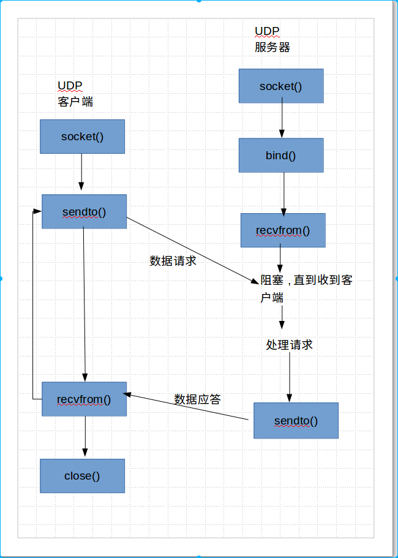

### UDP

### UDP性质

> TCP是建立可靠连接，并且通信双方都可以以流的形式发送数据。相对于TCP，UDP则是面向无连接的协议
> 使用UDP时，不需要建立连接。只需要知道对方的IP地址和端口号，就可以直接发送数据包，但是，能不能到达就不知道了
> 虽然用UDP传输数据不可靠，但是他比TCP速度快，对于不要求可靠到达的数据，可以使用UDP协议.

### 适用情况

> UDP⼀般⽤于多点通信和实时的数据业务，⽐如
>
> - 语⾳⼴播
> - 视频
> - QQ
> - TFTP(简单⽂件传送）
> - SNMP（简单⽹络管理协议）
> - RIP（路由信息协议，如报告股票市场，航空信息）
> - DNS(域名解析）

### UDP客户端服务器模型

> 

### 创建socket客户端

> - 创建客户端套接字
> - 发送/接收数据
> - 关闭套接字
>
> ```python
> #!/usr/bin/env python
> # coding=utf-8
> # author:ning
>
>
> """
> 创建udpsocket客户端
> """
>
> from socket import *
>
>
> # 创建socket
> # 发送和接收数据
> # 关闭socket
>
> def main():
>     cliudp = socket(AF_INET, SOCK_DGRAM)  # udp socket
>     ip = '10.115.28.33'
>     port = 8899
>     ip_port = (ip, port)
>     bufsize = 1024
>     cliudp.sendto(b"hello world", ip_port)  # 发送的是一个元组
>     msg = cliudp.recvfrom(bufsize)
>     msg1, msg2 = msg  # 返回的是一个元组,包括返回的信息和服务器的ip port
>     print(msg1)
>     print(msg2)
> 	cliudp.close()
>
> if __name__ == "__main__":
>     main()
> ```
>
> ```python
> '''
> s.recvfrom(bufsize)
>     与recv类型，但是返回值是(data,address),其中data是包含接收数据的字符串
>     address 是发送数据的地址和端口号
> s.sentto(string[,flag],address)
>     发送UDP数据，将数据发送到套接字，address是形式为(ipaddr,port)的tuple，指定远程地址，返回值是发送的字节数
> '''
> ```
>
> 需要注意的是:服务器对客户端的链接会随机派送一个端口号

### 创建udp服务端

> - 创建套接字
> - 绑定
> - 收发数据
> - 关闭套接字
>
> ```python
> #!/usr/bin/env python
> # coding=utf-8
>
> """
> 创建udpserver服务端
> """
>
> # 创建socket
> # 绑定
> # 收发数据
> # 关闭socket
>
> from socket import *
>
>
> def main():
>     sersocket = socket(AF_INET, SOCK_DGRAM)
>     ip = ''  # 指定所有的网卡都可以用来收发数据
>     port = 8899
>     ip_port = (ip, port)
>     bufsize = 1024
>     sersocket.bind(ip_port)
>
>     while True:
>         msg = sersocket.recvfrom(bufsize)
>         msg1, msg2 = msg
>         print(msg1.encode(encoding='utf-8'))
>         sersocket.sendto(msg1, msg2)
>     sersocket.close()
>
>
> if __name__ == "__main__":
>     main()
> ```

### 总结

> - udp是TCP/IP协议族中的⼀种协议能够完成不同机器上的程序间的数据通信
> - udp服务器/客户端
>   - udp的服务器和客户端的区分：往往是通过 请求服务 和 提供服务 来进⾏
>     区分
>   - 请求服务的⼀⽅称为：客户端
>   - 提供服务的⼀⽅称为：服务器
> - udp绑定问题
>   - ⼀般情况下，服务器端，需要绑定端⼝，⽬的是为了让其他的客户端能够正确发送到此进程
>   - 客户端，⼀般不需要绑定，⽽是让操作系统随机分配，这样就不会因为需要绑定的端⼝被占⽤⽽导致程序⽆法运⾏的情况