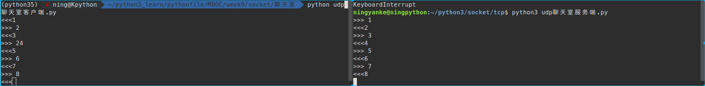
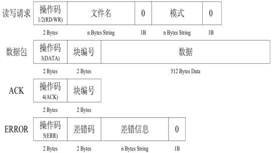
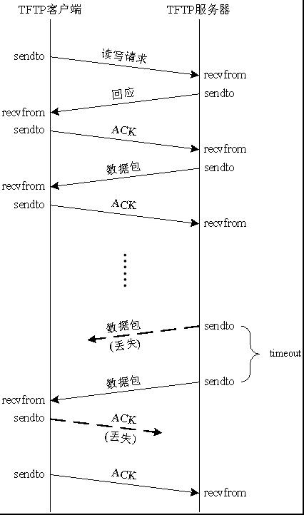
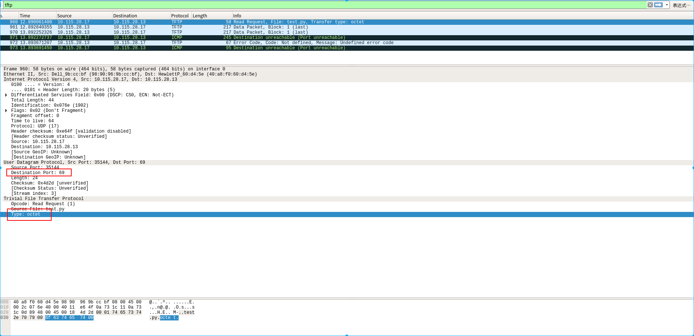
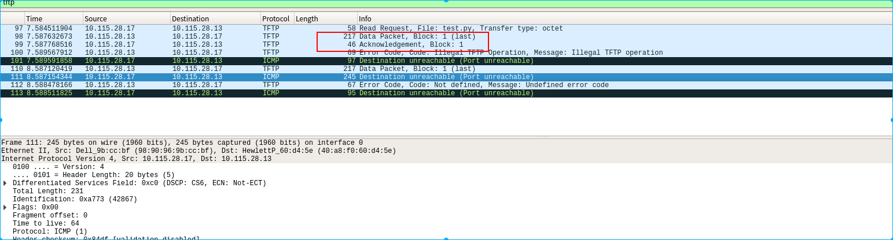

## UDP综合应用

### 1.UDP聊天室

> 首先实现的是客户端和服务器端能够交互的输入:
>
> `\r` 格式化字符串,用于把光标置于首位
>
> ```python
> """
> udp聊天室客户端
> """
>
> from socket import *
>
>
> def main():
>     clisocket = socket(AF_INET, SOCK_DGRAM)
>     ip = '10.115.28.33'
>     port = 8899
>     ip_port = (ip, port)
>     bufsize = 1024
>     while True:
>         msg = input("\r<<<")
>         clisocket.sendto(msg.encode(encoding='utf-8'), ip_port)
>         msg = clisocket.recvfrom(bufsize)
>         msg1, msg2 = msg
>         print("\r>>>", msg1.decode(encoding='utf-8'))
>
>
> if __name__ == '__main__':
>     main()
> ```
>
> ```python
> """
> udp聊天服务端
> """
> from socket import *
>
>
> def main():
>     sersocket = socket(AF_INET, SOCK_DGRAM)
>     ip = ""    # 指定所有的网卡都可以用来接收消息
>     port = 8899
>     ip_port = (ip, port)
>     bufsize = 1024
>     sersocket.bind(ip_port)
>     while True:
>         msg = sersocket.recvfrom(bufsize)
>         msg1, msg2 = msg
>         print("\r>>>", msg1.decode(encoding='utf-8'))
>         data = input("\r<<<")
>         sersocket.sendto(data.encode(encoding='utf-8'), msg2)
>
>
> if __name__ == '__main__':
>     main()
> ```
>
> 这样实现的只能一方发送,一方接收,不能做到其中一方的连续发送,要想做到这个,必须使用多线程或多进程
>
> 
>
> #### 使用线程发送
>
> ```python
> '''客户端'''
> from socket import *
> import time
> from threading import Thread
>
>
> def send(sock, ip_port):
>     while True:
>         msg = input("\r<<<")
>         sock.sendto(msg.encode(encoding='utf-8'), ip_port)
>
>
> def recive(sock, bufsize):
>     while True:
>         msg = sock.recvfrom(bufsize)
>         msg1, msg2 = msg
>         print('\r>>>{}:{}:{}'.format(
>             msg2, time.ctime(), msg1.decode(encoding='utf-8')))
>
>
> def main():
>     clisocket = socket(AF_INET, SOCK_DGRAM)
>     ip = '10.115.28.33'
>     port = 8899
>     bufsize = 1024
>     ip_port = (ip, port)
>
>     ip1 = ""
>     port1 = 7788
>     ip_port1 = (ip1, port1)
>     clisocket.bind(ip_port1)
>     threads1 = Thread(target=send, args=(clisocket, ip_port))
>     threads2 = Thread(target=recive, args=(clisocket, bufsize))
>     threads1.start()
>     threads2.start()
>     threads1.join()
>     threads2.join()
>
>     clisocket.close()
>
>
> if __name__ == '__main__':
>     main()
> ```
>
> ```python
> #!/usr/bin/env python
> # -*- coding: utf-8 -*-
> # @Author: ning
> # @Date:   2018-01-27 20:45:07
> # @Last Modified by:   ning
> # @Last Modified time: 2018-01-27 21:01:00
>
> '''服务器'''
> import time
> from socket import *
> from threading import *
>
>
> def recive(sock, bufsize):
>     while True:
>         msg = sock.recvfrom(bufsize)
>         msg1, msg2 = msg
>         print('\r>>>{}:{}:{}'.format(
>             msg2, time.ctime(), msg1.decode(encoding='utf-8')))
>
>
> def send(sock, ip_port):
>     while True:
>         msg = input("\r<<<")
>         sock.sendto(msg.encode(encoding='utf-8'), ip_port)
>
>
> def main():
>     ip = ''
>     port = 8899
>     ip_port = (ip, port)
>     bufsize = 1024
>     sersocket = socket(AF_INET, SOCK_DGRAM)
>     sersocket.bind(ip_port)
>
>     ip1 = '10.115.28.17'
>     port1 = 7788
>     ip_port1 = (ip1, port1)
>
>     threads1 = Thread(target=recive, args=(sersocket, bufsize))
>     threads2 = Thread(target=send, args=(sersocket, ip_port1))
>     threads1.start()
>     threads2.start()
>     threads1.join()
>     threads2.join()
>
>
> if __name__ == '__main__':
>     main()
>
> ```

### 2.UDP-tftp应用

> #### TFTP 协议介绍
>
> TFTP（Trivial File Transfer Protocol,简单文件传输协议）是TCP/IP协议族中的一个用来在客户端与服务器之间进行简单文件传输的协议
> 特点：
>
> - 简单
> - 占用资源小
> - 适合传递小文件
> - 适合在局域网进行传递
> - 端口号为69
> - 基于UDP实现
>
> #### TFTP数据报文格式
>
> 
>
> | 操作码  | 功能        |
> | ---- | --------- |
> | 1    | 读请求       |
> | 2    | 写请求       |
> | 3    | data数据    |
> | 4    | ACK确认报文   |
> | 5    | 异常报文,错误报文 |
>
> #### TFTP 报文流程
>
> 
>
> #### TFTP下载
>
> 没有确认报文(ACK)
>
> ```python
> """
> 实现tftp下载功能
> 根据tftp的报文流程构造数据包
> """
>
> from socket import *
> import struct
>
>
> # 使用的是UDP协议
> clisocket = socket(AF_INET, SOCK_DGRAM)
>
>
> # 发送下载请求
> ip = '10.115.28.13'
> port = 69
> ip_port = (ip, port)
> filename = b'test.py'
> len_filename = len(filename)
> msg = struct.pack('!H{}sb5sb'.format(len_filename),
>                   1, filename, 0, b'octet', 0)
> clisocket.sendto(msg, ip_port)
>
> # 服务器回应消息
> recvmsg = clisocket.recvfrom(1024)
> recvmsg1, recvmsg2 = recvmsg
> print(recvmsg1.decode(encoding='utf-8'), recvmsg2)
> '''
> recvmsg2: 返回一个元组,包括服务器地址和返回的端口号
> ('10.115.28.13', 52758)
> '''
> ```
>
> 运行显示
>
> ```python
> # -*- coding: utf-8 -*-
> # @Author: ning
> # @Date:   2017-01-02 21:03:42
> # @Last Modified by:   ning
> # @Last Modified time: 2017-01-02 21:04:11
>
> print  "hello world"
>  ('10.115.28.13', 52758)
> [Finished in 0.0s]
> ```
>
> 可以抓包查看tftp的连接过程:
>
> 
>
> - 客户端按照构造的包发送给服务器
> - 服务器返回客户端想要下载的文件的内容
> - 由于客户端没有发送`ACK` 确认报文,所以服务器发送了多次
> - 客户端向服务器发送了错误代码5
> - 服务器也向客户端发送了错误代码5
> - 双方断开连接
>
> 发送确认报文(ACK)
>
> 
>
> 可以清楚的看到ack的确认报文,但是由于客户端没有采取动作,连接超时,双方断开连接
