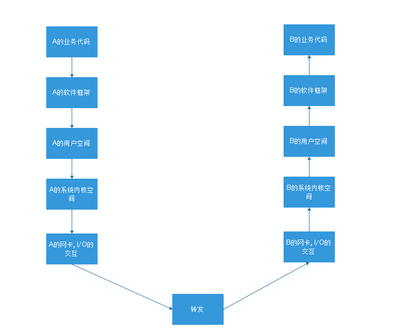
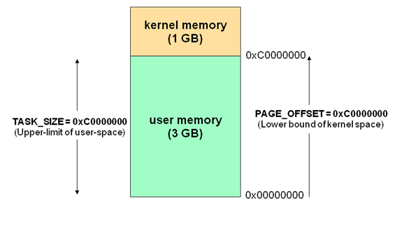
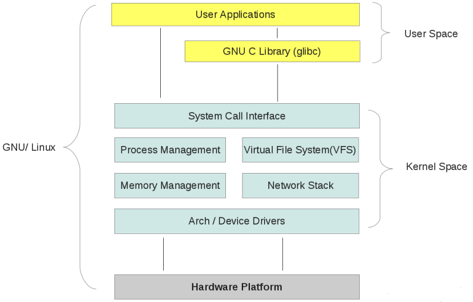
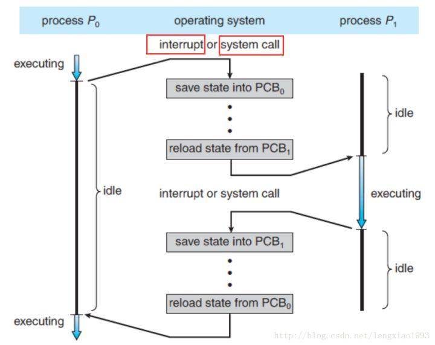
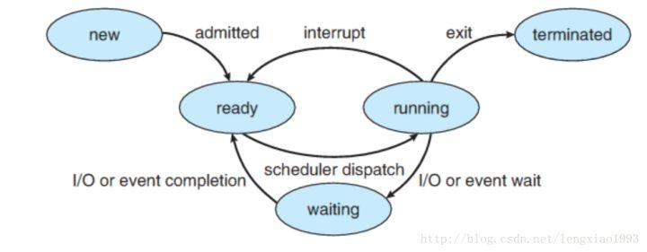
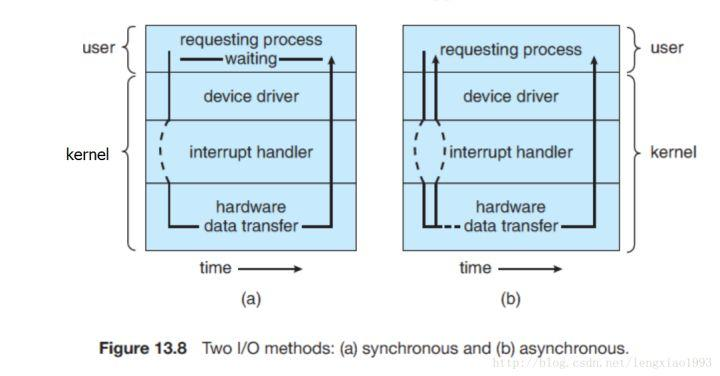
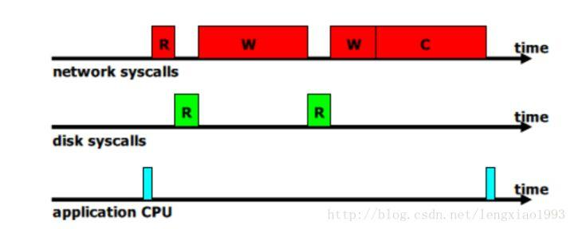
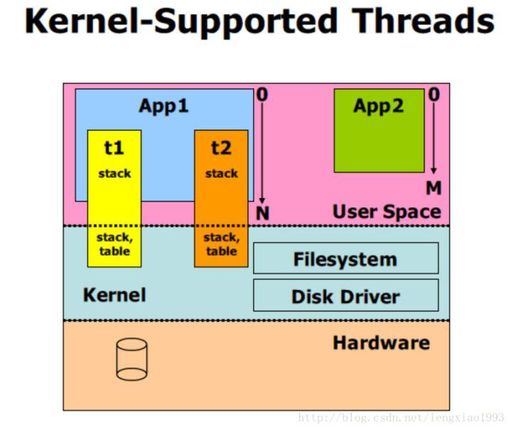
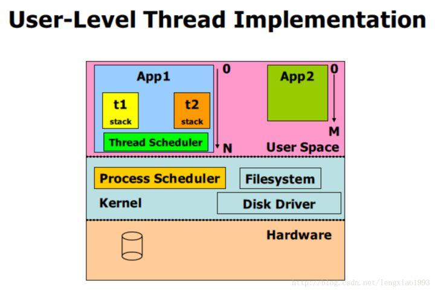

## 同步异步

> 同步异步针对不同的层次有不同的理解,需要具体的场景的支持,不能笼统而论.
>
> 简单来说:一个网络包从应用程序A,发到另外一台电脑上应用程序B,应该经过:
>
> 
>
> 前一级调用后一级的功能,后一级返回前一级的结果,在单独的调用上,存在着同步/异步,阻塞和非阻塞

### 基本概念

#### 用户空间和内核空间

> 我们知道现在操作系统都是采用虚拟存储器，那么对32位操作系统而言，它的寻址空间（虚拟存储空间）为4G（2的32次方）。操心系统的核心是内核，独立于普通的应用程序，可以访问受保护的内存空间，也有访问底层硬件设备的所有权限。为了保证用户进程不能直接操作内核，保证内核的安全，操心系统将虚拟空间划分为两部分，一部分为内核空间，一部分为用户空间。针对linux操作系统而言，将最高的1G字节（从虚拟地址0xC0000000到0xFFFFFFFF），供内核使用，称为内核空间，而将较低的3G字节（从虚拟地址0x00000000到0xBFFFFFFF），供各个进程使用，称为用户空间。每个进程可以通过系统调用进入内核，因此，Linux内核由系统内的所有进程共享。于是，从具体进程的角度来看，每个进程可以拥有4G字节的虚拟空间
>
> 空间分配情况如下图所示:
>
> 
>
> 有了用户空间和内核空间，整个linux内部结构可以分为三部分，从最底层到最上层依次是：`硬件-->内核空间-->用户空间`。如下图所示：
>
> 

#### 进程切换

> 复杂的不谈,简单的来说;
>
> 
>
> - 当一个程序正在执行的过程中， 中断（interrupt） 或 系统调用（system call） 发生可以使得 CPU 的控制权会从当前进程转移到操作系统内核。
> - 操作系统内核负责保存进程 i 在 CPU 中的上下文（程序计数器， 寄存器）到 PCBi （操作系统分配给进程的一个内存块）中。
> - 从 PCBj 取出进程 j 的CPU 上下文， 将 CPU 控制权转移给进程 j ， 开始执行进程 j 的指令。
>
> 几个底层概念的通俗（不严谨）解释：
>
> - 中断（interrupt） 
>    - CPU 微处理器有一个中断信号位， 在每个CPU时钟周期的末尾, CPU会去检测那个中断信号位是否有中断信号到达， 如果有， 则会根据中断优先级决定是否要暂停当前执行的指令， 转而去执行处理中断的指令。 （其实就是 CPU 层级的 while 轮询）
>
>
> - 时钟中断( Clock Interrupt )
>    - 一个硬件时钟会每隔一段（很短）的时间就产生一个中断信号发送给 CPU，CPU 在响应这个中断时， 就会去执行操作系统内核的指令， 继而将 CPU 的控制权转移给了操作系统内核， 可以由操作系统内核决定下一个要被执行的指令。
>
>
> - 系统调用（system call）
>    - system call 是操作系统提供给应用程序的接口。 用户通过调用 systemcall 来完成那些需要操作系统内核进行的操作， 例如硬盘， 网络接口设备的读写等。系统调用（英语：system call），又称为系统呼叫，指运行在使用者空间的程序向操作系统内核请求需要更高权限运行的服务。系统调用提供用户程序与操作系统之间的接口。大多数系统交互式操作需求在内核态执行。如设备IO操作或者进程间通信。

#### 进程阻塞

> 
>
> 上图展示了一个进程的不同状态：
>
> - New。 进程正在被创建.
> - Running. 进程的指令正在被执行
> - Waiting. 进程正在等待一些事件的发生（例如 I/O 的完成或者收到某个信号）。
> - Ready. 进程在等待被操作系统调度。
> - Terminated. 进程执行完毕（可能是被强行终止的）。
>
> 我们所说的 “阻塞”是指进程在**发起了一个系统调用**（System Call） 后， 由于该系统调用的操作不能立即完成，需要等待一段时间，于是内核将进程挂起为**等待 （waiting）**状态， 以确保它不会被调度执行， 占用 CPU 资源。
>
> 1

#### 文件描述符

> 在Linux系统中一切皆可以看成是文件，文件又可分为：普通文件、目录文件、链接文件和设备文件。文件描述符（file descriptor）是内核为了高效管理已被打开的文件所创建的索引，其是一个非负整数（通常是小整数），用于指代被打开的文件，所有执行I/O操作的系统调用都通过文件描述符。程序刚刚启动的时候，0是标准输入，1是标准输出，2是标准错误。如果此时去打开一个新的文件，它的文件描述符会是3.POSIX标准要求每次打开文件时（含socket）必须使用当前进程中最小可用的文件描述符号码

#### 缓存I/O

> 缓存I/O又被称作标准I/O，大多数文件系统的默认I/O操作都是缓存I/O。在Linux的缓存I/O机制中，数据先从磁盘复制到内核空间的缓冲区，然后从内核空间缓冲区复制到应用程序的地址空间。
>
>        读操作：操作系统检查内核的缓冲区有没有需要的数据，如果已经缓存了，那么就直接从缓存中返回；否则从磁盘中读取，然后缓存在操作系统的缓存中。
>
>        写操作：将数据从用户空间复制到内核空间的缓存中。这时对用户程序来说写操作就已经完成，至于什么时候再写到磁盘中由操作系统决定，除非显示地调用了sync同步命令
>
> 缓存I/O的优点：**1）在一定程度上分离了内核空间和用户空间，保护系统本身的运行安全；2）可以减少读盘的次数，从而提高性能**。
>
>        缓存I/O的缺点：在缓存 I/O 机制中，DMA 方式可以将数据直接从磁盘读到页缓存中，或者将数据从页缓存直接写回到磁盘上，而不能直接在应用程序地址空间和磁盘之间进行数据传输，这样，数据在传输过程中需要在**应用程序地址空间（用户空间）和缓存（内核空间）之间进行多次数据拷贝操作**，这些数据拷贝操作所带来的CPU以及内存开销是非常大的。

### I/O模式

> 网络IO的本质是socket的读取，socket在linux系统被抽象为流，IO可以理解为对流的操作。刚才说了，对于一次IO访问（以read举例），数据会先被拷贝到操作系统内核的缓冲区中，然后才会从操作系统内核的缓冲区拷贝到应用程序的地址空间。所以说，当一个read操作发生时，它会经历两个阶段：
>
> - 第一阶段：等待数据准备 (Waiting for the data to be ready)
> - 第二阶段：将数据从内核拷贝到进程中 (Copying the data from the kernel to the process)
>
> 对于socket流而言
>
> - 第一步：通常涉及等待网络上的数据分组到达，然后被复制到内核的某个缓冲区
> - 第二步：把数据从内核缓冲区复制到应用进程缓冲区
>
> 正是因为有2个阶段,linux下产生了5种网络模式的方案
>
> - **同步模型（synchronous IO）**
>   - 阻塞IO（bloking IO）
>   - 非阻塞IO（non-blocking IO）
>   - 多路复用IO（multiplexing IO）
> - 信号驱动式IO（signal-driven IO） (不常用)
> - **异步IO（asynchronous IO）**
>
> 对于多路复用I/O中的`epoll` 对系统空间访问来说,采用的确实异步的方式,也就是不是使用轮询去检测是否由数据要读写,而是要求系统内核空间 在有数据读写的时候产生事件通知.这是一种异步的方式,但是整体而言,他还是同步模型中的.
>
> synchronous IO和asynchronous IO的区别之前，需要先给出两者的定义。POSIX的定义是这样子的：
>
> - A synchronous I/O operation causes the requesting process to be blocked until that I/O operation completes;
> - An asynchronous I/O operation does not cause the requesting process to be blocked;
>
> 两者的区别就在于synchronous IO做”IO operation”的时候会将process阻塞.定义中所指的”IO operation”是指真实的IO操作.
>
> 那么很明显,对于`epoll ` 他也是阻塞等待 系统内核 关于读写 操作的事件通知,从整体上说他是同步的,但是他这种等待事件的机制是异步的,因为,`epoll` 并不会卡在一个socket上,而是整体等待事件的通知.

#### 进程间通信的同步/异步， 阻塞/非阻塞

> 进程间的通信时通过 send() 和 receive() 两种基本操作完成的。具体如何实现这两种基础操作，存在着不同的设计。
> 消息的传递有可能是**阻塞的**或**非阻塞的** – 也被称为**同步**或**异步**的
>
> - 阻塞式发送（blocking send）. 发送方进程会被一直阻塞， 直到消息被接受方进程收到。
> - 非阻塞式发送（nonblocking send）。 发送方进程调用 send() 后， 立即就可以其他操作。
> - 阻塞式接收（blocking receive） 接收方调用 receive() 后一直阻塞， 直到消息到达可用。
> - 非阻塞式接受（nonblocking receive） 接收方调用 receive() 函数后， 要么得到一个有效的结果， 要么得到一个空值， 即不会被阻塞。
>
> **上述不同类型的发送方式和不同类型的接收方式，可以自由组合。**
>
> - 也就是说， 从进程级通信的维度讨论时， 阻塞和同步（非阻塞和异步）就是一对同义词， 且需要针对**发送方**和**接收方**作区分对待
>
> 典型就是`epoll`

#### I/O System Call 的阻塞/非阻塞， 同步/异步

> 这里再重新审视 **阻塞/非阻塞 IO** 这个概念， 其实**阻塞和非阻塞**描述的是进程的一个操作是否会使得进程转变为“等待”的状态， 但是为什么我们总是把它和 IO 连在一起讨论呢？
>
> 原因是， **阻塞**这个词是与系统调用 System Call 紧紧联系在一起的， 因为要让一个进程进入 等待（waiting） 的状态, 要么是它主动调用 wait() 或 sleep() 等挂起自己的操作， 另一种就是它调用 System Call, 而 System Call 因为涉及到了 I/O 操作， 不能立即完成， 于是内核就会先将该进程置为等待状态， 调度其他进程的运行， 等到 它所请求的 I/O 操作完成了以后， 再将其状态更改回 ready 。
>
> 操作系统内核在执行 System Call 时， CPU 需要与 IO 设备完成一系列物理通信上的交互， 其实再一次会涉及到阻塞和非阻塞的问题， 例如， 操作系统发起了一个读硬盘的请求后， 其实是向硬盘设备通过总线发出了一个请求，它即可以阻塞式地等待IO 设备的返回结果，也可以非阻塞式的继续其他的操作。 在现代计算机中，这些物理通信操作基本都是异步完成的， 即发出请求后， 等待 I/O 设备的中断信号后， 再来读取相应的设备缓冲区。 但是，大部分操作系统默认为用户级应用程序提供的都是阻塞式的系统调用 （blocking systemcall）接口， 因为阻塞式的调用，使得应用级代码的编写更容易（代码的执!行顺序和编写顺序是一致的）。
>
> 但同样， 现在的大部分操作系统也会提供非阻塞I/O 系统调用接口（Nonblocking I/O system call）。 一个非阻塞调用不会挂起调用程序， 而是会立即返回一个值， 表示有多少bytes 的数据被成功读取（或写入）。
>
> 非阻塞I/O 系统调用( nonblocking system call )的另一个替代品是 **异步I/O系统调用 （asychronous system call）**。 与非阻塞 I/O 系统调用类似，asychronous system call 也是会立即返回， 不会等待 I/O 操作的完成， 应用程序可以继续执行其他的操作， 等到 I/O 操作完成了以后，操作系统会通知调用进程（设置一个用户空间特殊的变量值 或者 触发一个 signal 或者 产生一个软中断 或者 调用应用程序的回调函数）。
>
> 此处， **非阻塞I/O 系统调用( nonblocking system call )** 和 **异步I/O系统调用 （asychronous system call）**的区别是：
>
> - 一个**非阻塞I/O 系统调用 read()** 操作立即返回的是任何可以立即拿到的数据， 可以是完整的结果， 也可以是不完整的结果， 还可以是一个空值。
> - 而**异步I/O系统调用** read（）结果必须是完整的， 但是这个操作完成的通知可以延迟到将来的一个时间点。
>
> 下图展示了同步I/O 与 异步 I/O 的区别 （非阻塞 IO 在下图中没有绘出）
>
> 
>
> 注意， 上面提到的 **非阻塞I/O 系统调用( nonblocking system call )** 和 **异步I/O系统调用** 都是非阻塞式的行为（non-blocking behavior）。 他们的差异仅仅是返回结果的方式和内容不同

#### 非阻塞 I/O 如何帮助服务器提高吞吐量

> 考虑一个**单进程**服务器程序， 收到一个 Socket 连接请求后， 读取请求中的文件名，然后读请求的文件名内容，将文件内容返回给客户端。 那么一个请求的处理流程会如下图所示。
>
> 
>
> - R 表示读操作
> - W 表示写操作
> - C 表示关闭操作
>
> 在这个过程中， 我们可以看到， CPU 和 硬盘IO 的资源大部分时间都是闲置的。 此时， 我们会希望在等待 I/O 的过程中继续处理新的请求。
>
> 方案一： 多进程
>
> - 每到达一个请求， 我们为这个请求新创建一个进程来处理。 这样， 一个进程在等待 IO 时， 其他的进程可以被调度执行， 更加充分地利用 CPU 等资源。
> - 问题： 每新创建一个进程都会消耗一定的内存空间， 且进程切换也会有时间消耗， 高并发时， 大量进程来回切换的时间开销会变得明显起来。
>
> 方案二：多线程
>
> - 和多进程方案类似，为每一个请求新建一个线程进行处理，这样做的重要区别是， 所有的线程都共享同一个进程空间
> - 问题： 需要考虑是否需要为特定的逻辑使用锁。
>
> 引申问题： 一个进程中的某一个线程发起了 system call 后， 是否造成整个进程的阻塞？ 如果会， 那么多线程方案与单进程方案相比就没有明显的改善。
>
> - 解决办法1：内核支持的线程（kenerl supported threads） 
>
> - - 操作系统内核能够感知到线程， 每一个线程都会有一个内核调用栈（kenerl stack） 和 保存CPU 寄存器下文的 table 。
>
> 
>
> 在这种方案中， 如果 CPU 是多核的， 不同的线程还可以运行在不同的 CPU processor 上。 既实现了IO 并发， 也实现了 CPU 并发。
>
> 问题： 内核支持线程可移植性差， 其实现对于不同的操作系统而言有所差别。
>
> - 解决办法2： 用户支持的线程（user supported threads） 
>
> - - 内核感知不到用户线程， 每一个用户的进程拥有一个调度器， 该调度器可以感知到线程发起的系统调用， 当一个线程产生系统调用时， 不阻塞整个进程， 切换到其他线程继续运行。 当 I/O 调用完成以后， 能够重新唤醒被阻塞的线程。
>
>   - 实现细节： 
>
>   - - 应用程序基于线程库 thread libray 编写
>     - 线程库中包含 “虚假的” read(), write(), accept()等系统调用。
>     - 线程库中的 read(), write(), accept() 的底层实现为非阻塞系统调用（Non-blocking system call）， 调用后，由于可以立即返回， 则将特定的线程状态标记为 waiting, 调度其他的可执行线程。 内核完成了 IO 操作后， 调用线程库的回调函数， 将原来处于 waiting 状态的线程标记为 runnable.
>
> 
>
> 从上面的过程可以看出，用户级支持线程（User-Supported Threads）的解决方案基于非阻塞IO系统调用( non-blocking system call) ， 且是一种基于操作系统内核事件通知（event-driven）的解决方案， 该方案可以降低系统处理并发请求时的进程切换开销。  基于这个方案， 可以引申到更为宽泛的 event-driven progreamming 话题上。 但是这里就不作赘述了。
>

### 总结：

>  1. 阻塞/非阻塞， 同步/异步的概念要注意讨论的上下文：
>
> - 在进程通信层面， 阻塞/非阻塞， 同步/异步基本是同义词， 但是需要注意区分讨论的对象是发送方还是接收方。
> - 发送方阻塞/非阻塞（同步/异步）和接收方的阻塞/非阻塞（同步/异步） 是互不影响的。
> - 在 IO 系统调用层面（ IO system call ）层面， 非阻塞 IO 系统调用 和  异步 IO 系统调用存在着一定的差别， 它们都不会阻塞进程， 但是返回结果的方式和内容有所差别， 但是都属于非阻塞系统调用（ non-blocing system call ）
>
>  2. 非阻塞系统调用（non-blocking I/O system call 与 asynchronous I/O system call） 的存在可以用来实现线程级别的 I/O 并发， 与通过多进程实现的 I/O 并发相比可以减少内存消耗以及进程切换的开销。