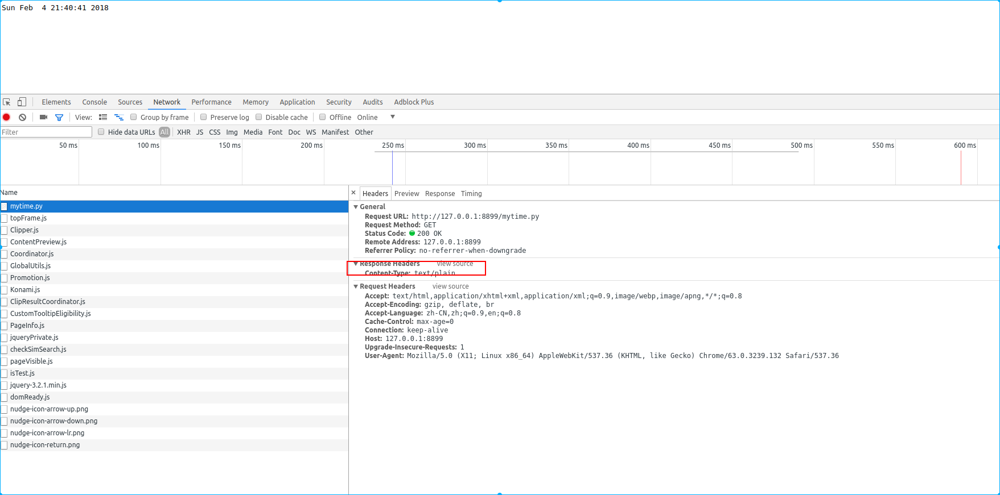

## web服务器

### web静态服务器

#### 回显固定的页面

> 使用HTTP协议服务器端发送给客户端测试
>
> ```python
> #!/usr/bin/env python
> # coding=utf-8
>
>
> """
> web静态服务器回显固定的页面
> 使用单进程服务器实现
> """
>
>
> from socket import *
> from multiprocessing import Process
>
>
> def handle_cli(sock):
>     recvmsg = sock.recv(1024)
>     # show HTTP Request msg
>     print(recvmsg)
>
>     # create HTTP response msg
>     response_first_line = b'HTTP/1.1 200 OK\r\n'
>     response_header = b'Server:MyWebServer\r\n'
>     response_body = b'This is a test for HTTP'
>     response = response_first_line + response_header + b'\r\n' + response_body
>     sock.send(response)
>     # close socket
>     sock.close()
>
>
> def main():
>     # create socket
>     sersocket = socket(AF_INET, SOCK_STREAM)
>     # bind
>     ipaddr = ('', 8899)
>     sersocket.bind(ipaddr)
>     # listen
>     sersocket.listen(20)
>     # restart socket
>     sersocket.setsockopt(SOL_SOCKET, SO_REUSEADDR, 1)
>
>     # accept
>     while True:
>         newsocket, cliaddr = sersocket.accept()
>         print('From {}:{} connection'.format(cliaddr[0], cliaddr[1]))
>         p1 = Process(target=handle_cli, args=((newsocket,)))
>         p1.start()
>         # main process close socket, child process start socket
>         newsocket.close()
>
>
> if __name__ == '__main__':
>     main()
> ```

#### 回显html页面的内容

> 目录结构
>
> ```bash
> $ tree 
> .
> ├── html_page
> │   ├── index.html
> │   └── login.html
> ├── 回显html页面.py
> └── 显示固定的页面.py
> ```
>
> ```python
> #!/usr/bin/env python
> # -*- coding: utf-8 -*-
>
>
> """
> web静态服务器显示固定的HTML页面的内容
> """
>
> from socket import *
> from multiprocessing import *
> import re
>
>
> HTML_ROOT_DIR = './html_page'
>
>
> def handle_headers(status, phrease):
>     response_first_line = 'HTTP/1.1 %s %s\r\n' % (status, phrease)
>     response_header = b'Server:MyWebServer\r\n'
>     return response_first_line.encode(encoding='utf-8') + response_header
>
>
> def handle_cli(sock):
>     recvmsg = sock.recv(1024).decode(encoding='utf-8')
>     # show HTTP Request msg
>     # print(recvmsg)
>
>     # create HTTP response msg
>     # response_first_line = b'HTTP/1.1 200 OK\r\n'
>     # response_header = b'Server:MyWebServer\r\n'
>     # response_body = b'This is a test for HTTP'
>     # response = response_first_line + response_header + b'\r\n'
>     # + response_body
>
>     # send html page to client
>
>     # get recvmsg first line
>     request_first_line = recvmsg.split('\r\n')[0]
>
>     # user re get filename
>     patt = '\w+ (/[^ ]*)'
>     filename = re.match(patt, request_first_line).group(1)
>
>     # set index html page
>     if '/' == filename:
>         filename = '/index.html'
>     try:
>         f = open(HTML_ROOT_DIR + filename, 'rb')
>     except IOError as e:   # 文件不存在
>         response_header = handle_headers('404', 'Not Found')
>         response_body = b'File Not found'
>         response = response_header + b'\r\n' + response_body
>     else:               # 文件存在
>         response_header = handle_headers('200', 'OK')
>         response_body = f.read()
>         response = response_header + b'\r\n' + response_body
>
>     sock.send(response)
>     # close socket
>     sock.close()
>
>
> def main():
>     # create socket
>     sersocket = socket(AF_INET, SOCK_STREAM)
>     # bind
>     ipaddr = ('', 8899)
>     sersocket.bind(ipaddr)
>     # listen
>     sersocket.listen(20)
>     # restart socket
>     sersocket.setsockopt(SOL_SOCKET, SO_REUSEADDR, 1)
>
>     # accept
>     while True:
>         newsocket, cliaddr = sersocket.accept()
>         print('From {}:{} connection'.format(cliaddr[0], cliaddr[1]))
>         p1 = Process(target=handle_cli, args=((newsocket,)))
>         p1.start()
>         # main process close socket, child process start socket
>         newsocket.close()
>
>
> if __name__ == '__main__':
>     main()
>
> ```
>
> 浏览器访问结果
>
> 
>
> 

#### web服务器抽象化

> 将web服务器整体看做一个类,抽象化
>
> ```python
> #!/usr/bin/env python
> # -*- coding: utf-8 -*-
> # @Author: ningyanke
>
> """
> 抽象化web服务器,将web服务器看做一个整体
> """
>
> from socket import *
> from multiprocessing import Process
> import re
>
> HTML_ROOT_DIR = './html_page'
>
>
> class HTTPServer:
>     '''将web服务器看做一个整体,它应该具有自己的方法和属性'''
>
>     def __init__(self):
>         # 6.实现基本的socket对象
>         self.sersocket = socket(AF_INET, SOCK_STREAM)
>
>     def bind(self, ip='', port=8899):
>         # 5.实现绑定ip port, 需要有一个基本的socket对象
>         self.sersocket.bind((ip, port))
>         self.sersocket.setsockopt(SOL_SOCKET, SO_REUSEADDR, 1)
>
>     def start(self, num=5):
>         '''6.实现start 开启socket方法'''
>         # 7.设置侦听
>         self.sersocket.listen(num)
>         while True:
>             newsocket, cliaddr = self.sersocket.accept()
>             # 8.使用子进程处理客户端socket,HTTPServer的方法之一
>             p1 = Process(target=self.handle_cli, args=((newsocket,)))
>             p1.start()
>
>     def handle_cli(self, sock):
>         '''9.实现handle_cli'''
>         recvmsg = sock.recv(1024).decode(encoding='utf-8')
>
>         # get recvmsg first line
>         request_first_line = recvmsg.split('\r\n')[0]
>
>         # user re get filename
>         patt = '\w+ (/[^ ]*)'
>         filename = re.match(patt, request_first_line).group(1)
>
>         # handle_headers 处理response返回的数据的头部
>         # set index html page
>         if '/' == filename:
>             filename = '/index.html'
>         try:
>             f = open(HTML_ROOT_DIR + filename, 'rb')
>         except IOError as e:   # 文件不存在
>             response_header = self.handle_headers('404', 'Not Found')
>             response_body = b'File Not found'
>             response = response_header + b'\r\n' + response_body
>         else:               # 文件存在
>             response_header = self.handle_headers('200', 'OK')
>             response_body = f.read()
>             response = response_header + b'\r\n' + response_body
>
>         sock.send(response)
>         # close socket
>         sock.close()
>
>     def handle_headers(self, status, phrease):
>         '''10.处理handle_headers'''
>         response_first_line = 'HTTP/1.1 %s %s\r\n' % (status, phrease)
>         response_header = b'Server:MyWebServer\r\n'
>         return response_first_line.encode(encoding='utf-8') + response_header
>
>
> # 1.对HTTPServer的使用
> def main():
>     # 2.需要实例化HTTPServer这个类
>     httpserver = HTTPServer()
>     # 3.HTTPServer 应该具有绑定 (ip,port)的方法
>     httpserver.bind()
>     # 4.运行HTTPServer
>     httpserver.start()
>
>
> if __name__ == '__main__':
>     main()
> ```
>
> 浏览器访问
>
> 
>
> 

### web动态服务器

#### 简单的请求web服务器上的py文件

> 既然运行的都是web服务器上的py文件,因此需要对`index.py` 的python 文件的后缀名称进行判断
>
> ```bash
> $ tree
> ├── dynamic
> │   ├── mytime.py
> │   └── __pycache__
> │       └── mytime.cpython-35.pyc
> ├── html_page
> │   ├── index.html
> │   └── login.html
> ├── 抽象化web服务器.py
> ├── 回显html页面.py
> ├── 简单动态web服务器.py
> └── 显示固定的页面.py
> ```
>
> ```python
> #!/usr/bin/env python
> # -*- coding: utf-8 -*-
> # @Author: ningyanke
>
>
> """
> 简单动态请求,使用上一步新建的类模型
> """
>
>
> from socket import *
> from multiprocessing import Process
> import re
> import sys
>
> HTML_ROOT_DIR = './html_page'
>
>
> class HTTPServer:
>     '''将web服务器看做一个整体,它应该具有自己的方法和属性'''
>
>     def __init__(self):
>         # 6.实现基本的socket对象
>         self.sersocket = socket(AF_INET, SOCK_STREAM)
>
>     def bind(self, ip='', port=8899):
>         # 5.实现绑定ip port, 需要有一个基本的socket对象
>         self.sersocket.bind((ip, port))
>         self.sersocket.setsockopt(SOL_SOCKET, SO_REUSEADDR, 1)
>
>     def start(self, num=5):
>         '''6.实现start 开启socket方法'''
>         # 7.设置侦听
>         self.sersocket.listen(num)
>         while True:
>             newsocket, cliaddr = self.sersocket.accept()
>             # 8.使用子进程处理客户端socket,HTTPServer的方法之一
>             p1 = Process(target=self.handle_cli, args=((newsocket,)))
>             p1.start()
>
>     def handle_cli(self, sock):
>         '''9.实现handle_cli'''
>         recvmsg = sock.recv(1024).decode(encoding='utf-8')
>
>         # get recvmsg first line
>         request_first_line = recvmsg.split('\r\n')[0]
>
>         # user re get filename
>         patt = '\w+ (/[^ ]*)'
>         filename = re.match(patt, request_first_line).group(1)
>
>         # handle_headers 处理response返回的数据的头部
>         # set index html page
>
>         # 对解析到的request 的首部文件是 .py结尾的文件进行判断
>         # /mytime.py
>         if filename.endswith('.py'):   # .py文件
>             try:
>                 m = __import__(filename[1:-3])   # 动态导入
>                 # 测试点
>                 print(1)
>             except Exception as e:
>                 # 测试点
>                 print(2)
>                 response_header = self.handle_headers('404', 'Not Found')
>                 response_body = b'File Not found'
>                 response = response_header + b'\r\n' + response_body
>             else:
>                 response_header = self.handle_headers('200', 'OK')
>                 response_body = m.application()
>                 # 测试点
>                 print(response_body)
>                 response = response_header + b'\r\n' + \
>                     response_body.encode(encoding='utf-8')
>         else:
>             if '/' == filename:
>                 filename = '/index.html'
>             try:
>                 f = open(HTML_ROOT_DIR + filename, 'rb')
>             except IOError as e:   # 文件不存在
>                 response_header = self.handle_headers('404', 'Not Found')
>                 response_body = b'File Not found'
>                 response = response_header + b'\r\n' + response_body
>             else:               # 文件存在
>                 response_header = self.handle_headers('200', 'OK')
>                 response_body = f.read()
>                 response = response_header + b'\r\n' + response_body
>
>         sock.send(response)
>         # close socket
>         sock.close()
>
>     def handle_headers(self, status, phrease):
>         '''10.处理handle_headers'''
>         response_first_line = 'HTTP/1.1 %s %s\r\n' % (status, phrease)
>         response_header = b'Server:MyWebServer\r\n'
>         return response_first_line.encode(encoding='utf-8') + response_header
>
>
> # 1.对HTTPServer的使用
> def main():
>     # 导入模块文件
>     Python_Model_dir = './dynamic'
>     sys.path.insert(1, Python_Model_dir)
>     # 2.需要实例化HTTPServer这个类
>     httpserver = HTTPServer()
>     # 3.HTTPServer 应该具有绑定 (ip,port)的方法
>     httpserver.bind()
>     # 4.运行HTTPServer
>     httpserver.start()
>
>
> if __name__ == '__main__':
>     main()
> ```
>
> 客户端
>
> ```python
> #!/usr/bin/env python
> # -*- coding: utf-8 -*-
>
> import time
>
>
> def application():
>     return time.ctime()
> ```
>
> 访问效果
>
> 

#### 使用WSGI的要求写

> 这样虽然可以写出一个小类型的服务器,但是每个人写的都是不同的,因此出来一种标准类型的东西,就是`WSGI`
>
> [WSGI](./10009.md)
>
> 如果以前导入运行过mytime,应该把`mytime.pyc` 删除,重新编译,才会生成重写的效果
>
> ```python
> #!/usr/bin/env python
> # -*- coding: utf-8 -*-
>
>
> from socket import *
> from multiprocessing import Process
> import re
> import sys
>
> HTML_ROOT_DIR = './html_page'
>
>
> class HTTPServer:
>     '''将web服务器看做一个整体,它应该具有自己的方法和属性'''
>
>     def __init__(self):
>         # 6.实现基本的socket对象
>         self.sersocket = socket(AF_INET, SOCK_STREAM)
>
>     def bind(self, ip='', port=8899):
>         # 5.实现绑定ip port, 需要有一个基本的socket对象
>         self.sersocket.bind((ip, port))
>         self.sersocket.setsockopt(SOL_SOCKET, SO_REUSEADDR, 1)
>
>     def start(self, num=5):
>         '''6.实现start 开启socket方法'''
>         # 7.设置侦听
>         self.sersocket.listen(num)
>         while True:
>             newsocket, cliaddr = self.sersocket.accept()
>             # 8.使用子进程处理客户端socket,HTTPServer的方法之一
>             p1 = Process(target=self.handle_cli, args=((newsocket,)))
>             p1.start()
>
>     def handle_cli(self, sock):
>         '''9.实现handle_cli'''
>         recvmsg = sock.recv(1024).decode(encoding='utf-8')
>
>         # get recvmsg first line
>         request_first_line = recvmsg.split('\r\n')[0]
>
>         # user re get filename
>         patt = '\w+ (/[^ ]*)'
>         filename = re.match(patt, request_first_line).group(1)
>         option = re.match('(\w+) /[^ ]*', request_first_line).group(1)
>
>         # create env
>         env = {
>             'PATH': filename,
>             'OPTION': option
>         }
>
>         # handle_headers 处理response返回的数据的头部
>         # set index html page
>
>         # 对解析到的request 的首部文件是 .py结尾的文件进行判断
>         # /mytime.py
>         if filename.endswith('.py'):   # .py文件
>             try:
>                 m = __import__(filename[1:-3])   # 动态导入
>                 # 测试点
>                 print(1)
>                 print(filename[1:-3])
>             except Exception as e:
>                 # 测试点
>                 print(2)
>                 response_header = self.handle_headers('404', 'Not Found')
>                 response_body = b'File Not found'
>                 response = response_header + b'\r\n' + response_body
>             else:
>                 """
>                 WSGI接口定义,要求Web开发者实现一个函数, 可以响应HTTP请求
>                 def application(environ, start_response):
>                     start_response('200 OK', [('Content-Type', 'text/html')])
>                     return 'Hello World!
>                 上面的application()函数就是符合WSGI标准的一个HTTP处理函数，它接收两个参数：
>
>                 environ：一个包含所有HTTP请求信息的dict对象；
>                 start_response：一个发送HTTP响应的函数。
>                 整个application()函数本身没有涉及到任何解析HTTP的部分，也就是说，把底层web服务器解析部分
>                 和应用程序逻辑部分进行了分离，这样开发者就可以专心做一个领域了不过，等等，这个application()
>                 函数怎么调用？如果我们自己调用，两个参数environ和start_response我们没法提供，返回的str也没法发给浏览器。
>
>                 所以application()函数必须由WSGI服务器来调用。有很多符合WSGI规范的服务器。而我们此时的web服务器的目的
>                 就是做一个极可能解析静态网页还可以解析动态网页的服务器
>                 """
>                 # 测试点
>                 print(dir(m))
>                 response_body = m.application(env, self.handle_headers)
>
>                 # response_header = self.handle_headers('200', 'OK')
>                 # response_body = m.application()
>                 # 测试点
>                 print(response_body)
>                 response = bytes(self.response_header, 'utf-8') + b'\r\n' + \
>                     response_body.encode(encoding='utf-8')
>         else:
>             if '/' == filename:
>                 filename = '/index.html'
>             try:
>                 f = open(HTML_ROOT_DIR + filename, 'rb')
>             except IOError as e:   # 文件不存在
>                 response_header = self.handle_headers('404', 'Not Found')
>                 response_body = b'File Not found'
>                 response = response_header + b'\r\n' + response_body
>             else:               # 文件存在
>                 response_header = self.handle_headers('200', 'OK')
>                 response_body = f.read()
>                 response = response_header + b'\r\n' + response_body
>
>         sock.send(response)
>         # close socket
>         sock.close()
>
>     def handle_headers(self, status, headers):
>         '''
>         10.处理handle_headers
>             status = '200 OK'
>         headers = [
>             ('Content-Type', 'text/plain')
>         ]
>         '''
>
>         """
>         response_first_line = 'HTTP/1.1 %s %s\r\n' % (status, phrease)
>         response_header = b'Server:MyWebServer\r\n'
>         return response_first_line.encode(encoding='utf-8') + response_header
>         """
>         response_first_line = 'HTTP/1.1 ' + status + '\r\n'
>         response_header = ''
>         for header in headers:
>             response_header += '%s:%s\r\n' % header
>         # 测试点
>         print(response_header)
>         self.response_header = response_first_line + response_header
>
> # 1.对HTTPServer的使用
>
>
> def main():
>     # 导入模块文件
>     Python_Model_dir = './dynamic'
>     sys.path.insert(1, Python_Model_dir)
>     # 2.需要实例化HTTPServer这个类
>     httpserver = HTTPServer()
>     # 3.HTTPServer 应该具有绑定 (ip,port)的方法
>     httpserver.bind()
>     # 4.运行HTTPServer
>     httpserver.start()
>
>
> if __name__ == '__main__':
>     main()
> ```
>
> 客户端
>
> ```python
> import time
>
> """
> 1.第一版
> def application():
>     return time.ctime()
> """
>
>
> def application(env, handle_headers):
>     status = '200 OK'
>     headers = [
>         ('Content-Type', 'text/plain')
>     ]
>     handle_headers(status, headers)
>     return time.ctime()
>
>
> if __name__ == '__main__':
>     env = {}
>
>     def handle_headers(status, headers):
>         return 'HH'
>     m = application(env, handle_headers)
>     print(m)
> ```
>
> 浏览器访问结果
>
> 

### 自己实现一个小的框架

> 以以上的2个python文件为基础,实现一个小的框架,尽量不在`server.py`中处理事情,而是通过框架文件来处理`server.py` 中遇到的各种解析,这样`server.py` 可以专心的跑底层服务,需要的模块全部都从框架文件中加载.

#### 从框架文件中加载所有需要的函数

> 原来的`mytime.py` ,可以同样新建一些`myhello.py` , 现在不想要那么多入口文件,而只要一个管理所有的入口文件,所以,可以对`MyFrame.py` 进行修改:
>
> 
>
> 