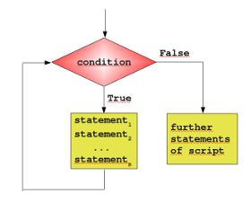

#####  循环语句 `while`,`for`
>循环语句的结构控制如图<br>
>###### `while`循环
>>###### 语句的一般形式:
>```python
>while 判断条件:
>	语句
>```
>实例，计算1-100的总和
>```python
>i = j = 0
>while i < 101:
>	j = i+j
>	i += 1
>print('和为{}'.format(j))
>```
>###### 无限循环
>通过设置条件为`true`来实现无限循环，这在服务器的客户端上实时请求，非常有效
>```python
>var = 1
>while var == 1:
>	num = input('请输入一个值:')
>	print("你输入的值是{}".format(num))
>print('byebye')
>```
>###### `while`循环使用`else`语句
>当`while...else..`条件为`false`时，会执行`else`语句
>```python
>In [206]: count = 0
>In [208]: while count < 5:
>     ...:     print(count,'小于5')
>     ...:     count += 1
>     ...: else:
>     ...:     print(count,'大于等于5')
>     ...:     
>0 小于5
>1 小于5
>2 小于5
>3 小于5
>4 小于5
>5 大于等于5
>```
>###### 简单语句组
>类似与`if`的三元表达式，如果`while`只有一个语句，可以把该语句与`while`写在同一行
>`while True:print('Hello world')`
######`for`语句
>`for`循环可以遍历任何序列的项目,比如一个列表，元组，字符串，
>`for`循环的格式如下
>```python
>for <varialbe> in <sequence>:
>	<statements>
>else:
>	<statements>
>```
>```python
>languages = ["C", "C++", "Perl", "Python"]
> for x in languages:
>...      print (x)
>...
>C
>C++
>Perl
>Python
>>
>```
