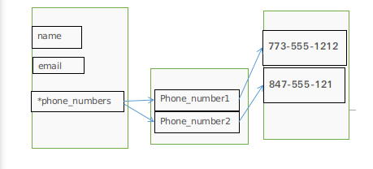

### 语句
#### 什么是语句
>为了能够严谨地阐述这个概念，抄一段维基百科中的词条：[命令式编程](https://zh.wikipedia.org/wiki/%E6%8C%87%E4%BB%A4%E5%BC%8F%E7%B7%A8%E7%A8%8B)
>>命令式编程（英语：Imperative programming），是一种描述电脑所需作出的行为的编程范型。几乎所有电脑的硬件工作都是指令式的；几乎所有电脑的硬件都是设计来运行机器码，使用指令式的风格来写的。较高级的指令式编程语言使用变量和更复杂的语句，但仍依从相同的范型。
运算语句一般来说都表现了在存储器内的数据进行运算的行为，然后将结果存入存储器中以便日后使用。高级命令式编程语言更能处理复杂的表达式，可能会产生四则运算和函数计算的结合。


#### 基本语句
>一般所有高级语言，都包含如下语句，Python也不例外：
>>#####循环语句:
>>容许一些语句反复运行数次。循环可依据一个默认的数目来决定运行这些语句的次数；或反复运行它们，直至某些条件改变。
>>#####条件语句:
>>容许仅当某些条件成立时才运行某个区块。否则，这个区块中的语句会略去，然后按区块后的语句继续运行。
>>#####无条件分支语句
>>容许运行顺序转移到程序的其他部分之中。包括跳跃（在很多语言中称为Goto）、副程序和Procedure等。

#### 重要语句
#####`import`语句
>python中有很多内置或其他的模块，可以使用`import`语句导入到python中
>有2中基本的形式
>`import　Ｘ`或者`from x import Y`，这两个语句是等价的


##### 赋值语句
> 把变量和内存中的数据连接起来
> 基本的赋值语句类似　`a = 2`
> 赋值给多个变量，解压可迭代对象赋值给多个变量
>```python
>#赋值给多个变量
>In [193]: a , b , c = (4,5,6)
>
>In [194]: print(a,b,c)
>4 5 6
>
>In [195]: a,b,c = [1,2,3]
>
>In [196]: print(a,b,c)
>1 2 3
>>＃解压可迭代对象赋值给多个变量
>In [198]: a,*b=(1,2,3,4,5)
>
>In [199]: print(a,b)
>1 [2, 3, 4, 5]
>
>In [200]: *a,b=(1,2,3,4)
>
>In [201]: print(a,b)
>[1, 2, 3] 4
>```
>解压可迭代对象赋值给多个变量的图解
>
>
